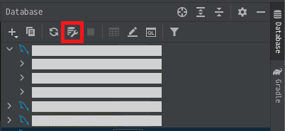
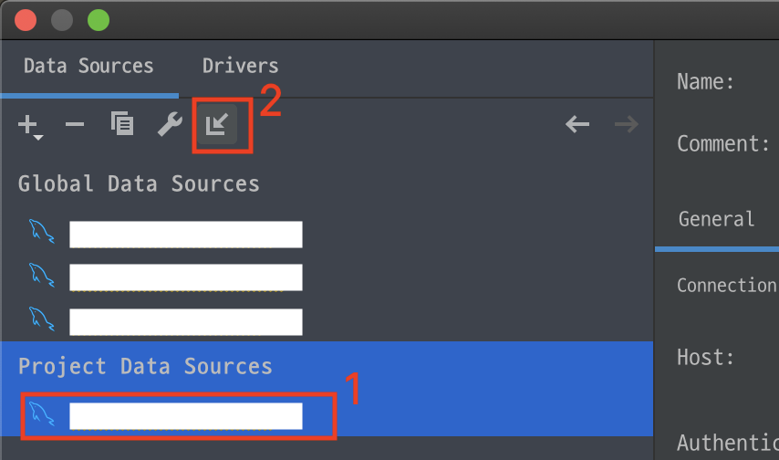

# IntelliJ에서 DataSource 공유하기

> dbtool로 [DataGrip](https://www.jetbrains.com/datagrip/?gclid=EAIaIQobChMI9LCA9-Hx8QIVQXZgCh2rzw97EAAYASAAEgJfdfD_BwE)을 사용하고 있던 와중, 인텔리제이가 버벅거려 `invalidate caches > clear file system cache and local history`로 restart를 했더니... 기존에 세팅해두었던 커넥션이 모두 날아가버렸다 ㅠ_ㅜ  
세팅해둔 정보는 프로젝트 내 `.idea`에 저장되어 있었던 것.    
처음엔 몰라서 다시 세팅하고 잘 썼는데, 또 위와 같이 날려야 하는 상황이 오자 이런 세팅에 더이상 내 노동력을 할애하고 싶지 않아서 해결법을 찾았다. ~~*는 사실 두어번 더 같은 실수를 반복했다*~~  

 

## 1

 

## 2

원하는 데이터 소스를 클릭한 후(1), 2버튼을 누르면 된다.  
그럼 해당 데이터 소스는 Global Data Sources로 등록되어, 다른 프로젝트에서도 접근할 수 있다.

 

만약 다시 local data source로 돌리고 싶다면?  
다시 해당 데이터 소스 클릭 후, 2버튼을 누르면 된다.  

  

---

  

## 참고
- [JetBrains News:: IntelliJ 기반의 IDE 에서 Data 소스를 쉽게 공유하세요](https://blog.jetbrains.com/ko/2018/05/24/intellij-ide-data/)
