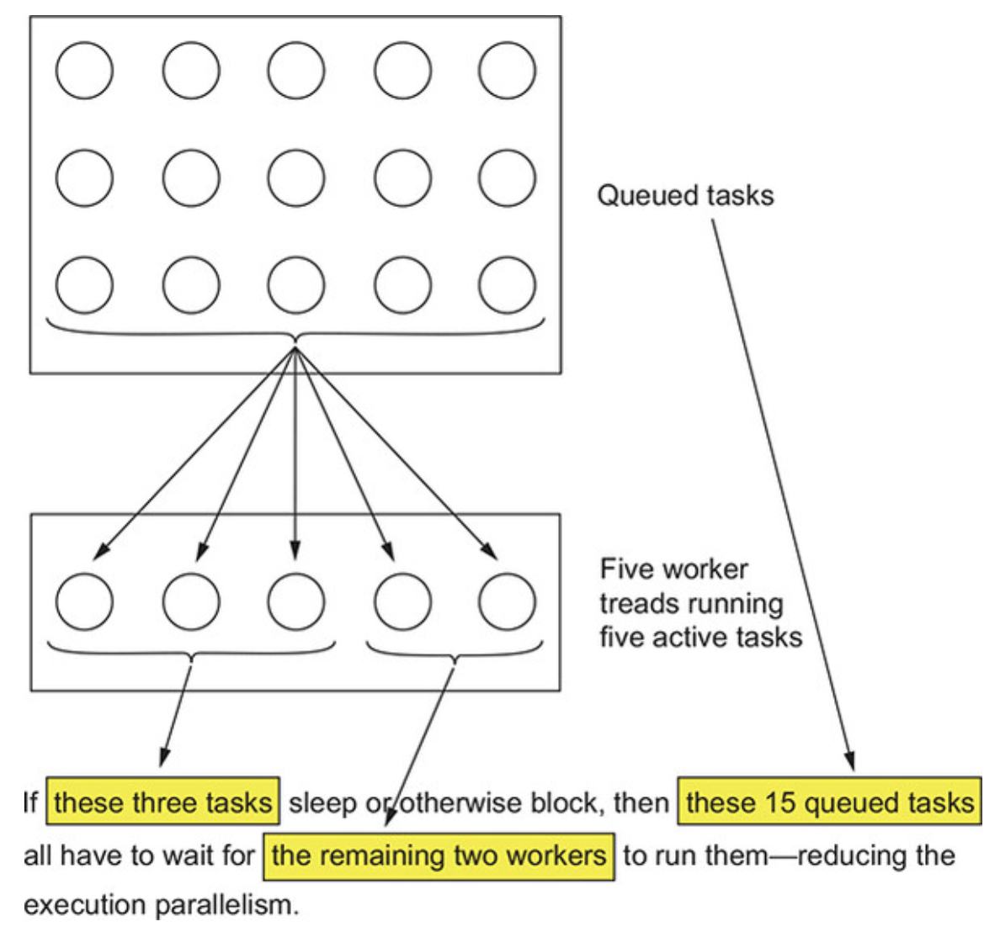
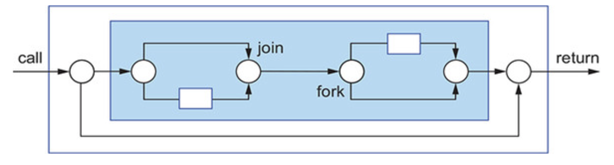
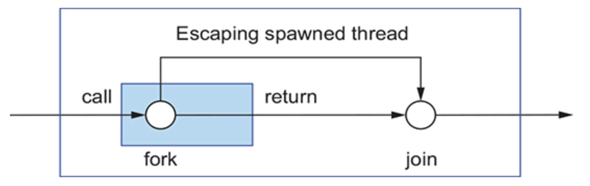
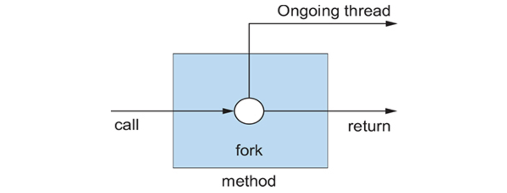
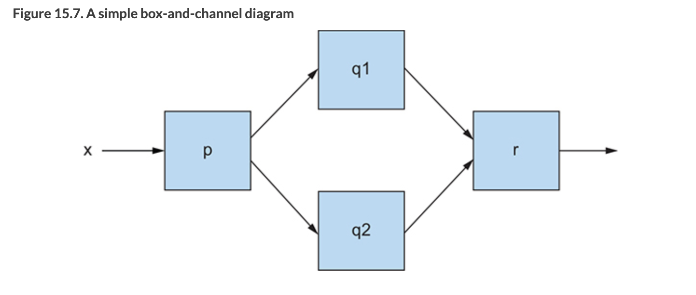
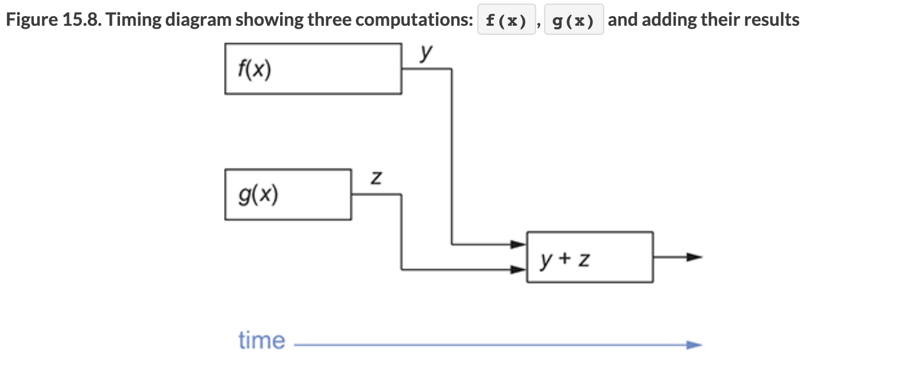
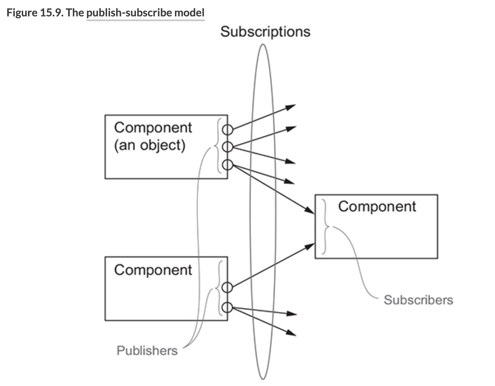

# **CH15. CompletableFuture와 리액티브 프로그래밍 컨셉의 기초**
병렬성과 동시성을 이용해 효율적인 웹 서비스를 제공할 수 있다.  

> **동시성** 
> - **한 번에 여러가지 일을 다루는 것**
>     - 작업을 동시에 실행한다는 개념이 **아님**.  
>       **여러 작업들을 작게 쪼개어 번갈아 가며 수행**하는 것!
> - 싱글코어 컴퓨터가 어떻게 멀티태스킹이 가능한지 알 수 있는 개념
> 
> **병렬성**
> - **한 번에 여러가지 일을 하는 것**
>     - 시간의 관점으로 완벽한 동시!
> - 싱글 코어에서는 불가능. 멀티 코어이거나 싱글 코어 컴퓨터가 둘 이상 존재할 때 가능

<br/>  

이번 장에서는 비동기 Futures, 발행-구독 프로토콜을 기반으로 하는 리액티브 프로그래밍과 자바 9 Flow API의 캡슐화를 포함한 내용을 다룬다.  
  
---

## **목차**
- [15.1 동시성을 구현하는 자바 support의 진화](#151-동시성을-구현하는-자바-support의-진화)
- [15.2 동기 API와 비동기 API](#152-동기-api와-비동기-api)
- [15.3 박스와 채널 모델](#153-박스와-채널-모델)
- [15.4 CompletableFuture와 콤비네이터를 이용한 동시성](#154-completablefuture와-콤비네이터를-이용한-동시성)
- [15.5 발행-구독 그리고 리액티브 프로그래밍](#155-발행-구독-그리고-리액티브-프로그래밍)
- [15.6 리액티브 시스템 vs 리액티브 프로그래밍](#156-리액티브-시스템-vs-리액티브-프로그래밍)

---

# 15.1 동시성을 구현하는 자바 support의 진화
처음에 자바는 동기화된 클래스와 메서드를 이용해 `Runnable`과 `Thread`를 lock했다.    
자바 5부터는 `ExecutorService` 인터페이스, `Callable<T>`, `Future<T>`, 제네릭 등을 지원했다. `ExecutorService`는 `Runnable`과 `Callable` 둘 다 실행할 수 있다.  
이런 기능들 덕분에 멀티코어 CPU에서 쉽게 병렬 프로그래밍을 구현할 수 있게 되었고, 이후에도 자바는 효율적인 프로그래밍이 가능하도록 동시성에 대한 지원을 개선시켰다.  
자바 7에서는 분할, 정복 알고리즘의 포크/조인 구현을 지원하는 `java.util.concurrent.RecursiveTask`가 추가되었고, 자바 8에서는 스트림, 람다에 기반한 병렬 프로세싱이 추가되었다.   
  
자바는 `Future`를 조합하는 기능<sub>(`Future`를 implements한 `CompletableFuture`)</sub>을 추가하면서 동시성을 강화했고, 자바 9에서는 분산 비동기 프로그래밍을 명시적으로 지원한다. 이들 API는 매쉬업 애플리케이션<sub>(다양한 웹 서비스의 정보를 실시간으로 조합해 User에게 제공하는 종류의 애플리케이션 등)</sub>을 개발하는데 필수적인 기초 모델과 툴킷을 제공한다. 이 과정을 **리액티브 프로그래밍**이라 부르며 자바 9에서는 발행-구독 프로토콜<sub>`java.util.concurrent.Flow`</sub>로 이를 지원한다.  
`CompletableFuture`와 `Flow`의 목표는 가능한한 **동시에 실행할 수 있는 독립적인 태스크를 만들면서** 멀티코어 혹은 여러 기기를 통해 제공되는 **병렬성을 쉽게 이용하는 것**이다.  

<br/>

## **스레드와 높은 수준의 추상화**
단일 CPU를 가진 컴퓨터는 운영체제(OS)가 각 사용자에게 프로세스 하나씩을 할당하기 때문에, 여러 사용자를 지원할 수 있다. OS는 각 사용자가 자신만의 공간에 있다고 생각할 수 있게 가상 주소 공간을 각 프로세스에게 제공한다. OS는 주기적으로 번갈아가며 각 프로세스에게 CPU를 할당하고, 프로세스는 다시 OS에 **스레드**(프로세스 자신과 같은 주소 공간을 공유하는 프로세스)를 요청하여, task를 동시 혹은 협력하여 사용할 수 있다.  
    
멀티코어 환경에서 한 명의 사용자가 하나의 사용자 프로세스만 실행한 경우, 스레드를 사용하지 않으면 해당 기기의 컴퓨팅 파워를 모두 활용할 수 없다. 각 코어는 1개 이상의 프로세스나 스레드에 할당될 수 있지만, 프로그램이 스레드를 사용하지 않는다면 효율성을 고려해 여러 프로세서 코어 중 1개만 사용할 것이기 때문이다.    
  
예를 들어 8개 코어를 가진 CPU에서는 이론적으로 프로그램을 8개의 코어에서 병렬로 실행하여, 실행 속도를 8배까지 향상시킬 수 있다(*물론 오버헤드로 인해 실제 8배가 되긴 어렵..*).     
  
아래와 같이 숫자 8,000,000개가 저장된 배열 요소를 모두 더하는 예제가 있다.    
```java
final long sum = 0;
for (int i = 0; i < 8_000_000; i++) {
    sum += stats[i];
}
```
이를 8개의 스레드를 이용해 실행시킨다면 다음과 같은 방식이 될 것이다.  
```java
// 첫번째 스레드
final long sum0 = 0;
for (int i = 0; i < 1_000_000; i++) {
    sum0 += stats[i];
}

// ... 중략

// 마지막 스레드
final long sum7 = 0;
for (int i = 7_000_001; i < 8_000_000; i++) {
    sum7 += stats[i];
}
```
메인 프로그램에선 8개의 스레드를 생성하고 `.start()`로 실행한 다음 `.join()`으로 완료될 때까지 기다렸다가 `sum0 + ... + sum7`로 총 합을 구한다.  
  
위와 같이 8개의 스레드를 관리하는 식으로 해결할 수도 있고,  
아래와 같이 stream으로 손쉽게 병렬성을 이용할 수도 있다. 
```java
final long sum = Arrays.stream(stats).parallel().sum();
```
Stream은 외부 반복(명시적 루프) 대신 **내부 반복**을 통해 병렬성을 쉽게 사용할 수 있도록 한다. 즉 병렬 스트림 반복은 명시적으로 스레드를 사용하는 것( == 직접 8개의 스레드를 사용하여 해결하는 것)에 비해 **높은 수준의 개념**(== **추상화**)이며, 이는 스레드 사용을 추상화하여 제공한다는 뜻이다.     

  
> *추상화되었기에 지저분한 코드는 라이브러리 내부로 구현되어 **복잡성이 줄어**든다.*    

<br/>
  
자바 7부터는 `RecursivceTask`지원 덕분에 `포크/조인` 스레드 추상화로 `분할/정복 알고리즘`을 병렬화하여 멀티코어 머신에서 효율적으로 배열의 합을 연산할 수 있다.  
이를 알아보기에 앞서, 스레드 추상화의 기반 개념에 해당하는 자바 5의 `ExecutorService`개념과 스레드 풀을 알아보자.  
  
<br/>

## **`Executor`와 스레드 풀**
자바 5는 `Executor`프레임워크와 thread pool을 통해 thread의 힘을 높은 수준으로 끌어올리는 (== 프로그래머가 task 제출과 실행을 분리할 수 있는) 기능을 제공했다.   

### **스레드의 문제**
자바 스레드는 직접 OS 스레드에 접근한다. OS 스레드를 만들고 종료하려면 비싼 비용(페이지 테이블과 관련한 상호작용)을 치러야 하며, OS 스레드의 개수는 제한되어 있다. OS가 지원하는 스레드 수를 초과해 사용하면 자바 애플리케이션이 예상치 못한 방식으로 크래시될 수 있으므로, 기존 스레드가 실행되는 상태에서 계속 새로운 스레드가 만들어지는 상황이 없도록 해야한다.     
  
### **스레드 풀이 더 좋은 이유**
자바의 `ExecutorService`는 task를 제출하고 나중에 결과를 돌려받을 수 있는 인터페이스를 제공한다. 프로그램은 `newFixedThreadPool`같은 팩토리 메서드 중 하나를 이용해 스레드 풀을 만들어 사용할 수 있다.  
```java 
package java.util.concurrent;

public class Executors {
    public static ExecutorService newFixedThreadPool(int nThreads) { // nThreads는 생성할 스레드 개수
        return new ThreadPoolExecutor(nThreads, nThreads, 0L, TimeUnit.MILLISECONDS, new LinkedBlockingQueue());
    }
    // ...
}
```

```java
// 실제 사용 시                
final ExecutorService executorService = Executors.newFixedThreadPool(5);    // 5개 스레드 만들겠다는 뜻
```

이 메서드는 워커 스레드를 포함한 `ExecutorService`를 만들고 이를 스레드 풀에 저장한다. 스레드 풀에서 놀고 있던 스레드에 할당된 task를 먼저 온 순서대로 실행하고, 이 task 실행이 종료되면 스레드는 다시 풀에 반납된다. 이 방식의 장점은 하드웨어 스레드에 맞는 수의 task를 유지함과 동시에 수 천개의 task를 스레드 풀에 아무 오버헤드 없이 할당할 수 있다는 점이다. 이 때 task는 `Runnable`이나 `Callable`의 형태이다.  
즉 프로그래머가 **task**(`Runnable`이나 `Callable`)을 제공하면 **스레드가 이를 실행**한다.   
    
### **스레드 풀을 이용할 때 주의해야 할 사항**
대부분 스레드를 직접 사용하는 것보다 스레드 풀을 이용하는 것이 바람직하지만, 다음 2가지 사항은 주의해야 한다.  
- k개의 스레드를 가진 스레드 풀은 오직 k개만큼의 스레드를 동시에 실행할 수 있다. 스레드 수보다 초과로 할당된 task는 큐에 저장되며, 이전에 실행 중인 task가 종료되어 노는 스레드가 발생하기 전까지는 스레드에 할당되지 않는다. 이때 `잠을 자거나`, `I/O를 기다리거나`, `네트워크 연결을 기다리는` task가 있다면 주의해야 한다. 이는 *블록된 상황*이고 이들 task가 워커 스레드에 할당되어 있지만 실제로는 아무 작업도 하지 않고 있으며 나머지 task들은 이들을 기다리고 있는 상황인 것이다. 혹여 먼저 실행된 task가 나중에 실행된 task의 결과를 기다리는 상황(`Future`의 일반적인 패턴)이라면 *데드락에 걸릴 수도 있다*.     

    > *블록 상황에 놓일 수 있는 task는 스레드 풀에 할당하지 않는 게 best....*  
- 자바 프로그램은 중요한 코드를 실행하는 스레드가 죽는 일이 발생하지 않도록 `main`이 반환되기 전에 모든 스레드의 작업이 끝나길 기다린다. 따라서 프로그램을 종료하기 전에 모든 스레드 풀을 종료하는 습관을 가져야 한다.  
장기간 실행하는 인터넷 서비스를 관리할 수 있도록, 자바는 `Thread.setDaemon()`을 제공하여 이런 상황을 다룰 수 있게 지원한다.

<br/>

## **스레드의 다른 추상화 : 중첩되지 않은 메서드 호출**
CH7(병렬 스트림 처리와 포크/조인 프레임워크)에서 설명한 동시성은  
task나 스레드가 메서드 호출 안에서 시작되면, 작업이 끝날 때까지 그 메서드 호출은 반환되지 않고 기다렸다. 스레드 생성과 `join()`이 한 쌍처럼 중첩된 메서드 호출 내에 존재하였다. 이를 **엄격한**<sub>strict</sub> **포크/조인**이라 부른다.   
  
> | → | ⃝ | ☐ |
> |--|--|--|
> | 스레드 | 포크, 조인 | 메서드의 호출, 반환 |
  

    
<br/>
  
시작된 task를 내부 호출이 아니라 외부 호출에서 종료하도록 기다려, 좀 더 여유로운 방식의 포크/조인을 사용해도 비교적 안전하다.   

   
이번 CH15에서는 아래 그림처럼 사용자의 메서드 호출에 의해 스레드가 생성되고, 메서드를 벗어나 계속 실행되는 **동시성** 형태에 초점을 둔다.   
 

메서드가 호출되면 바로 리턴되고, 그 사이 메서드 내에서 만들어진 task 실행이 계속되는 메서드를 **비동기 메서드**라 한다.   
이들 메서드를 사용할 때는 다음 사항을 주의해야 한다. 
- 스레드 실행은 메서드를 호출한 다음, 코드와 동시에 실행되므로 데이터 race condition(경쟁 문제)를 일으키지 않도록 주의해야 한다.
- 기존 실행 중이던 스레드가 종료되지 않은 상태에서 `main()`이 종료되면 어떻게 될까?
    - 애플리케이션을 종료하지 못하고 모든 스레드가 실행을 끝낼 때까지 기다린다.
    - 애플리케이션 종료를 방해하는 스레드를 강제종료(kill)시키고, 애플리케이션을 종료한다.  
    > 문제는.. 위 2가지 방법 모두 안전하지 못하다.  
    > 깜빡하고 있던 종료되지 않은 스레드에 의해 애플리케이션이 크래시될 수도 있고,   
    > 디스크에 쓰기 I/O 작업을 시도하는 일련의 작업을 중단했을 때 이로 인해 외부 데이터의 일관성이 파괴될 수도 있다.   
    > ==> 이들 문제를 피하려면 애플리케이션에서 만든 모든 스레드를 추적하고, 애플리케이션을 종료하기 전에 스레드 풀을 포함한 모든 스레드를 종료하는 것이 좋다!    
  
자바 스레드는 `setDaemon()`을 이용해 데몬/비데몬을 구분시킬 수 있다. 데몬 스레드는 애플리케이션이 종료될 때 강제 종료되므로, 디스크의 데이터 일관성을 파괴하지 않는 동작을 수행할 때 유용하다. 반면 `main()`은 모든 비데몬 스레드가 종료될 때까지 기다린다.  
  
<br/>

## **스레드에 무엇을 바라는가?**
일반적으로 모든 하드웨어 스레드를 활용해 **병렬성의 장점을 극대화 하도록** 프로그램 구조를 만드는 것. 즉, **프로그램을 작은 태스크 단위로 구조화하는 것**이 목표이다.   
  
<br/><br/>

---

<br/><br/>

# 15.2 동기 API와 비동기 API   
CH7에서는 자바 8의 Stream을 이용해 명시적으로 병렬 하드웨어를 이용할 수 있음을 살펴봤다. Stream의 `parallel()`메서드를 이용하여 손쉽게 **병렬성**을 이용할 수 있었다.   

아래 코드를 보자.
```java
int f(int x);
int g(int x);
```
```java
int y = f(x);
int z = g(x);
System.out.println(y + z);
```      

`f`와 `g` 메서드는 물리적 결과를 반환하므로 **동기 API**라고 부른다.   
`f`와 `g`를 실행하는데 오랜 시간이 걸린다고 가정하고, 두 작업 사이에 상호작용이 없는 상태라면 각각의 메서드를 별도의 CPU 코어로 실행하여 로직 수행 시간을 `max(time(f), time(g))`가 되도록 단축할 수 있다.   
```java
public static void main(String[] args) throws InterruptedException {
    int x = 1000;   
    final Result result = new Result();

    final Thread t1 = new Thread(() -> result.left = f(x));
    final Thread t2 = new Thread(() -> result.right = g(x));
    t1.start();
    t2.start();
    t1.join();
    t2.join();
    System.out.println(result.left + result.right);
}

private static class Result {
    private int left;
    private int right;
}
```

<br/>

`Runnable`<sub>`public Thread(Runnable target)`</sub> 대신 `Future` API 인터페이스를 이용해 만들 수도 있다.  
```java
import java.util.concurrent.ExecutionException;
import java.util.concurrent.ExecutorService;
import java.util.concurrent.Executors;
import java.util.concurrent.Future;

public class ExecutorServiceExample {
    public static void main(String[] args) throws ExecutionException, InterruptedException {
        final int x = 1000;

        final ExecutorService executorService = Executors.newFixedThreadPool(2);    // 2개 스레드를 생성함
        final Future<Integer> y = executorService.submit(() -> f(x));
        final Future<Integer> z = executorService.submit(() -> g(x));
        System.out.println(y.get() + z.get());

        executorService.shutdown();
    }
    // 생략
}
```
위 코드에는 `submit(Callable<T> task)`처럼 불필요한 코드가 존재하고 있다.. 이는 **비동기 API**로 바꿔서 해결할 수 있다!    
> 자바 5의 `Future`와 자바 8의 `CompletableFuture`을 조합하여 해결하는 방법을 [CH15.4](#154-completablefuture와-콤비네이터를-이용한-동시성)와 CH16에서,  
> 발행-구독 프로토콜에 기반한 자바 9의 `java.util.concurrent.Flow`인터페이스를 이용하여 해결하는 방법을 [CH15.5](#155-발행-구독-그리고-리액티브-프로그래밍) 와 CH17에서 알아볼 예정이다. 

지금은 먼저 Future 형식과 리액티브 형식을 이용해 해결해 보자.   

<br/>

## **`Future` 형식 API**
먼저 `f`와 `g`의 리턴타입을 변경시키자.  
```java
Future<Integer> f(int x);
Future<Integer> g(int x);
```
  
그럼 다음과 같이 호출을 바꿀 수 있다.  
```java
public static void main(String[] args) throws ExecutionException, InterruptedException {
    final int x = 1000;

    final Future<Integer> y = f(x);
    final Future<Integer> z = g(x);
    System.out.println(y.get() + z.get());
}
```
  
이제 메서드 `f`, `g`는 호출 즉시 자신의 원래 바디를 평가하는 task를 가지고 있는 `Future`를 리턴한다. 그리고 `get()`을 이용해 두 `Future`가 완료되어 결과가 합쳐지기를 기다린다.  
  
> :warning: `TODO`
> - *책에서 뭘 의도하려고 한 것인지 잘 모르겠음 :thinking: 위 코드는 스레드를 할당하거나 하지 않아서 블록킹된 상태로 순차진행됨.*   
    
<br/>

## **리액티브 형식 API**
이번엔 `f`, `g`의 시그니처를 바꿔, 콜백 형식 프로그래밍을 이용해보자.  
> 이 책에서의 콜백: 메서드가 반환된 **이후에** 호출될 수 있는 람다나 메서드 참조를 뜻함  

```java
void f(int x, IntConsumer dealWithResult)
```

리턴이 `void`인데 `f`를 통해 어떻게 결과를 받는다는 것일까?!  
`f`메서드에 추가 파라미터로 콜백을 전달(`IntConsumer`를 람다 형태로 전달)하여, `f`의 바디에서 `return`을 통해 결과를 반환하는 것이 아니라, 결과가 준비되면 이를 람다로 호출하는 task를 만드는 구조이다! (`IntConsumer`는 `int`타입을 파라미터로 받아 void를 리턴 ==> `int -> void`)      

```java
public class CallbackStyleExample {
    public static void main(String[] args) {
        final int x = 1000;

        final Result result = new Result();

        f(x, (int temp) -> {
            result.left = temp;
            System.out.println(result.left + result.right);     // 2000
        });
        g(x, (int temp) -> {
            result.right = temp;
            System.out.println(result.left + result.right);     // 3001
        });
    }

    private static class Result {
        private int left;
        private int right;

        public int getLeft() {
            return left;
        }

        public void setLeft(final int left) {
            this.left = left;
        }

        public int getRight() {
            return right;
        }

        public void setRight(final int right) {
            this.right = right;
        }
    }

    private static void f(int x, IntConsumer dealWithResult) {
        dealWithResult.accept(x * 2);
    }

    private static void g(int x, IntConsumer dealWithResult) {
        dealWithResult.accept(x + 1);
    }
}
```
    
하지만 결과가 달라진다!  
`f`, `g` 의 호출 합계를 정확하게 출력하지 않고, 상황에 따라 먼저 계산된 결과를 출력한다. lock을 사용하지 않으므로 값을 두 번 출력할 수 있을 뿐더러 때로는 `+`에 제공된 두 피연산자가 `println`이 호출되기 전에 업데이트될 수도 있다.     
  
이 문제는 아래 2가지 방법으로 보완할 수 있다.    
- `if-then-else`를 이용해 적절한 lock으로 두 콜백이 모두 호출되었는지 확인한 다음 `println`한다.
- 리액티브 형식의 API는 보통 한 결과가 아니라 일련의 이벤트에 반응하도록 설계되었으므로 `Future`를 이용하는 것이 더 적절하다.  
    > - 리액티브 형식의 비동기 API는 자연스럽게 일련의 값(나중에 스트림으로 연결)을 처리하는 데 적합.  
    > - `Future` 형식의 API는 일회성의 값을 처리하는 데 적합하다.  

위 2가지 대안은 코드를 더 복잡하게 만들 수는 있지만, (명시적으로 스레드를 처리하는 코드에 비해) 사용 코드를 더 단순하게 만들어주며 높은 수준의 구조를 유지할 수 있도록 도와준다. 그리고 애플리케이션의 효율성을 크게 향상시킬 수 있다.  

<br/>

## **잠자기(그리고 기타 블로킹 동작)는 해로운 것으로 간주**
`sleep` 메서드를 사용하는 등으로 스레드를 잠자게 할 수 있는데, 문제는 **스레드는 잠들어도 시스템 자원을 점유한다**는 것이다. 스레드를 많이 사용하고 그 중 대부분이 잠을 잔다면 문제는 심각해진다.  
스레드 풀에서 잠을 자는 task는 다른 task가 시작되지 못하게 막고 있는 것이며, 이는 자원을 소비한다는 사실을 기억하자 (OS가 이들 task를 관리하므로, 일단 스레드로 할당된 task를 중지시키지는 못한다 :scream: ).  
잠자는 스레드 외에, 블록 동작도 스레드의 실행을 막는다. 다른 task가 어떤 동작을 완료하길 기다리거나(e.g. `Future`의 `get()` 호출), 외부 상호작용을 기다리는 동작들(e.g. 네트워크/DB 서버 등에서 읽기 작업을 기다리거나, 키보드 입력과 같이 사람의 상호작용을 기다리는 작업 등)이 그 예이다.   
     
이런 상황에서 할 수 있는 일은?
이상적으로는 절대 task에서 기다리는 일을 만들지 않거나, 아니면 코드에서 예외를 일으키는 방법으로 처리할 수도 있다. task를 앞/뒤 두 부분으로 나누고 블록되지 않을 때만 뒷부분을 자바가 스케줄링하도록 요청할 수 있다.  

- ### 예제 A: 한 개의 작업을 갖는 코드

```java
public static void main(String[] args) throws InterruptedException {
    work1();
    Thread.sleep(10000);
    work2();
    work3();
}
```

- ### 예제 B: task를 나누어 스케줄링을 추가한 코드

```java
public class ScheduledExecutorServiceExample {
    public static void main(String[] args) {
        final ScheduledExecutorService scheduledExecutorService = Executors.newScheduledThreadPool(1);

        work1();

        scheduledExecutorService.schedule(ScheduledExecutorServiceExample::work2, 10, TimeUnit.SECONDS);
        // work1()이 끝난 다음, 10초 뒤에 work2()를 개별 task로 스케줄함

        work3();
        // work2가 다른 스레드에서, 10초 후에, 작업을 하기 때문에 work1이 끝난 후 work3의 로그가 곧바로 찍힌다. 

        scheduledExecutorService.shutdown();
    }

    public static void work1() {
        System.out.println("Hello from Work1 ==> " + Thread.currentThread().getName());
    }
    public static void work2() {
        System.out.println("Hello from Work2 ==> " + Thread.currentThread().getName());
    }
    public static void work3() {
        System.out.println("Hello from Work3 ==> " + Thread.currentThread().getName());
    }
}
```

```bash
// 결과
Hello from Work1 ==> main
Hello from Work3 ==> main               
Hello from Work2 ==> pool-1-thread-1    // work1의 로그가 찍힌 후 10초 후에 이 로그가 찍힘
```

세 task 모두 thread pool에서 실행된다고 가정하자.  
먼저 `예제 A`의 코드를 살펴보자. 코드는 스레드 풀 큐에 추가되며, 차례가 되면 실행된다. `work1()`이 실행되고 완료된 후, 이 이후 코드 실행 차례가 되면 워커 스레드를 점유한 상태에서 아무것도 하지않고 10초동안 잠들 자게 된다. 10초 후 깨어나서 `work2()`, `work3()`를 차례대로 실행한 다음, 작업을 종료하고 워커 스레드를 해제한다.     
`예제 B` 코드는 `work1()`을 실행한다. 그리고 `work2()`가 10초 후에 실행될 수 있도록 큐에 추가한다. 그러고나서 `work3()`이 실행된다.  
      
`예제 A`와 `예제 B`는 둘 다 같은 동작<sub>(`work1`이 수행된 후 10초간 잠들기)</sub>을 수행하지만, `예제 A`에서는 자는 동안 귀중한 스레드 자원을 점유하는 반면(10초동안 아무 작업도 실행되지 못함), `예제 B`는 **다른 작업이 실행될 수 있도록 허용한다는 점**이 다르다.     
  
task를 만들 땐 이런 특징을 잘 활용해야 한다. task를 block하기보단, 다음 작업을 task로 제출하고 현재 task는 종료하는 것이 바람직하다.  
  
I/O 작업에도 이 원칙을 적용하는 것이 좋다. 읽기 작업을 기다리지 않고, block하지 않는 `읽기 시작`메서드를 호출하고 // 읽기 작업이 끝나면 이를 처리할 다음 task를 런타임 라이브러리에 스케줄하도록 요청하고 종료한다.  
  
물론 이런 디자인 패턴을 따르려면 코드가 복잡하거나 어려워 보일 수 있다. 하지만 앞으로 다룰 `CompletableFuture`인터페이스는 `Future#get`을 이용해 (명시적으로 block하지 않고) 콤비네이터를 사용함으로, 복잡한 형식의 코드를 런타임 라이브러리 내에 추상화한다 :sunglasses:   
  
만약 스레드의 제한이 없고, 스레드 스위칭 비용이 저렴하다면 `예제 A`나 `예제 B` 코드는 사실상 동일한 퍼포먼스라 보면 된다. 하지만 스레드라는 것은 제한이 있기 마련이고, 저렴하지 않기 때문에 잠을 자거나 block해야할 여러 task가 존재한다면 가능한한 `예제 B`형식을 따르는게 좋다.  

<br/>

## **현실성 확인**
새로운 시스템을 설계할 때, block할 수 있는 모든 동작을 비동기 호출로 구현한다면 병렬 하드웨어를 최대한 활용할 수 있을 것이다. 하지만 이는 현실적으로는 어렵다.   
모든 API를 비동기로 만드는 것 대신, 자바의 개선된 동시성 API을 검토해보고 이를 이용해보길 권장한다.   
네트워크 서버의 block/non-block API를 일관적으로 제공하는 [Netty](https://netty.io/)같은 라이브러리를 사용해보는 것도 도움이 된다.  

<br/>

## **비동기 API에서 예외는 어떻게 처리하는가?**
메서드 수행 도중 예상치 못한 일이 일어나면, 예외를 발생시켜 다른 동작이 실행되게 해야 한다.  
  
`Future`나 리액티브 형식의 비동기 API에서 호출된 메서드의 실제 바디는, 별도의 스레드에서 호출되며 이때 발생하는 어떤 에러는 이미 호출자의 실행 범위와는 관계없는 상황이 된다. 이럴 때 `Future`를 구현한 `CompletableFuture`에서는 `get()` 런타임에 예외처리를 할 수 있는 기능을 제공하며, 예외에서 회복할 수 있도록 `exceptionally()`같은 메서드도 제공한다(*CH16에서 다룰 예정*).   
  
리액티브 형식의 비동기 API에서는 `return` 대신 기존 콜백이 호출되므로 예외가 발생했을 때 실행될 추가 콜백을 만들어 인터페이스를 바꿔야 한다.   
아래 코드처럼 리액티브 API에 여러 콜백을 포함시킬 수 있다.                           
```java
void f(int x, Consumer<Integer> dealWithResult, Consumer<Throwable> dealWithException);
```
그럼 `f`의 바디는 다음을 수행할 수 있다. 
```java
dealWithException(e);
```

위 `f`처럼 콜백이 여러 개면, 이를 따로 제공하는 것보다 하나의 객체로 이 메서드를 감싸는 것이 좋다. 자바 9의 `Flow` API에서는 여러 콜백을 한 객체로 감싼 `Subscriber<T>`<sub>4개의 콜백 각각을 대표하는 4개의 메서드를 포함한 클래스</sub>를 제공한다.   
```java
package java.util.concurrent;

public final class Flow {
    // ...
    public static interface Subscriber<T> {
        public void onSubscribe(Subscription subscription);
        public void onNext(T item);                 // 값이 있을 때
        public void onError(Throwable throwable);   // 도중에 에러 발생했을 때
        public void onComplete();                   // 값을 다 소진했거나, 에러가 발생해서 더 이상 처리할 데이터가 없을 때
    }
    // ...
}
```

위 `f`에 이를 적용하면, 아래와 같이 시그니처가 바뀐다.
```java
void f(int x, Subscriber<Integer> s);
```
이제 `f`의 바디는 다음처럼 <sub>`Throwable` 타입인</sub>`t`로 예외가 발생했음을 가리키게 된다.  
```java
s.onError(t);
```
  
<br/><br/>

---

<br/><br/>

# 15.3 박스와 채널 모델
박스와 채널 모델(box-and-channel model)을 이용하면 **동시성** 모델을 잘 도식화할 수 있다.  
박스와 채널 모델을 이용해 생각과 코드를 구조화할 수 있으며, 대규모 시스템 구현의 추상화 수준을 높일 수 있다.  


위 그림을 코드를 구현해보자.    

#### **1. 하드웨어 병렬성을 활용하지 못한 코드**
```java
int t = p(x);
System.out.println( r(q1(t), q2(t)) );
```
`q1`과 `q2`를 차례대로 호출하기 때문에, 이는 병렬성과 거리가 멀다.   
    
#### **2. `Future`를 이용해 병렬로 수행하는 코드**
```java
int t = p(x);
Future<Integer> a1 = executorService.submit(() -> q1(t));
Future<Integer> a2 = executorService.submit(() -> q2(t));
System.out.println( r(a1.get(), a2.get()) );
```
다이어그램에 따라 `p`와 `r`은 `Future`로 감싸지 않았다. `p`는 다른 어떤 작업보다 먼저 처리해야 하고 `r`은 모든 작업이 끝난 후 가장 마지막으로 처리해야 한다. 
```java
System.out.println( r(q1(t), q2(t)) + s(x) );
```    
위 코드에서 병렬성을 극대화하려면 모든 다섯 함수(`p`, `q1`, `q2`, `r`, `s`)를 `Future`로 감싸야 하기 때문에 초기에 우리가 원했던 작업과는 거리가 있다..?  

<br/>

> :warning: `TODO` 
> - *갑자기 `s`는 왜 튀어나온 것인지? 위 박스 모델 외 다른 진행되어야 하는 작업을 뜻하는 것일까* 
> - *`r(a1.get(), a2.get())`*  이 코드가 원하던 작업이 아닌가?  

<br/>

#### **3. 콤비네이터를 이용해 해결하기**
```java
p.thenBoth(q1,q2).thenCombine(r)
```
이런 식으로 구현하면 초기에 원했던 작업이 된다. 이때 `thenBoth`, `thenCombine`를 사용한 부분은 실제로 콤비네이터<sub>combinators</sub>와  `CompletableFuture`를 이용해 비슷하게 구현해볼 수 있다. 이에 대해선 CH15.4에서 이어서 살펴본다.  
   
병렬성을 극대화하기 위해서는 모든 함수를 `Future`로 감싸는게 좋지만, 많은 task가 `Future`의 `get()`메서드를 호출하면 `Future`가 끝나기만을 기다리는 상태에 놓일 수 있어, 결과적으로 하드웨어의 병렬성을 제대로 활용하지 못하거나 데드락에 걸릴 수 있다.     
이 문제 역시 CH15.4에서 다룰 `CompletableFuture`와 `Combinators`를 이용해 해결할 수 있다.   
    
<br/><br/>

---

<br/><br/>

# 15.4 `CompletableFuture`와 콤비네이터를 이용한 동시성
자바 8은 `Future`의 구현체인 `CompletableFuture`를 이용해 `Future`를 조합할 수 있는 기능을 추가했다.  
일반적으로 `Future`는 `get()`으로 결과를 얻을 수 있는 `Callable`로 만들어진다. 하지만 `CompletableFuture`는 실행할 코드 없이 `Future`를 만들 수 있도록 허용하며, `complete()`을 이용해 나중에 다른 스레드가 이를 완료할 수 있고, `get()`을 통해 값을 얻을 수 있도록 한다. 그래서 `Future`를 조합<sub>compose</sub>한 구현체이지만 `CompletableFuture`라고 부른다.  

아래 코드로 `f(x)`와 `g(x)`를 동시에 실행하여 둘의 합계를 구할 수 있다.   
```java  
public class CFComplete {
    public static void main(String[] args) throws ExecutionException, InterruptedException {
        final ExecutorService executorService = Executors.newFixedThreadPool(10);
        final int x = 1000;
        
        final CompletableFuture<Integer> a = new CompletableFuture<>();
        executorService.submit(() -> a.complete(Functions.f(x)));

        final int b = Functions.g(x);

        System.out.println(a.get() + b);
        
        executorService.shutdown();
    }
}

class Functions {
    public static int f(int x) {
        return x * 2;
    }

    public static int g(int x) {
        return x + 1;
    }
}
```
  
위 코드는 `f(x)`의 실행이 끝나지 않은 상황에서 `get()`을 기다려야 하므로 프로세싱 자원이 낭비될 수도 있다.     
  
#### ***`f(x)`, `g(x)`를 실행하는 두 개의 활성스레드가 있을 때, 한 스레드는 다른 스레드가 return문을 실행해 종료할 때까지 기다렸다가 시작한다. 이 상황에서 스레드를 더 완벽하게 활용하려면 어떻게 구현해야 할까?***    
`f(x)`를 실행하는 태스크 1, `g(x)`를 실행하는 태스크 2, 합계를 계산하는 태스크 3(앞선 2개의 태스크를 재활용할 수도 있다) 이렇게 3개를 이용하는 것이다. 하지만 처음 2개의 태스크가 실행되기 전까지 태스크 3은 실행할 수 없다. 자바로 이 문제를 어떻게 해결할 수 있을까?  
==> `Future`를 조합해 이 문제를 해결할 수 있다.  

위 자원 낭비 상황은 `CompletableFuture#thenCombine()`을 이용해 두 연산 결과를 효과적으로 해결할 수 있다.    

```java
public class CompletableFuture<T> implements Future<T>, CompletionStage<T> {
    ...
    public <U,V> CompletableFuture<V> thenCombine(
        CompletionStage<? extends U> other,
        BiFunction<? super T,? super U,? extends V> fn
    ) {
        return biApplyStage(null, other, fn);
    }
    ...
}
```

이 메서드는 두 개의 `CompletableFuture`값(`T`, `U` 결과 형식)을 받아 한 개의 새 값(`V` 결과 형식)을 만든다.    
    
```java  
public class CFComplete {
    public static void main(String[] args) throws ExecutionException, InterruptedException {
        final int x = 1000;
        final ExecutorService executorService = Executors.newFixedThreadPool(10);
        final CompletableFuture<Integer> a = new CompletableFuture<>();
        final CompletableFuture<Integer> b = new CompletableFuture<>();

        final CompletableFuture<Integer> c = a.thenCombine(b, Integer::sum);

        executorService.submit(() -> a.complete(Functions.f(x)));
        executorService.submit(() -> b.complete(Functions.g(x)));

        System.out.println(c.get());

        executorService.shutdown();
    }
}

class Functions {
    public static int f(int x) {
        return x * 2;
    }

    public static int g(int x) {
        return x + 1;
    }
}
```

두 작업(`a`, `b`)이 모두 끝나면, `a`의 결과와 `b`의 결과를 `Integer::sum`(`(i, j) -> i + j`)에 적용하고 블록하지 않은 상태로 결과 `Future`를 반환한다.     
`thenCombine`이 핵심이다.  
`Future a`와 `Future b`를 알지 못하는 상황에서 `thenCombine`은 두 연산이 끝났을 때 스레드 풀에서 실행된 연산을 만든다. 세 번째 연산 `c`는 다른 두 작업이 끝날 때까지는 스레드에서 실행되지 않는다(먼저 시작해서 **블록되지 않는 점이 특징**).  따라서 앞선 코드에서 발생했던 불록 문제는 발생하지 않는다. `Future`의 연산이 두 번째로 종료되는 상황에서 실제 필요한 스레드는 1개지만, 스레드 풀의 2개의 스레드는 여전히 활성 상태이다(아래 그림 참고). 

앞선 블록된 상황의 버전에서 `a`와 `b`의 결과를 더하려는 연산은 `f(x)` 또는 `g(x)`를 실행(블록될 가능성이 있는)한 동일한 스레드에서 수행했다. 반면 `thenCombine`은 `f(x)`와 `g(x)`가 끝난 다음에야 덧셈 계산이 실행된다.  

<br/>

> *결국 `.get`을 하는 부분은 이전 연산(`a`)이 실행 완료되기 전까진 새로운 스래드를 할당받지 않는다는 것. block되는 코드는 이전 연산 완료 여부와 상관없이 `.get`을 하기 때문에 거기에 스레드가 할당돼서 블락되어버리고(이전 연산(`a`)이 끝날 때까지)..* 

<br/>

상황에 따라서 `get()`을 기다리는 스레드가 큰 문제가 되지 않을 수도 있어 `Future`를 이용한 방식으로 해결해도 된다. 하지만 만약 많은 수의 `Future`를 사용해야 하는 경우엔 `CompletableFuture`와 콤비네이터를 이용해 `get()`을 블록하지 않도록 해 병렬 실행의 효율성은 노ㅠ이고 데드락은 피하는 해결책으로 구현할 수 있다.  

<br/><br/>

---

<br/><br/>

# 15.5 발행-구독 그리고 리액티브 프로그래밍
`Future`와 `CompletableFuture`는 독립적 실행과 병렬성이라는 정식적 모델에 기반한다. 연산이 끝나면 `get()`으로 `Future`를 얻을 수 있다. 따라서 `Future`는 **한 번만 실행**해 결과를 제공한다.    
       
반면 리액티브 프로그래밍은 `Future`같은 객체 여럿을 통해 한 번이 아닌 여러 결과를 제공한다.  
- e.g. 실시간으로 바뀌는 온도를 보여주는 온도계
    - 특정 시간단위로 (변화된)온도 값을 반복적으로 제공
- e.g. 웹 서버 컴포넌트 응답을 기다리는 리스너 객체
    - 네트워크에 HTTP 요청이 발생하길 기다렸다가, 이후 결과 데이터를 생산
- 위 두 예시에서 공통인 부분
    - 온도계는 온도가 변화했을 때를 감지하고 이에 반응하며, 리스너는 요청이 오면 이에 반응한다.  
        - 둘 다 반응<sub>react</sub>하는 부분이 존재한다.  
    - 한 번의 결과가 아닌 여러 번의 결과가 존재
  
> *위 케이스에서 스트림이 떠올릴 수도 있으나, 스트림은 값을 분리(fork 처럼)하기 어려우며 2개로 분리된 스트림에서 다시 결과를 합치기(join 처럼)도 어렵다. 스트림은 선형적인 파이프라인 처리 기법에 알맞다.*    
      
자바 9에서는 `java.util.concurrent.Flow`의 인터페이스에 발생-구독 모델(pub-sub 프로토콜)을 적용해 리액티브 프로그래밍을 제공한다. CH17에서 더 살펴볼 예정이며, `Flow`는 다음과 같이 정리할 수 있다.  
- **구독자**<sub>subscriber</sub>가 구독할 수 있는 **발행자**<sub>publisher</sub>
- 이 연결을 **구독**<sub>subscription</sub>이라 한다
- 이 연결을 이용해 **메시지**(혹은 **이벤트**)를 전송한다
      
        

위는 `구독`을 채널로, `publisher`와 `subscriber`를 box로 표현한 그림이다. 여러 component가 하나의 `구독자`로 구독할 수 있고, 하나의 component가 여러 개별 stream을 발행할 수 있으며, 한 component는 여러 `구독자`에 가입할 수 있다.  

<br/>

## **두 Flow를 합치는 예제**
두 정보 소스로부터 발생하는 이벤트를 합쳐서 다른 subscriber가 볼 수 있도록 publish하는 예를 통해 발행-구독의 특징을 간단하게 확인해보자.   
이 예제는 엑셀에서 `C3`셀에 `=C1+C2`라는 수식을 넣어두는 방식과 동일하다. `C1`이나 `C2`의 값이 갱신되면 `C3`에도 새로운 값이 반영된다.  

먼저 `Cell`클래스를 만들어 셀 2개를 초기화해보자.  
```java
public class Cell {
    private int value = 0;
    private String name;

    public Cell(final String name) {
        this.name = name;
    }
}
```

```java
public static void main(String[] args) {
    final Cell c1 = new Cell("C1");
    final Cell c2 = new Cell("C2");
}
```

이제 `c1`이나 `c2`의 값이 바뀌었을 때 `c3`가 두 값을 더하도록 만들어보자. 그럴려면 `c1`이나 `c2`에 이벤트가 발생했을 때 `c3`가 구독하도록 만들어야 한다.    

이벤트 발행을 위해 인터페이스 `Publisher<T>`가 필요하다.   
```java
public final class Flow {
    ...
    @FunctionalInterface
    public static interface Publisher<T> {
        public void subscribe(Subscriber<? super T> subscriber);
    }
    ...
}
```
위 인터페이스는 통신할 subscriber를 인자로 받는다. 어떤 녀석이 구독하는지 등록해주는 부분이다. `Subscriber<T>` 인터페이스는 `onNext`라는 정보를 전달할 단순 메서드를 갖고 있으며, 바디는 원하는 대로 구현하면 된다.  
```java
public final class Flow {
    ...
    public static interface Subscriber<T> {
        public void onNext(T item);
        ...
    }
    ...
}
```
     
위 두 개념을 합쳐보자.   
`Cell`은 `Publisher`(셀의 이벤트를 발행할 수 있음)이며 동시에 `Subscriber`(다른 셀의 이벤트를 구독할 수 있음)라는 사실을 기억하자.   
```java
public class Cell implements Publisher<Integer>, Subscriber<Integer> {
    private int value = 0;
    private String name;
    private List<Subscriber> subscribers = new ArrayList<>();

    public Cell(final String name) {
        this.name = name;
    }

    @Override
    public void subscribe(final Subscriber<? super Integer> subscriber) {
        subscribers.add(subscriber);
    }

    private void notifyAllSubscribers() {
        // 새로운 값이 있음을 모든 subscriber에게 알리는 메서드
        subscribers.forEach(subscriber -> subscriber.onNext(this.value));
    }

    @Override
    public void onNext(final Integer newValue) {
        // 구독한 셀의 값이 갱된되었을 때 반응함
        System.out.println("onNext[" + this.name + "] :: " + this.value + " --> " + newValue); // 값이 갱신됨을 콘솔로 출력
        this.value = newValue;
        notifyAllSubscribers(); // 값이 갱신되었음을 모든 구독자에게 알림
    }

    @Override
    public void onSubscribe(final Subscription subscription) {}

    @Override
    public void onError(Throwable t) {
        t.printStackTrace();
    }

    @Override
    public void onComplete() {}
}
```

```java
public static void main(String[] args) {
    final Cell c1 = new Cell("C1");
    final Cell c2 = new Cell("C2");
    final Cell c3 = new Cell("C3");

    c1.subscribe(c3);   // c1의 구독자로 c3가 추가됨
    c1.onNext(10);
    // c1의 value가 갱신되고, (onNext에서 호출하는 notifyAllSubscribers로 인해) c1을 구독하고 있던 c3의 값도 갱신됨 
    c2.onNext(10); // c2의 value만 변경됨 
}
```
위 코드는 `c1`을 `c3`가 구독하고 있어, `c1`이 변경되면 `c3`에게 publish되는 구조이다.
  
`C3=C1+C2`는 어떻게 구현할까? 왼쪽과 오른쪽의 연산 결과를 저장할 수 있는 별도의 클래스가 필요하다.  
```java
public class Cell implements Publisher<Integer>, Subscriber<Integer> {
    private int value = 0;
    private String name;
    private List<Subscriber> subscribers = new ArrayList<>();

    public Cell(final String name) {
        this.name = name;
    }

    public int getValue() {
        return value;
    }

    public String getName() {
        return name;
    }

    @Override
    public void subscribe(final Subscriber<? super Integer> subscriber) {}

// setLeft와 setRight를 인자로 받음
// Consumer는 (T -> void) 인 FunctionalInterface
//      그래서 (int를 인자로 받아 void를 리턴하는) setLeft나 setRight를 인자로 받을 수 있다
    public void subscribe(Consumer<? super Integer> onNext) {
        subscribers.add(new Subscriber<Integer>() {

            @Override
            public void onComplete() {}

            @Override
            public void onError(Throwable t) {
                t.printStackTrace();
            }

            @Override
            public void onNext(Integer val) {
                System.out.println("\t\t onNext: " + val);
                onNext.accept(val);
            }

            @Override
            public void onSubscribe(Subscription s) {}

        });
    }

    private void notifyAllSubscribers() {
        // 새로운 값이 있음을 모든 subscriber에게 알리는 메서드
        System.out.println("\t notifyAllSubscribers! ");
        subscribers.forEach(subscriber -> subscriber.onNext(this.value));
    }

    @Override
    public void onNext(final Integer newValue) {
        // 구독한 셀의 값이 갱된되었을 때 반응함
        System.out.println("onNext[" + this.name + "] :: " + this.value + " --> " + newValue); // 값이 갱신됨을 콘솔로 출력
        this.value = newValue;
        notifyAllSubscribers(); // 값이 갱신되었음을 모든 구독자에게 알림
    }

    @Override
    public void onSubscribe(final Subscription subscription) {}

    @Override
    public void onError(Throwable t) {
        t.printStackTrace();
    }

    @Override
    public void onComplete() {}
}
```
```java
public class ArithmeticCell extends Cell {
    private int left;
    private int right;

    public ArithmeticCell(final String name) {
        super(name);
    }

    public void setLeft(final int left) {
        this.left = left;
        System.out.println("\t\t\t setLeft:: " + this.left + " + " + this.right);
        onNext(left + this.right);  // 셀 값을 갱신하고 모든 구독자에게 알림
    }

    public void setRight(final int right) {
        this.right = right;
        System.out.println("\t\t\t setRight:: " + this.left + " + " + this.right);
        onNext(right + this.left);  // 셀 값을 갱신하고 모든 구독자에게 알림
    }
}
```

```java
public static void main(String[] args) {
    final ArithmeticCell c3 = new ArithmeticCell("C3");
    final Cell c1 = new Cell("C1");
    final Cell c2 = new Cell("C2");

    c1.subscribe(c3::setLeft);
    c2.subscribe(c3::setRight);

    c1.onNext(10);
    System.out.println("---------------------------------");
    c2.onNext(20);
    System.out.println("---------------------------------");
    c2.onNext(15);
}
```

```bash
// 결과

onNext[C1] :: 0 --> 10
	 notifyAllSubscribers! 
		 onNext: 10
			 setLeft: 10 + 0
onNext[C3] :: 0 --> 10
	 notifyAllSubscribers! 
---------------------------------
onNext[C2] :: 0 --> 20
	 notifyAllSubscribers! 
		 onNext: 20
			 setRight:: 10 + 20
onNext[C3] :: 10 --> 30
	 notifyAllSubscribers! 
---------------------------------
onNext[C2] :: 20 --> 15
	 notifyAllSubscribers! 
		 onNext: 15
			 setRight:: 10 + 15
onNext[C3] :: 30 --> 25
	 notifyAllSubscribers! 
```

1. `c1.subscribe(c3::setLeft);`
    - `c1`의 `subscribe`는 `Consumer`를 인자로 받는다.
        - `Cell`클래스 -> `public void subscribe(Consumer<? super Integer> onNext)`
    - 위 예시에서는 `ArithmeticCell#setLeft`를 인자로 받았다.
    - `c1`의 `subscribers`에는 (`c3#setLeft`를 실행할 `onNext`를 가진)`new Subscriber<>()`가 add되었다.
        - `private List<Subscriber> subscribers`
2. `c1.onNext(10);`
    - `c1`의 value가 10으로 변경되었다
    > `onNext[C1] :: 0 --> 10`
    - `notifyAllSubscribers`가 호출된다
3. `notifyAllSubscribers();`
    > `　　notifyAllSubscribers! `
    - `c1`의 구독자에게 알림이 간다. 
        - `c1.subscribers` 를 순회하며, 각 요소의 `onNext(this.value)`가 실행된다.
            - `this.value`는 갱신된 `c1`의 value
4. `onNext(Integer val)`
    - `c1.subscribers`의 0번째 요소는 1번에서 추가된 (`c3#setLeft`를 실행할 `onNext`를 가진)`new Subscriber<>()`이다.  
    이 요소의 `onNext(Integer val)`가 실행된다.
    > `　　　　onNext: 10`
5. `onNext.accept(val);`
    - `onNext` 내부에 있는 `onNext.accept(val)`가 실행된다.    
        - `accept`를 실행하는 `onNext`는, 1번에서 호출되었던 `c1`의 `subscribe(Consumer<? super Integer> onNext)` 파라미터이다.
            - 즉 `c3::setLeft`가 실행된다.
                - `setLeft`는 `T -> void`인 FunctionalInterface
        - 갱신된 값은 10이고(left), 현재 right는 초기값이므로 0인 상태
    > `　　　　　　setLeft:: 10 + 0`
6. `onNext(left + this.right);`
    - `c3`의 값이 갱신되었으므로 `onNext`를 실행한다.
    - 이때 `left == 10`, `right == 0`
        - 결론적으로 `c3`는 10 ( = 10 + 0)
    - 이 `onNext`는 상위 클래스인 `Cell`의 `onNext`가 실행된다.
7. `public void onNext(final Integer newValue) {`
    - 파라미터인 `newValue`에는 10이 들어온다.
    > `onNext[C3] :: 0 --> 10`
8. `notifyAllSubscribers();`
    > `　　notifyAllSubscribers! `
    - `c3`를 구독하고 있는 것은 현재 없으므로 `c1.onNext(10);`메서드 흐름은 이제 끝났다.  

<br/>

`C3=C1+C2`, `C5=C3+C4`를 표현해보자.
```java
final ArithmeticCell c3 = new ArithmeticCell("C3");
final ArithmeticCell c5 = new ArithmeticCell("C5");
final Cell c1 = new Cell("C1");
final Cell c2 = new Cell("C2");
final Cell c4 = new Cell("C4");

c1.subscribe(c3::setLeft);
c2.subscribe(c3::setRight);

c3.subscribe(c5::setLeft);
c4.subscribe(c5::setRight);

c1.onNext(10);
c2.onNext(20);
c1.onNext(15);
c4.onNext(1);
c4.onNext(3);
```

<details>
<summary>결과 로깅</summary>
<div markdown="1">

```bash
onNext[C1] :: 0 --> 10
	 notifyAllSubscribers! 
		 onNext: 10
			 setLeft:: 10 + 0
onNext[C3] :: 0 --> 10
	 notifyAllSubscribers! 
		 onNext: 10
			 setLeft:: 10 + 0
onNext[C5] :: 0 --> 10
	 notifyAllSubscribers! 
onNext[C2] :: 0 --> 20
	 notifyAllSubscribers! 
		 onNext: 20
			 setRight:: 10 + 20
onNext[C3] :: 10 --> 30
	 notifyAllSubscribers! 
		 onNext: 30
			 setLeft:: 30 + 0
onNext[C5] :: 10 --> 30
	 notifyAllSubscribers! 
onNext[C1] :: 10 --> 15
	 notifyAllSubscribers! 
		 onNext: 15
			 setLeft:: 15 + 20
onNext[C3] :: 30 --> 35
	 notifyAllSubscribers! 
		 onNext: 35
			 setLeft:: 35 + 0
onNext[C5] :: 30 --> 35
	 notifyAllSubscribers! 
onNext[C4] :: 0 --> 1
	 notifyAllSubscribers! 
		 onNext: 1
			 setRight:: 35 + 1
onNext[C5] :: 35 --> 36
	 notifyAllSubscribers! 
onNext[C4] :: 1 --> 3
	 notifyAllSubscribers! 
		 onNext: 3
			 setRight:: 35 + 3
onNext[C5] :: 36 --> 38
	 notifyAllSubscribers! 
```

---

</div>
</details>

최종적으로 `C1=15` `C2=20` `C3=35` `C4=3` `C5=38` 이 되었다.  

<br/>

> 데이터가 발행자<sub>생산자; publisher</sub>에서 구독자<sub>소비자; subscriber</sub>로 흐르는 것을 개발자는 **업스트림**<sub>upstream</sub> 혹은 **다운스트림**<sub>downstream</sub>이라 부른다.  
> 위 예제에서 데이터 `newValue`는 업스트림 `onNext()`로 전달되고, `notifyAllSubscribers()`호출을 통해 다운스트림 `onNext()`호출로 전달된다. 

<br/>

지금까지 발행-구독 핵심 개념을 확인했다.  
이제 리액티브 프로그래밍과 직접적으로 관련된 내용을 더 살펴보자.  
  
자바 9 `Flow` API의 `Subscriber`는 `onNext`이벤트 외에 `onComplete`나 `onError` 같은 메서드를 지원하여, 데이터 흐름이 종료되었거나 흐름 도중 예외가 발생된 것(e.g. `onNext`로 더이상 데이터가 발생하지 않는 상황)을 알 수 있다. 기본 옵저버 패턴보다 이런 부분이 강화되었다.  
    
`Flow`인터페이스에는 **압력**<sub>pressure</sub>과 **역압력**<sub>backpressure</sub>이라는 복잡한 기능이 지원된다... 이들은 스레드 활용에서 필수인 기능이다.  
예를들어 온도계 예제에서 기존엔 sec 단위로 온도를 보고했었는데, 기능이 업그레이드되어 ms마다 온도를 보고한다고 가정하자. 이렇게 빠른 속도로 발생할 이벤트를 아무 문제없이 처리(onNext)할 수 있을까? 이런 상황을 **압력**이라 부른다.  
그리고 이런 상황에 통과할 수 있는 이벤트 수를 제한하는 것을 **역압력** 기법이라 부른다. 자바 9 `Flow` API에서는 publisher가 ~~무한의 속도로 아이템을 방출하지 않고~~ 요청했을 때만 다음 아이템을 보내도록 하는 `request()`를 제공한다. 이는 밀어내는(push)모델이 아니라 당기는(pull)모델이다.  

```java
public final class Flow {
    public static interface Subscription {
        public void request(long n);
        public void cancel();
    }
    ...
}
```

<br/>

## **역압력**<sub>backpressure</sub>
앞서 설명했던 것처럼 `Publisher`에서 `Subscriber`로 정보가 전달될 때, 정보의 흐름 속도를 **역압력**(흐름 제어)으로 제어할 수 있어야 한다. 즉 `Subscriber`가 `Publisher`로 정보를 알려줄 필요가 있다는 것이다.  
`Publisher`는 여러 `Subscriber`를 갖고 있으므로, 역압력 요청이 딱 해당 연결에만 영향을 미쳐야 하는데, 이를 위해 `Flow` API는 `onSubscribe`메서드를 제공한다.  
`Publisher`와 `Subscriber` 사이에 채널이 연결되면 첫 이벤트로 이 `onSubscribe`가 호출된다.     
```java
public static interface Subscriber<T> {
    public void onSubscribe(Subscription subscription);
    ...
}
```

이 메서드의 파라미터인 `Subscription`은 앞서 언급했던 것 처럼 `Publisher`와 `Subscriber`가 통신할 수 있는 메서드(`request()`, `cancel()`)를 포함한다.   

`Publisher`는 `Subscription`객체를 만들어 `Subscriber`에게 전달하고, `Subscriber`는 이를 이용해 `Publisher`에게 정보를 보낼 수 있다. 

<br/>

## **실제 역압력의 간단한 형태**
한 번에 한 개의 이벤트를 처리하도록 발행-구독 연결을 구성하려면 다음과 같은 작업이 필요하다.  
- `Subscriber`가 `onSubscribe`로 전달된 `Subscription` 객체를 로컬로 저장
- `Subscriber`가 수많은 이벤트를 받지 않도록 `onSubscribe`, `onNext`, `onError`의 마지막 동작에 `channel.request(1)`을 추가해 오직 한 이벤트만 요청
- 요청을 보낸 채널에만 `onNext`, `onError` 이벤트를 보내도록 `Publisher`의 `notifyAllSubscribers` 코드를 바꾼다
    - 보통 여러 `Subscriber`가 자신만의 속도를 유지할 수 있도록 `Publisher`는 새 `Subscription`을 만들어 각 `Subscriber`와 연결함

구현이 간단해 보일 수 있지만 역압력을 구현하려면 다음과 같은 장단점을 생각해야 한다.
- 여러 `Subscriber`가 있을 때 이벤트를 가장 느린 속도로 보낼 것인가? 아니면 각 `Subscriber`에게 보내지 않은 데이터를 저장할 별도의 큐를 가질 것인가?
- 큐가 너무 커지면 어떻게 해야 할까?
- `Subscriber`가 준비되지 않았다면 큐의 데이터를 폐기할 것인가?

(온도계 예시에서 온도 데이터 하나를 유실하는건 그리 대수로운 일이 아니지만, 은행 계좌에서 크레딧이 사라지는걸 생각하면 이건 큰일이다 :scream: )    
  
당김 기반 리액티브 역압력이라는 개념도 있다. 이 기법에서는 `Subscriber`가 `Publisher`로부터 요청을 당긴다<sub>**pull**</sub>는 의미에서 리액티브 당김 기반<sub>**reactive pull-based**</sub>이라 불린다. 이런 방식으로도 역압력을 구현할 수 있다.  

<br/><br/>

---

<br/><br/>

# 15.6 리액티브 시스템 vs 리액티브 프로그래밍
리액티브 시스템은<sub>reactive system</sub>은 다음과 같은 속성을 가진다
- 반응성<sub>responsive</sub>
    - 실시간으로 입력에 반응
- 회복성<sub>resilient</sub>
    - 한 컴포넌트의 실패로 전체 시스템이 실패하지 않아야 함
- 탄력성<sub>elastic</sub>
    - 시스템이 자신의 부하에 맞게 적응하며 효율적으로 처리함
  
> 위 속성들은 [The Reactive Manifesto](https://www.reactivemanifesto.org/)에서 확인할 수 있다.

리액티브 시스템은 리액티브한 환경을 가진 아키텍쳐를 의미하고, 여르 프로그래밍 기법 중 리액티브 프로그래밍을 이용해 리액티브 시스템을 구축할 수 있다.   
`java.util.concurrent.Flow`같은 자바 인터페이스에서 제공하는 **리액티브 프로그래밍** 형식을 이용할 수도 있다. 이들 인터페이스 설계는 *Reactive Manifesto* 의 네번째 속성인 메시지 주도(`message-driven`) 속성을 반영한다.   

