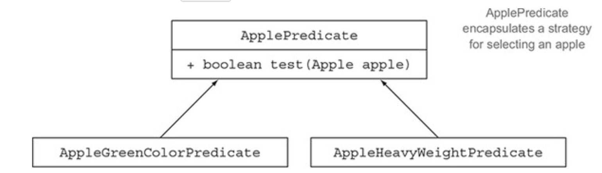

# **CH2. 동작 파라미터화 코드 전달하기**
**동적 파라미터화** <sub>behavior parameterization</sub>
> 동적 파라미터화를 이용해 자주 변경되는 요구 사항에 효과적으로 대응할 수 있다.
- 구체적으로 어떻게 실행할 것인지 아직 결정하지 않은 코드 블록
    - 이 코드 블록을 프로그램이 호출한다
- e.g. 메서드의 인자로 코드 블록을 전달할 수 있다. 이때 코드 블록은 호출하는 쪽에서 구현해서 넘겨줄 수 있다. 
    - 결국 코드 블록에 따라 메서드의 동작이 정해지므로, 메서드의 동작이 파라미터화되었다고 볼 수 있다. 

<br/>

## 목차
- [2.1 변화하는 요구사항에 대응하기](#21-변화하는-요구사항에-대응하기)
- [2.2 실전 예제](#22-실전-예제)

<br/><br/>

---

<br/><br/>

# 2.1 변화하는 요구사항에 대응하기
예를 들어 `농장`에서 `재고목록`을 조회하는 애플리케이션에, `녹색 사과`만 필터링하는 기능을 추가한다고 가정하자.  

## **step 1: 녹색 사과 필터링하기**
```java
// 사과 색을 정의하는 enum
enum Color {RED, GREEN}
```

```java
public static List<Apple> filterGreenApples(final List<Apple> inventory) {
    final List<Apple> result = new ArrayList<>();
    for (Apple apple : inventory) {
        if (Color.GREEN.equals(apple.getColor())) { // 녹색 사과만 필터링
            result.add(apple);
        }
    }
    return result;
}
```

<br/>

만약 `빨간 사과`를 필터링하고 싶다면?  
물론 if문을 추가하여 분기처리하는 것도 방법이지만, 원하는 색(`노란`, `어두운 빨간`, `옆은 녹색`...)이 점점 늘어날수록 지저분한 코드가 되어버릴 것이다.     
이럴 땐! 동작 방식이 비슷한 코드가 반복된다면 그 코드는 추상화시켜 해결할 수 있다 :)    

<br/>

## **step 2: 색을 파라미터화**
필터링하고자 하는 색을 파라미터로 받으면, 좀 더 요구 사항에 유연한 코드를 만들 수 있다.  
```java
public static List<Apple> filterApplesByColor(
        final List<Apple> inventory,
        final Color color
) {
    final List<Apple> result = new ArrayList<>();
    for (Apple apple : inventory) {
        if (apple.getColor().equals(color)) {
            result.add(apple);
        }
    }
    return result;
}
```

그럼 이제 원하는 색상을 메서드의 파라미터로 전달하여 사용할 수 있다.    
```java
final List<Apple> greenApples = filterApplesByColor(apples, Color.GREEN);
final List<Apple> redApples = filterApplesByColor(apples, Color.RED);
```

<br/>

이때... 색상이 아닌 무게 별로 필터링하고 싶다는 요구 사항이 생겼다면?!    

아래와 같이 무게 정보를 파라미터로 받는 메서드를 추가하는 방식으로 해결할 수 있다.  
```java
public static List<Apple> filterApplesByWeight(
        final List<Apple> inventory,
        final int weight
) {
    final List<Apple> result = new ArrayList<>();
    for (Apple apple : inventory) {
        if (apple.getWeight() > weight) {
            result.add(apple);
        }
    }
    return result;
}
```
  
하지만 이 메서드는 `filterApplesByColor`의 메서드와 파라미터(`color`|`weight`)만 다르고 동일하다.   
> *이는 소프트웨어 공학의 `DRY`<sub>don't repeat yourself</sub> (같은 것을 반복하지 말 것) 원칙을 어기는 것이다.*       
   
<br/>   

그럼 어떻게 개선할 수 있을까?   

`(List inventory, Color color, int weight, boolean flag)` 이렇게 `flag`를 파라미터에 추가하여, 색상으로 필터링할 것인지 무게로 필터링할 것인지 넘겨주는 것도 방법일.. 수도... 있다.... (*책에는 이 방식으로 코드 구현이 되어있지만 굳이 필요 없(~~세상 지저분~~)다고 생각하여 굳이 여기에 첨부하지는 않음*)  
   
좀 더 확장해서 생각해 보면,  
`어떤 조건으로 필터링할 것인지`를 파라미터로 제공(== ***동적 파라미터화***)한다면 유연하면서 중복되지 않는 구현이 가능하다.    
  
<br/>   
  
## **step 3: 추상적 조건으로 필터링(동적 파라미터화)**
참/거짓을 반환하는 함수<sub>`predicate`</sub>를 정의하여 이 함수를 파라미터로 제공해보자.  
```java
public interface ApplePredicate {
    boolean test(Apple apple);
}
```

그럼 아래와 같이 여러 조건별로 `implements ApplePredicate` 한 클래스를 정의할 수 있다.  
```java
public class AppleHeavyWeightPredicate implements ApplePredicate {
    public boolean test(Apple apple) {
        return apple.getWeight() > 150;
    }
}

public class AppleGreenColorPredicate implements ApplePredicate {
    public boolean test(Apple apple) {
        return Color.GREEN.equals(apple.getColor());
    }
}
```
  
  

<br/>   

> 위와 같은 구현 기법을 [전략 디자인 패턴](https://ko.wikipedia.org/wiki/%EC%A0%84%EB%9E%B5_%ED%8C%A8%ED%84%B4)<sub>strategy design pattern</sub>이라 한다.  
> 각 `전략`(알고리즘)을 캡슐화하는 `알고리즘 패밀리`를 정의해두고, 런타임에 `전략`을 선택하는 기법이다.  
> - *위 예시 기준으로*
>   - 알고리즘 패밀리 
>       -  `ApplePredicate`
>    - 전략 
>       - `AppleHeavyWeightPredicate`
>       - `AppleGreenColorPredicate`

<br/>   

이제 `ApplePredicate`를 파라미터로 받아 `test()`를 수행하도록 `filterApplesByXXXX` 메서드를 고쳐보자. (*이렇게 메서드가 다양한 동작(전략)을 파라미터로 받아서 내부적으로 다양한 동작을 수행하는 것을 **동작 파라미터화**라 한다*)  
이렇게 구현하면 `컬렉션을 반복하는 로직`과 `컬렉션의 각 요소에 적용할 동작`을 **분리**할 수 있다는 이점도 얻게 된다.  

<br/>   

```java
public static List<Apple> filterApples(
        final List<Apple> inventory,
        final ApplePredicate p
) {
    final List<Apple> result = new ArrayList<>();
    for (Apple apple : inventory) {
        if (p.test(apple)) {
            result.add(apple);
        }
    }
    return result;
}
```
  
이제 원하는 조건을 가진 `implements ApplePredicate`한 클래스를 만들면 된다!    

예를 들어 빨간 사과 && 무게가 150초과인 사과를 필터링하고자 한다면,  
```java
public static class AppleRedAndHeavyPredicate implements ApplePredicate {
    public boolean test(Apple apple) {
        return Color.RED.equals(apple.getColor())
                && apple.getWeight() > 150;
    }
}
```
```java
final List<Apple> redAndHeavyApples = filterApples(apples, new AppleRedAndHeavyPredicate());
```

<br/>

`p.test(apple)`에 해당하는 로직을 입맛에 따라 바꿔가며 구현할 수 있다!  
하나의 메서드(`filterApples()`)가 여러 가지 동작을 수행할 수 있게 된 것이다.    
  
<br/>

이제 여기서 좀 더 나아가보자.    
위 방식대로라면 조건이 달라질 때마다 `ApplePredicate`의 구현체를 계속 만들어 줘야하는데, 이 부분이 거추장스럽지는 않은가? :thinking:

<br/>

## **step 4: 익명 클래스 사용**
자바는 클래스 선언과 인스턴스화를 동시에 수행할 수 있는 **[익명 클래스](https://docs.oracle.com/javase/tutorial/java/javaOO/anonymousclasses.html)**<sub>anonymous class</sub> 기법(?)을 제공한다. 이를 이용한다면 앞서 거추장스러웠던 부분을 조금 거둬낼 수 있다.  

<br/>   

앞서 `AppleRedAndHeavyPredicate`를 구현하여 사용했던 부분을, 익명 클래스를 이용해 다시 구현해보자.    
```java
final List<Apple> result =
        filterApples(apples, new ApplePredicate() {
            @Override
            public boolean test(final Apple apple) {
                return Color.RED.equals(apple.getColor())
                        && apple.getWeight() > 150;
            }
        });
```

별도의 클래스를 만들지 않고, 파라미터로 넘겨줄 때 익명 클래스로 구현해주어 좀 더 간결한 코드로 나타낼 수 있다.  

그래도 아직 코드 자체가 장황하여 만족스럽지는 않다.  
여기서 더 간결하게 정리할 수 있을까?  

<br/>

## **step 5: 람다 표현식 사용**
결론부터 말하자만, 자바 8의 람다식을 사용해 아래와 같이 간결하게 나타낼 수 있다.  
```java
final List<Apple> result =
        filterApples(apples, (Apple apple) -> Color.RED.equals(apple.getColor()));
``` 

<br/>

그렇다면 사과말고 다른 과일도 이렇게 필터링할 수 있지 않을까?  

<br/>

## **step 6: 리스트 형식으로 추상화**
자바 8은 이미 아래와 같은 인터페이스를 제공하고 있다.  
```java
package java.util.function;

@FunctionalInterface
public interface Predicate<T> {
    boolean test(T t);
    ...
}
```

이를 이용해 아래와 같이 `filter()`를 구현할 수 있다.  
```java
public static <T> List<T> filter(final List<T> list, final Predicate<T> p) {
    final List<T> result = new ArrayList<>();
    for (T e : list) {
        if (p.test(e)) {
            result.add(e);
        }
    }
    return result;
}
```
```java
final List<Apple> filteredApples =
        filter(
                apples,
                (Apple apple) -> Color.GREEN.equals(apple.getColor()) && apple.getWeight() > 100
        );

final List<Tomato> filteredTomatoes =
        filter(
                tomatoes,
                (Tomato tomato) -> tomato.getWeight() >= 80
        );
```

<br/><br/>

---

<br/><br/>

# 2.2 실전 예제
지금까지 동작 파라미터화를 이용해 변화되는 요구 사항을 유연하게 처리하는 방법을 알아봤다.  
자바 API의 많은 메서드를 이와 같이 다양한 동작으로 파라미터화할 수 있다.  

<br/>

## **`Comparator`로 정렬하기**
자바 8의 `java.util.List`는 `sort()`라는 디폴트 메서드가 포함돼있다.  
이 메서드는 `java.util.Comparator`를 인자로 받고, 내부에서 `Comparator#compare()`를 호출하여 정렬한다.    
즉 `Comparator`를 구현하여 `List#sort()`의 동작을 다양화할 수 있다는 뜻!  

색상 이름순으로 정렬해보자.    
먼저 익명 클래스 방식으로~     
```java
apples.sort(new Comparator<Apple>() {
    @Override
    public int compare(final Apple a1, final Apple a2) {
        return a1.getColor().compareTo(a2.getColor());
    }
});
```  
  
이걸 람다 표현식을 이용한다면    
```java
apples.sort((a1, a2) -> a1.getColor().compareTo(a2.getColor()));
```

이렇게 간단하게 구현할 수 있다 +_+    
(*물론 람다 표현식에 대해선 3장에서 더 알아볼 예정이므로, 여기선 `이렇게 표현 가능하구나~` 하는 정도로만 알고 넘어가면 된다*)  

<br/>

## **`Runnable`로 코드 블록 실행하기**
자바 스레드를 이용하면 병렬로 코드 블록을 실행할 수 있다.  
이때 어떤 작업을 수행할 것인지를 `Runnable` 인터페이스를 이용해 지정해줄 수 있다.     
```java
package java.lang;

public class Thread implements Runnable {
    ...
    public Thread(Runnable target) {
        init(null, target, "Thread-" + nextThreadNum(), 0);
    }
    ...
}
```
```java
package java.lang;

@FunctionalInterface
public interface Runnable {
    public abstract void run();
}
```

먼저 익명 클래스를 이용해 `hello world`를 출력하도록 해보자.   
```java
final Thread t = new Thread(new Runnable() {
    @Override
    public void run() {
        System.out.println("hello world");
    }
});
```

이를 람다 표현식으로 나타내면
```java
final Thread t = new Thread(() -> System.out.println("hello world"));
```
