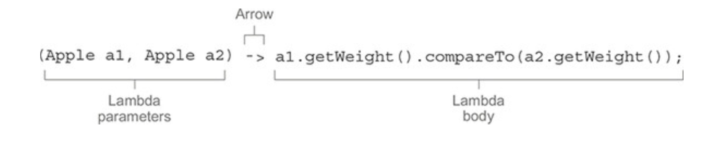
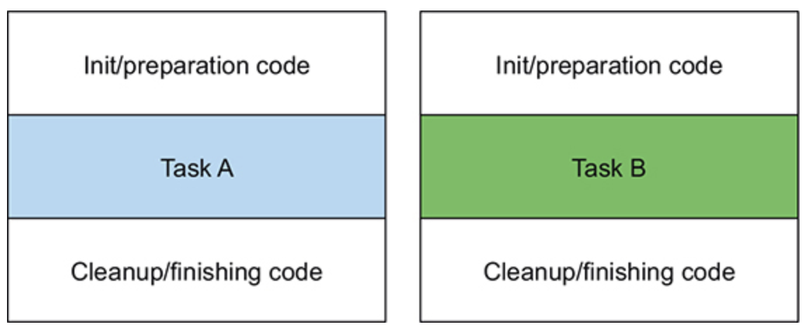

# **CH3. 람다 표현식**
- **동적 파라미터화**를 이용해 **변화하는 요구 사항에 효과적으로 대응하는 코드를 구현**할 수 있다.  
- 코드 블록을 다른 메서드로 전달할 수 있다.  
- ==> 위의 방법들로 **유연하고 재사용 가능한 코드**를 작성할 수 있다.  

<br/>

익명 클래스를 이용하여 동적 파라미터화를 할 수 있지만, 좀 더 깔끔한 코드로 구현하기 위해 자바 8의 새로운 기능인 **람다 표현식**을 사용해보자.  

<br/>

## 목차
- [3.1 람다란 무엇인가?](#31-람다란-무엇인가) 
- [3.2 어디에, 어떻게 람다를 사용할까?](#32-어디에-어떻게-람다를-사용할까)
- [3.3 람다 활용: 실행 어라운드 패턴](#33-람다-활용-실행-어라운드-패턴)
- [3.4 함수형 인터페이스 사용](#34-함수형-인터페이스-사용)
- [3.5 형식 검사, 형식 추론, 제약](#35-형식-검사-형식-추론-제약)
- [3.6 메서드 레퍼런스](#36-메서드-레퍼런스)

<br/><br/>

---

<br/><br/>

# 3.1 람다란 무엇인가?
**람다 표현식**은 전달할 수 있는 익명 함수를 단순화한 것.  
- 익명
    - 일반적인 메서드와 달리 이름이 없다.
- 함수
    - 특정 클래스에 종속되지 않기 때문에 함수이다. 
    - 메서드처럼 [`파라미터 리스트` + `바디` + `반환 형식` + `가능한 예외 리스트`]를 포함한다.
- 전달
    - 람다 표현식 자체를 메서드 파라미터로 전달하거나, 변수에 담을 수 있다.
- 간결
    - 코드를 더 쉽게, 간결하게 유연하게 구현할 수 있다. 

<br/>

우선 람다를 이용해 코드가 간단해지는걸 맛보자 :sunglasses:    
`Comparator` 객체를 이용해 사과의 색상 이름을 기준으로 오름차순 정렬하는 코드를 구현해보자.    
```java
// 익명 메서드를 이용한 코드
final Comparator<Apple> sortByColorName = new Comparator<>() {
    @Override
    public int compare(final Apple a1, final Apple a2) {
        return a1.getColor().compareTo(a2.getColor());
    }
};
```
```java
// 람다를 이용한 코드
final Comparator<Apple> sortByColorName = (a1, a2) -> a1.getColor().compareTo(a2.getColor());
```

람다를 이용하면 코드가 훠~얼씬 간결해진다 :+1:   
이제 이 람다에 대해서 찬찬히 알아가보자.    

<br/>

### **람다 구성**
  
- **파라미터 리스트** (lambda parameters)
    - e.g. `(a1, a2)`
- **화살표** (arrow)
    - `->`
- **람다 바디** (lambda body)
    - e.g. `a1.getColor().compareTo(a2.getColor());`
  
<br/>

### **유효한 람다 표현식들**
```java
() -> {return "hello world";} // 파라미터가 없으며, String을 반환

(String s) -> {return "hello " + s;} // String 타입의 파라미터 하나를 가지며, String을 반환

() -> "hello world" // 파라미터가 없으며, String을 반환 (람다 표현식에는 return이 함축되어 있어, return을 명시하지 않아도 된다)

(String s) -> "hello " + s

() -> { System.out.println("hello world 2"); } // 파라미터가 없으며, return값이 없다(void 리턴)
``` 

<br/><br/>

---

<br/><br/>

# 3.2 어디에, 어떻게 람다를 사용할까? 
**함수형 인터페이스**<sub>functional interface</sub>를 기대하는 곳에 람다 표현식을 사용할 수 있다.  

<br/>

## **함수형 인터페이스란?**
**추상 메서드**를 **하나만 포함**하고 있는 인터페이스를 **함수형 인터페이스**라 한다.  
> 자바 8부터 인터페이스는 `디폴트 메서드`를 포함할 수 있다.   
> - `디폴트 메서드` : 구현이 된, 바디를 가지고 있는 메서드 
>        
> 여러 개의 디폴트 메서드를 포함하고 있어도, **추상 메서드를 하나만 포함**하고 있다면 이 역시 **함수형 인터페이스**다.  
  
<br/>
   
아래 예시들이 **함수형 인터페이스**이다.    
```java
package java.util.function;

@FunctionalInterface
public interface Predicate<T> {
    boolean test(T t);
    ...
}
```
```java
package java.util;

@FunctionalInterface
public interface Comparator<T> {
    int compare(T var1, T var2);
    ...
}
```
```java
package java.lang;

@FunctionalInterface
public interface Runnable {
    public abstract void run();
}
```
  
아래의 경우, `A`만 함수형 인터페이스이다.  
```java
interface A {
    int add(int x, int y);
}

interface B extends A{
    int subtract(int x, int y);
}
```

<br/>

람다 표현식을 이용하여 함수형 인터페이스의 추상 메서드 구현을 직접 전달할 수 있다.    
람다 표현식 자체를 함수형 인터페이스의 인스턴스(*를 구현한 클래스의 인스턴스*)처럼 취급할 수 있다.   
> #### 함수형 인터페이스를 인수로 받는 메서드에만 람다 표현식을 사용할 수 있다. 

<br/>

아래는 `Runnable`함수형 인터페이스를 3가지 방식으로 구현해본 코드다.  
```java 
final Runnable anonymous = new Runnable() {
    @Override
    public void run() {
        System.out.println("hello world 1");
    }
};

final Runnable lambda = () -> System.out.println("hello world 2");

new Thread(anonymous);                                      // 익명 클래스 사용
new Thread(lambda);                                         // 람다 사용
new Thread(() -> System.out.println("hello world 3"));      // 람다 표현식을 직접 전달
```

<br/>

## **함수 디스크립터** <sub>function descriptor</sub>
함수형 인터페이스의 추상 메서드 시그니처<sub>signature</sub>를 람다 표현식 형태로 표현한 것이 **함수 디스크립터**이다.    
> e.g. `String print(int number)`라는 시그니처를 가진 메서드를, 함수 디스크립터로 표현하면 `int -> String`이 된다.  

<br/>

> #### ***왜 함수형 인터페이스를 인수로 받는 메서드에만 람다 표현식을 사용할 수 있을까?***
> 자바 언어 설계자들은 언어를 더 복잡하게 만들지 않는 선에서 람다를 도입하여 편의성을 제공하고자 지금과 같은 방식을 선택했다고 한다....   

<br/>

## **`@FunctionalInterface`**
함수형 인터페이스에는 이 애너테이션을 붙여, 해당 인터페이스가 함수형 인터페이스임을 나타낸다.     
만약 이 애너테이션을 붙였지만 해당 인터페이스가 추상 메서드를 두 개 이상 지정한다면, **컴파일 에러가 발생**한다. 
> 에러메시지: *`Multiple nonoverriding abstract methods found in interface XXX`*    

<br/><br/>

---

<br/><br/>

# 3.3 람다 활용: 실행 어라운드 패턴
아래와 같이 `작업`코드가 존재하고, 이 코드를 두 과정이 감싸고 있는 형태를 **실행 어라운드 패턴**이라고 한다.     
  
  

- 초기화/준비 코드 
- 작업 코드
    - 실제 자원을 처리하는 코드
    - e.g. 데이터베이스의 파일 처리)
- 정리/마무리 코드

<br/>

예로 파일에서 한 행을 읽어오는 코드를 구현해보자.    
> *`try-with-resources` 구문을 사용하면 자원을 명시적으로 닫을 필요가 없으므로 간결한 코드를 구현할 수 있다*.
```java
public static String processFile() throws IOException {
    try (BufferedReader br = new BufferedReader(new FileReader("data.txt"))) {
        return br.readLine();
    }
}
```

`파일을 읽을 준비`, `파일에서 한 행을 읽기`, `자원을 반납하는 작업`으로 이루어져 있으며  
이는 `실행 어라운드 패턴`임을 알 수 있다.    
   
이제 이 코드를 람다와 동적 파라미터화를 이용하여 유연하고 간결하게 만들어보자.      
  
<br/>
  
## **1단계: 동적 파라미터화를 기억하라**
현재 위 코드는 파일에서 한 줄만 읽을 수 있다.  
한 번에 두 줄을 읽거나, 가장 자주 사용되는 단어를 반환하는 등, 기존의 `설정` & `정리` 과정은 재사용하되 `실제 자원 처리`는 다양한 동작을 수행할 수 있는 유동적인 형태로 만들어보자. (==> *`processFile()`의 동작을 파라미터화하자!* )    
  
만약 파일에서 두 행을 읽어내는 코드를 람다 형식으로 구현한다면, 다음과 같은 형태가 될 수 있다.  
```java
String result = processFile((BufferedReader br) -> br.readLine() + br.readLine());
```

이 코드가 동작할 수 있도록 `processFile()`의 동작을 파라미터화 해보자.    

<br/>

## **2단계: 함수형 인터페이스를 이용해서 동작 전달**
> :ballot_box_with_check: 기억하기: *함수형 인터페이스를 기대하는 곳에 람다 표현식을 사용할 수 있다*    

`BufferedReader br -> String`, `throws IOException` 시그니처와 일치하는 함수형 인터페이스를 만들어야 한다.    
이 함수형 인터페이스는 `BufferedReaderProcessor`라고 정의하자.   
```java
@FunctionalInterface
public interface BufferedReaderProcessor {
    String process(BufferedReader br) throws IOException;
}
```
  
이 함수형 인터페이스를 `processFile`의 인수로 전달하자. 
```java
public static String processFile(BufferedReaderProcessor p) throws IOException {
    ...
}
```

<br/>

## **3단계: 동작 실행!**
이제 `processFile(BufferedReaderProcessor)`의 바디는 다음과 같이 구현할 수 있다.  
```java
public static String processFile(BufferedReaderProcessor p) throws IOException {
    try (BufferedReader br = new BufferedReader(new FileReader("data.txt"))) {
        return p.process(br);
    }
}
```

<br/>

## **4단계: 람다 전달**
이제 람다를 이용해 `process(BufferedReaderProcessor)`메서드의 시그니처 `BufferedReader -> String`과 일치하는 람다를  
`processFile(BufferedReaderProcessor)`의 인자로 전달할 수 있다.   
```java
// 한 행을 처리하는 코드
String resultA = processFile((BufferedReader br) -> br.readLine());

// 두 행을 처리하는 코드
String resultB = processFile((BufferedReader br) -> br.readLine() + br.readLine());
```

<br/><br/>

---

<br/><br/>

# 3.4 함수형 인터페이스 사용
자바 API는 람다 표현식을 편리하게 사용할 수 있도록 `Comparable`, `Runnable`, `Callable` 등 다양한 함수형 인터페이스들을 제공하고 있다.     
그리고 자바 8은 `java.util.function`패키지를 통해 함수형 인터페이스를 제공한다.       
    
이번엔 이 패키지에 있는 `Predicate`, `Consumer`, `Function` 인터페이스와 그리고 더 다양함 함수형 인터페이스를 살펴보자.    

<br/>

## **`Predicate`**
`Predicate<T>` 인터페이스는 `boolean test(T t)` 추상 메서드를 정의한다.  
이 메서드는 `T`타입의 객체를 인수로 받고 `boolean`을 반환한다.  
```java
package java.util.function;

@FunctionalInterface
public interface Predicate<T> {
    boolean test(T var1);
    ...
}
```
  
아래와 같은 상황에서 사용할 수 있다.  
```java
// 동작 파라미터화를 한 filter 메서드
public static <T> List<T> filter(List<T> list, Predicate<T> p) {
    final List<T> results = new ArrayList<>();

    for (T s : list) {
        if (p.test(s)) {
            results.add(s);
        }
    }

    return results;
}

public static void main(String[] args) {
    final List<Integer> listOfInt = Arrays.asList(1, 2, 3, 4, 5);
    
    // Predicate의 추상 메서드인 test를 구현한 람다 표현식 (동작을 정의함)
    final Predicate<Integer> isEven = i -> i % 2 == 0;    
    
    final List<Integer> results = filter(listOfInt, isEven);
}
```

<br/>

## **`Consumer`**
`Consumer<T>`인터페이스는 `T`타입을 인수로 받고 `void`를 반환하는 추상 메서드 `accept()`를 정의한다.   
```java
package java.util.function;

@FunctionalInterface
public interface Consumer<T> {
    void accept(T var1);
    ...
}
```
  
`T`타입의 객체를 인수로 받고, 어떤 동작을 수행하고자 할 때 사용할 수 있다.    
아래와 같이 `리스트의 모든 항목을 출력`하고자 할 때 사용할 수 있다.    
```java
// 동작 파라미터화를 한 forEach 메서드
public static <T> void forEach(List<T> list, Consumer<T> c) {
    for (T s : list) {
        c.accept(s);
    }
}

public static void main(String[] args) {
    final List<Integer> listOfInt = Arrays.asList(1, 2, 3, 4, 5);
    
    // Consumer의 추상 메서드인 accept를 구현한 람다 표현식 (동작을 정의함)
    final Consumer<Integer> printData = i -> System.out.println(i); 
    
    forEach(listOfInt, printData);
}
```

<br/>

## **`Function`**
`Function<T, R>`인터페이스는 `T`타입을 인수로 받고 `R`타입을 반환하는 추상 메서드 `apply`를 정의한다.    
```java
package java.util.function;

@FunctionalInterface
public interface Function<T, R> {
    R apply(T var1);
    ...
}
```
  
인수로 받은 데이터를 반환하는 데이터로 매핑하는 동작을 정의할 때 활용할 수 있다.    
(e.g. 사과 리스트를 받아 사과의 무게 정보를 반환, 문자열 리스트를 받아 문자열 길이 정보를 반환 등)  
```java
// 동적 파라미터화를 한 map 메서드
public static <T, R> List<R> map(List<T> list, Function<T, R> f) {
    final List<R> results = new ArrayList<>();

    for (T s : list) {
        results.add(f.apply(s));    // T타입인 s를 인자로 받고, R타입을 return하는 apply메서드
    }

    return results;
}

public static void main(String[] args) throws IOException {
    final List<String> fruits = Arrays.asList("apple", "banana", "citron");
    List<Integer> fruitNameLength = map(fruits, s -> s.length());   // 람다 표현식을 변수에 담지않고, map의 인수로 곧바로 전달
}
```

<br/>

## **기본형 특화**
앞서 살펴본 제네릭 함수형 인터페이스 `Predicate<T>`, `Consumer<T>`, `Function<T, R>`은 모두 **참조형만 사용**할 수 있는, **제네릭 타입**을 사용한다. (*`T`나 `R`에는 참조형만 사용할 수 있다* )    
  
물론 자바에서는 기본형을 참조형으로 변환할 수 있는 기능(오토박싱<sub>autoboxing</sub>), 참조형을 기본형으로 변환하는 기능(언박싱<sub>unboxing</sub>)을 제공하지만, 이러한 변환 과정에는 비용이 소모된다.      
> 기본형을 박싱한 값은 힙에 저장된다. 따라서 박싱한 값으로 연산을 수행한다면 메모리를 더 소비하며, 기본형으로 가져올 때도 메모리를 탐색하는 과정이 필요하다.    
```java
// 오토박싱 예제
final List<Integer> results = new ArrayList<>();

for (int i = 0; i < 10; i++) {
    results.add(i);
}
```  
  
자바 8에서는 기본형을 입출력으로 사용하는 상황일 때, 오토박싱 동작을 피할 수 있는! **기본형에 특화된 함수형 인터페이스**들을 제공한다.    
```java
Predicate<Integer> oddNumbers1 = (Integer i) -> i % 2 == 1;     // 박싱
oddNumbers1.test(3);    // 3이라는 int를, Integer 객체로 박싱

IntPredicate oddNumbers2 = (int i) -> i % 2 == 1;               // 박싱 없음
oddNumbers2.test(3);    
```  
  
위 코드처럼 특정 타입을 입력으로 받는 함수형 인터페이스들이 제공되며, 이 인터페이스의 이름에는 타입이 prefix처럼 붙는다. (*`DoublePredicate`, `IntConsumer`, `LongBinaryOperator`, `IntFunction` 등*)  

<br/>

### **자바 8의 대표적인 함수형 인터페이스**
| 함수형 인터페이스 | 함수 디스크립터 | 기본형 특화 인터페이스 |    
|-|-|-|
| Predicate<T> | T -> boolean | IntPredicate, LongPredicate, DoublePredicate |
| Consumer<T> | T -> void | IntConsumer, LongConsumer, DoubleConsumer | 
| Function<T, R> | T -> R | IntFunction<R>, IntToDoubleFunction, IntToLongFunction, LongFunction<R>, ToIntFunction<T>, ToDoubleFunction<T> | 
| Supplier<T> | () -> T | BooleanSupplier, IntSupplier, LongSupplier, DoubleSupplier |  
| BinaryOperator<T> | (T, T) -> T | IntBinaryOperator, LongBinaryOperator, DoubleBinaryOperator |
| BiFunction<T, U, R>  | (T, U) -> R | ToIntBiFunction<T, U>, ToLongBiFunction<T, U>, ToDoubleBiFunction<T, U> |

<br/>

### **람다와 함수형 인터페이스 예제**
| 사용 사례 | 람다 예제 | 대응하는 함수형 인터페이스 |
|-|-|-|
| boolean을 반환 | (List<String> list) -> list.isEmpty() | Predicate<List<String>> |
| 객체 생성하여 반환 | () -> new Apple(10) | Supplier<Apple> |
| 별도의 반환없이, 객체 출력만 수행 | (Apple a) -> System.out.println(a.getWeight()) | Consumer<Apple> |
| 객체에서 선택/추출 | (String s) -> s.length() | Function<String, Integer> 또는 ToIntFunction<String> |
| 두 값을 조합 | (int a, int b) -> a + b | IntBinaryOperator |
| 두 객체를 비교하여 특정 데이터를 반환 | (Apple a1, Apple a2) -> a1.getWeight().compareTo(a2.getWeight()) | Comparator<Apple> 또는 BiFunction<Apple, Apple, Integer> 또는 ToIntBiFunction<Apple, Apple> |

<br/>

> ### 예외, 람다, 함수형 인터페이스의 관계
> 예외를 던지는 람다 표현식을 만들려면, 확인된 예외를 선언하는 함수형 인터페이스를 직접 정의하거나 람다를 `try/catch` 블록으로 감싸야 한다.  
> 앞서 등장했었던 아래 코드는 `IOException`을 명시적으로 선언하는 함수형 인터페이스 `BufferedReaderProcessor`이다.  
> ```java
> @FunctionalInterface
> public interface BufferedReaderProcessor {
>     String process(BufferedReader br) throws IOException;
> }
> ```
> 이처럼 함수형 인터페이스를 직접 정의하거나,  
> 또는 `Function<T, R>` 타입의 함수형 인터페이스처럼 이미 만들어져있는 API를 기대하는 곳에서는 `try/catch`를 이용해 명시적으로 확인된 예외를 잡을 수 있다. 
> ```java
> Function<BufferedReader, String> f = (BufferedReader br) -> {
>     try {
>         return br.readLine();
>     } catch (IOException e) {
>         throw new RuntimeException(e);
>     }
> };
> ```

<br/><br/>

---

<br/><br/>

# 3.5 형식 검사, 형식 추론, 제약
컴파일러가 람다의 형식을 어떻게 확인하는지(람다 표현식의 유효성을 확인하는 방법), 피해야 할 사항은 어떤 것이 있는지 등을 알아보자. 

<br/>

## **형식 검사**
람다 표현식 자체에는 람다가 어떤 함수형 인터페이스를 구현하는지에 대한 정보가 없다.    
대신 람다가 사용되는 콘텍스트<sub>context</sub>를 이용해, 람다의 형식<sub>type</sub>을 추론할 수 있다.      

> *콘텍스트: 람다가 전달될 메서드 파라미터, 람다가 할당되는 변수 등*      
  
콘텍스트에서 기대하는 람다 표현식의 형식을 대상 형식<sub>target type</sub>이라 부른다. 예를 들면 람다 표현식을 담을 담은 변수가 있을 때, 그 변수의 타입을 대상 형식이라고 볼 수 있다.

<br/>

아래 코드를 통해, 람다 표현식을 사용할 경우 어떤 식으로 **형식을 확인**할 수 있는지 알아보자.  
```java
filter(inventory, Predicate<Apple> p);
```
1. `filter`메서드는 두 번째 파라미터로 `Predicate<Apple>`(대상 형식)을 기대한다.
2. `Predicate<T>`은 `test`라는 한 개의 추상 메서드를 정의하는 **함수형 인터페이스**이다. 여기선 `T`가 `Apple`
로 대체되었다.  
3. 여기서 `test`메서드는 `Apple`을 인자로 받고, `boolean`을 반환한다. 
4. `filter`메서드로 전달된 두 번째 인수는, 3번 항목을 만족해야 한다.  

```java
List<Apple> heavierThan150 = filter(inventory, (Apple a) -> a.getWeight() > 150);
```
함수 디스크립터(`Apple -> boolean`)와 람다의 시그니처가 일치한다!  
람다도 `Apple`을 인자로 받고, `boolean`을 반환하므로, 코드 형식 검사가 성공적으로 완료된다.    

<br/>

## **같은 람다, 다른 함수형 인터페이스**
같은 람다 표현식이더라도 다른 함수형 인터페이스로 사용될 수 있다.  
예를 들어 `Callable`과 `PrivilegedAction`는 둘 다 `인수를 받지 않고, T타입을 반환하는 함수`를 정의한다.  
아래 코드는 모두 유효한 코드이다.
```java
Callable<Integer> c = () -> 42;
PrivilegedAction<Integer> p = () -> 42;
```

즉, 하나의 람다 표현식을 다양한 함수형 인터페이스에 사용할 수 있다.
```java
// 람다 표현식은 모두 동일하지만, 서로 다른 함수형 인터페이스 타입 변수에 담은 것이 포인트!  

Comparator<Apple> c = (Apple a1, Apple a2) -> a1.getColor().compareTo(a2.getColor());
ToIntBiFunction<Apple, Apple> t = (Apple a1, Apple a2) -> a1.getColor().compareTo(a2.getColor());
BiFunction<Apple, Apple, Integer> b = (Apple a1, Apple a2) -> a1.getColor().compareTo(a2.getColor());
```

> ### 특별한 void 호환 규칙
> 람다의 바디에 일반 표현식이 있으면, void를 반환하는 함수 디스크립터와 호환된다.  
> (*물론 파라미터 타입은 동일해야 한다* )  
> ```java
> // Predicate p는 boolean을 반환받는다
> Predicate<String> p = s -> list.add(s);
> // Consumer는 void를 반환받는다
> Consumer<String> c = s -> list.add(s);
> ```
> `List#add(E)`는 실제로 `boolean`을 반환하며, `Consumer` 콘텍스트(`T -> void`)는 `void`를 기대하지만,  
> 위와 같이 사용할 수 있다!  

<br/>

## **형식 추론**
컴파일러는 람다 표현식이 사용된 콘텍스트(대상 형식)를 이용해 **람다의 시그니처**도 **추론**할 수 있다.   
결과적으로 컴파일러는 람다 표현식의 파라미터 타입에 접근할 수 있으므로 람다 문법에서 이를 생략할 수 있다!

```java
Comparator<Apple> c1 = (Apple a1, Apple a2) -> a1.getColor().compareTo(a2.getColor());  // 형식 추론 x
Comparator<Apple> c2 = (a1, a2) -> a1.getColor().compareTo(a2.getColor());              // 형식을 추론함
``` 

명시적으로 타입을 포함하는 것이 좋을 때도 있고, 타입을 배제하는 것이 가독성을 향상시킬 때도 있다.   
정해진 규칙은 없으며 상황에 맞게 사용하면 된다.  

<br/>

## **지역 변수 사용**
지금까지 람다 표현식은 바디 안에서 인수로 전달된 변수만을 사용했다.  
하지만 람다 표현식에서는 익명 함수가 하는 것처럼 자유 변수<sub>free variable</sub>를 활용할 수 있다.  
> *자유 변수: 인수로 전달된 변수가 아닌, **외부에서 정의된 변수***

이와 같은 동작을 **람다 캡처링**<sub>capturing lambda</sub>이라 한다.    

<br/>

람다는 인스턴스 변수와 클래스 변수(정적 변수)를 자유롭게 캡처(람다 자신의 바디 내에서 참조할 수 있음) 할 수 있다.
하지만 캡처가 가능하려면 몇 가지 제약이 있다.  
지역 변수는 명시적으로 `final`로 선언되어 있거나, `final`로 선언된 변수와 똑같이 사용되어야 한다.  
(==> 즉 **람다 표현식은 불변인 지역 변수를 캡쳐할 수 있**다!)  
  
```java 
// 컴파일에러 발생하는 코드: Variable used in lambda expression should be final or effectively final

int i = 0;
Runnable r = () -> System.out.println(i);
i = 1;  // i 변수에 값이 재할당되기 때문에 에러가 발생
```

<br/>

### 지역 변수의 제약
클래스 변수는 힙에 저장되며 지역 변수는 스택에 위치한다.(지역 변수는 자신을 정의한 스레드와 라이프사이클을 같이 한다)   
람다에서 지역 변수에 바로 접근할 수 있다는 가정 하에 람다가 스레드B에서 실행된다면, 변수를 할당한 스레드A가 사라져 변수 할당이 해제되었는데도 람다를 실행하는 스레드B에서는 해당 변수에 접근하려 할 수 있다.  
따라서 자바 구현에서는 원 변수가 아닌 **자유 지역 변수의 복사본을 제공**하여 접근토록 한다. 그에 따라 **복사본의 값이 바뀌지 않도록 보장되어야** 하기 때문에, **지역 변수는 불변성을 띄어야 한다**는 제약이 생긴 것이다. (가변 지역 변수를 새로운 스레드에서 캡처할 수 있다면 안전하지 않은 동작을 수행할 가능성이 생긴다)     
> 클래스 변수는 스레드가 공유하는 힙에 존재하므로 특별한 제약이 없다.    

<br/>

> ### 클로저
> 원칙적으로 **클로저**<sub>Closure</sub>란 **함수의 비지역 변수를 자유롭게 참조할 수 있는 함수 인스턴스**를 가리킨다.  
> 클로저는 다른 함수의 인수로 전달될 수 있다. 클로저는 클로저 외부에 정의된 변수의 값에 접근하고, **값을 바꿀 수 있다**.  
> 자바 8의 람다와 익명 클래스는 클로저와 비슷한 동작을 수행한다.  
> 람다와 익명클래스 모두 메서드의 인수로 전달될 수 있으며, 자신의 외부 영역의 변수에 접근할 수 있다.  
> 다만 **람다와 익명클래스**는 **그들이 정의된 메서드의 지역 변수의 값은 바꿀 수 없다**. 

<br/><br/>

---

<br/><br/>

# 3.6 메서드 레퍼런스
메서드 레퍼런스를 이용하면 기존의 메서드 정의를 재활용하여 람다처럼 전달할 수 있다.  

```java
// 람다를 이용한 코드
apples.sort((a1, a2) -> a1.getColor().compareTo(a2.getColor()));

// 메서드 레퍼런스와 java.util.Comparator.comparing을 활용한 코드
apples.sort(Comparator.comparing(Apple::getColor));
```

<br/>

## **요약**
- 메서드 레퍼런스를 이용하면 가독성을 높일 수 있고 좀 더 편리하게 메서드를 참조할 수 있다.  
- 메서드 명 앞에 구분자(`::`)를 붙이는 방식으로 메서드 레퍼런스를 활용할 수 있다.  
- 예를 들어 `Apple::getWeight`는 `Apple`클래스에 정의된 `getWeight()`메서드의 레퍼런스이다. 이는 `(Apple a) -> a.getWeight()`를 축약한 것이다.    

<br/>

#### *람다와 메서드 레퍼런스 단축 표현 예제*
| 람다 | 메서드 레퍼런스 단축 표현 |    
|-|-|
| (Apple a) -> a.getWeight() | Apple::getWeight |
| () -> Thread.currentThread().dumpStack() | Thread.currentThread()::dumpStack |
| (str, i) -> str.substring(i) | String::substring |
| (String s) -> System.out.println(s) | System.out::println |

<br/>

### 메서드 레퍼런스의 유형
- #### 정적 메서드 레퍼런스
    - `Integer::parseInt`
- #### 다양한 형식의 인스턴스 메서드 레퍼런스
    - `String::length`, `String:toUpperCase`
- #### 기존 객체의 인스턴스 메서드 레퍼런스
    - `Apple a` 변수가 존재할 때, `a::getWeight`

람다 표현식을 메서드 레퍼런스로 어떻게 바꿀 수 있는지 확인해보자.  
예를 들어 List에 포함된 문자열을 대소문자 구분하지 않고 정렬하는 프로그램을 구현하려 한다.    
`List#sort`는 `Comparator`를 인자로 받는다. `Comparator`는 추상메서드 `compare()`를 정의하고 있으며, `(T, T) -> int`라는 함수 디스크립터를 갖는다.    
코드로 구현하면 다음과 같다.  
```java
List<String> stringList = Arrays.asList("a", "b", "B", "A");
stringList.sort((s1, s2) -> s1.compareToIgnoreCase(s2));
```
위 람다 표현식의 시그니처는 `Comparator` 시그니처와 호환된다.(`(T, T) -> int`)    
  
이를 메서드 레퍼런스로 구현해보자.  
```java
stringList.sort(String::compareToIgnoreCase);
```
컴파일러는 메서드 레퍼런스가 주어진 함수형 인터페이스와 호환하는지 확인한다. 즉, **메서드 레퍼런스는 콘텍스트의 형식과 일치해야** 한다. 

<br/>

## **생성자 레퍼런스**
`ClassName::new`처럼 클래스명과 `new` 키워드를 이용해 기존 생성자의 레퍼런스를 만들 수 있다.   
이는 정적 메서드의 레퍼런스 만드는 방법과 비슷하다.    
  
예를 들어 인수가 없는 생성자를 통해 특정 클래스를 만들어보자.    
`Supplier`는 `() -> T` 시그니처를 갖고 있다. 이를 이용해 `Apple` 인스턴스를 만든다면 다음과 같다.    
```java 
// 람다 이용
Supplier<Apple> s1 = () -> new Apple(100, "red");
final Apple apple1 = s1.get();

// 생성자 레퍼런스 이용
Supplier<Apple> s2 = Apple::new;     // Apple의 기본 생성자를 이용한다.
final Apple apple2 = s2.get();
```
  
기본 생성자가 아닌 `Apple(int weight, String color)`처럼 매개변수를 갖는 생성자로 `Apple`을 생성하고자 한다면, `BiFunction` 인터페이스를 이용하면 된다.  
`BiFunction`의 시그니처는 `(T, U) -> R`이므로, `(Integer, String) -> Apple`을 기대할 수 있다!  
```java 
BiFunction<Integer, String, Apple> b = Apple::new;  // int, String을 매개변수로 받는 생성자를 이용한다.
final Apple apple = b.apply(120, "blue");
```
  
아래와 같은 방식으로 여러 사과 리스트를 만들 수도 있다.
```java
public static List<Apple> map(List<Integer> weights, Function<Integer, Apple> f) {
    final List<Apple> apples = new ArrayList<>();
    for (int weight : weights) {
        apples.add(f.apply(weight));
    }

    return apples;
}

public static void main(String[] args) {
    List<Integer> weights = Arrays.asList(1, 2, 3, 4, 5);
    List<Apple> apples = map(weights, Apple::new);        // map(weights, i -> new Apple(i))
}
```
