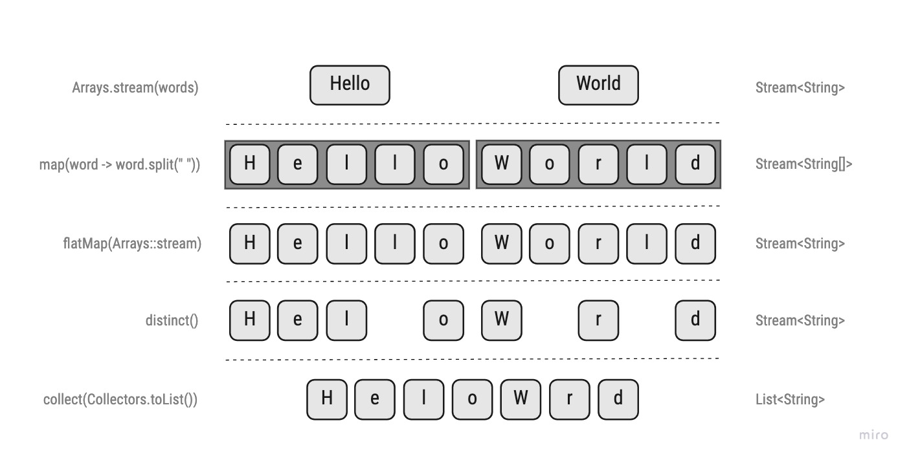
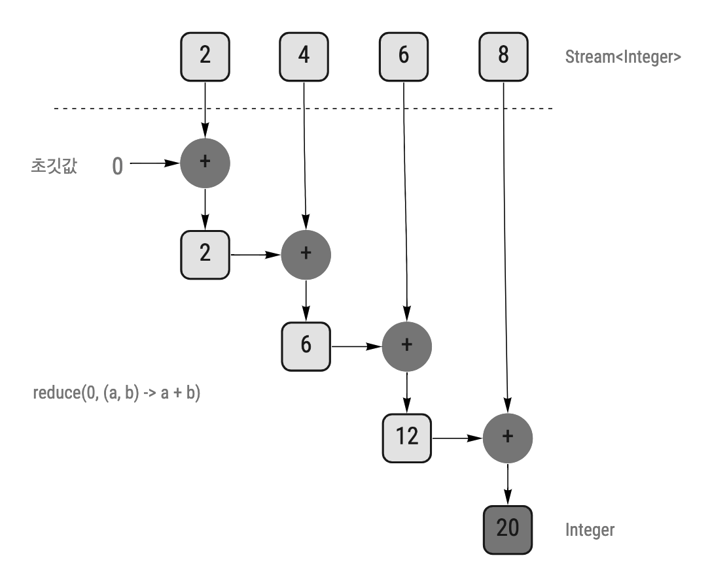

# **CH5. 스트림 활용**

<details>
<summary>참고: 사용될 예제 코드</summary>
<div markdown="1">

```java
public class Dish {
    private final String name;
    private final boolean vegetarian;
    private final int calories;
    private final Type type;

    public Dish(final String name, final boolean vegetarian, final int calories, final Type type) {
        this.name = name;
        this.vegetarian = vegetarian;
        this.calories = calories;
        this.type = type;
    }

    public String getName() {
        return name;
    }

    public boolean isVegetarian() {
        return vegetarian;
    }

    public int getCalories() {
        return calories;
    }

    public Type getType() {
        return type;
    }

    @Override
    public String toString() {
        return "Dish{" +
                "name='" + name + '\'' +
                ", vegetarian=" + vegetarian +
                ", calories=" + calories +
                ", type=" + type +
                '}';
    }
    public enum Type {
        MEAT, FISH, OTHER
    }
}
```

```java
final List<Dish> menu = Arrays.asList(
        new Dish("season fruit", true, 120, Dish.Type.OTHER),
        new Dish("pork", false, 800, Dish.Type.MEAT),
        new Dish("salmon", false, 450, Dish.Type.FISH),
        new Dish("prawns", false, 280, Dish.Type.FISH),
        new Dish("chicken", false, 400, Dish.Type.MEAT),
        new Dish("french fries", true, 530, Dish.Type.OTHER),
        new Dish("rice", true, 350, Dish.Type.OTHER),
        new Dish("pizza", true, 550, Dish.Type.OTHER),
        new Dish("beef", false, 700, Dish.Type.MEAT)
);
```

---

</div>
</details>

<br/>

## 목차
- [5.1 필터링](#51-필터링)
- [5.2 스트림 슬라이싱](#52-스트림-슬라이싱)
- [5.3 매핑](#53-매핑)
- [5.4 검색과 매칭](#54-검색과-매칭)
- [5.5 리듀싱](#55-리듀싱)
- [5.7 숫자형 스트림](#57-숫자형-스트림)
- [5.8 스트림 만들기](#58-스트림-만들기)

<br/><br/>

---

<br/><br/>

# 5.1 필터링
스트림의 요소를 선택하는 방법에 대해 알아보자.  
- `Predicate`로 필터링
- 고유 요소 필터링

<br/>

## **`Predicate`로 필터링**
스트림 인터페이스가 지원하는 `filter`메서드는 `Predicate`(`boolean`을 리턴하는 함수)를 인수로 받아, 결과값이 `true`인 모든 요소를 포함하는 스트림을 반환한다.     
```java
final Stream<Dish> dishStream = menu.stream()
        .filter(dish -> dish.getCalories() > 400);        
```

<br/>

## **고유 요소 필터링**
스트림은 고유한 요소로만 이루어진 스트림을 반환하는 `distinct`메서드도 지원한다.
>  `고유한` 요소에 대한 판단은 스트림에서 만든 객체의 `hashCode`, `equals`로 결정된다  

```java
// 짝수를 선택하고 중복은 걸러내는 코드

final List<Integer> numbers = Arrays.asList(1, 2, 1, 3, 3, 2, 4);
final List<Integer> evenNumbers = numbers.stream()
        .filter(i -> i % 2 == 0)            // 2, 2, 4
        .distinct()                         // 2, 4
        .collect(Collectors.toList());
```

<br/><br/>

---

<br/><br/>

# 5.2 스트림 슬라이싱
스트림의 요소를 선택하거나 스킵하는 다양한 방법을 알아보자.  

<br/>

## **`Predicate`를 이용한 슬라이싱**
자바 9는 스트림의 요소를 효과적으로 선택할 수 있도록 `takeWhile`, `dropWhile` 두 가지 새로운 메서드를 지원한다.  

### **`takeWhile` 활용**
- `takeWhile` 연산을 이용하면 스트림에 `Predicate`를 적용하면서 스트림을 슬라이스할 수 있다. 
    - 효과적인 필터링 가능!
  
```java
// 예제로 사용될 메뉴리스트

final List<Dish> specialMenu = Arrays.asList(
        new Dish("season fruit", true, 120, Dish.Type.OTHER),
        new Dish("prawns", false, 280, Dish.Type.FISH),
        new Dish("salmon", false, 450, Dish.Type.FISH),
        new Dish("beef", false, 700, Dish.Type.MEAT),
        new Dish("pork", false, 800, Dish.Type.MEAT)
);
```
  
위 예시에서 '450칼로리 이하'인 요리만 선택하고자 한다.  
제일 먼저 떠오르는 코드는 `filter(d -> d.getCalories() <= 450)`일 것이다 (아마두 :eyes::eyes:)  
하지만! 여기서 주목할 부분은 위 예시리스트는 이미 *칼로리 순으로 정렬되어 있다*는 부분이다. 이때는 스트림을 반복하면서 각 요소에 `Predicate`를 적용하다가, '450칼로리보다 칼로리가 큰 요리'가 나왔을 때 **반복 작업을 중단**하면 어떨까?!   
`takeWhile`연산을 이용하면 가능하다.    
```java
final List<Dish> dishes = specialMenu.stream()
        .takeWhile(dish -> dish.getCalories() <= 450)
        .collect(Collectors.toList());

// season fruit, prawns, salmon
```
  
### **`dropWhile` 활용**
- `dropWhile`은 `takeWhile`과는 정반대 작업을 수행한다.  
- `dropWhile`은 `Predicate`가 처음으로 `false`가 되면 그때 작업을 중단하고, 나머지 모든 요소를 반환한다.  
  
'450칼로리를 초과하는 요소'를 탐색하려면 `dropWhile`를 이용하면 된다. 
```java
final List<Dish> dishes = specialMenu.stream()
        .dropWhile(dish -> dish.getCalories() <= 450)
        .collect(Collectors.toList());

// beef, pork
```

<br/>

## **스트림 축소**
- `limit(n)` 메서드를 이용하여 주어진 값(`n`) 이하의 크기를 갖는 새로운 스트림을 반환할 수 있다.
- 정렬되지 않은 스트림(e.g. `Set`)에도 `limit`를 사용할 수 있으며, 이런 경우엔 결과 역시 정렬되지 않은 상태로 반환된다.

```java
// 300 칼로리 미만인 요리를 최대 3개까지 반환

final List<Dish> dishes = menu.stream()
        .filter(d -> d.getCalories() > 200)
        .limit(3)
        .collect(Collectors.toList());

// pork, salmon, prawns
```

<br/>

## **요소 건너뛰기**
- 스트림은 처음 n개 요소를 제외한 스트림을 반환하는 `skip(n)` 메서드를 지원한다. 
- 만약 n개 이하의 요소를 포함한 스트림에 `skip(n)`을 호출한다면, 빈 스트림이 반환된다.  

```java
// 300 칼로리 초과인 요리 중 처음 2개의 요리는 건너뛴 다음 나머지 요리를 반환

final List<Dish> dishes = menu.stream()
        .filter(d -> d.getCalories() > 300)
        .skip(2)
        .collect(Collectors.toList());

// chicken, french fries, rice, pizza, beef
```

<br/><br/>

---

<br/><br/>

# 5.3 매핑
스트림 API에서 `map`과 `flatMap`메서드를 사용하면, 특정 데이터를 선택할 수 있다.  

<br/>

## **스트림의 각 요소에 함수 적용하기**
- 스트림의 `map`메서드는 함수를 인자로 받으며, 인자로 제공된 함수는 각 요소를 새로운 요소로 매핑시킨다.  
    - 이는 modify의 개념보다는 '새로운 버전을 만든다', 'transforming(변환)'의 개념에 가까우며, 그래서 **매핑**이라는 단어를 사용한다.
  
```java
// Dish 리스트로부터 각 요소별 요리이름을 추출한다

final List<String> dishNames = menu.stream()
        .map(Dish::getName)
        .collect(Collectors.toList());
```
  
```java 
// 단어 리스트로부터 각 요소별 글자 수를 추출한다

final List<String> words = List.of("Modern", "Java", "In", "Action");
final List<Integer> wordLengths = words.stream()
        .map(String::length)        
        .collect(Collectors.toList());
```
  
- `map`에 다른 `map`메서드를 연결할 수도 있다.
```java
final List<Integer> dishNameLengths = menu.stream()
        .map(Dish::getName)
        .map(String::length)
        .collect(Collectors.toList());
```

<br/>

## **스트림 평면화**
단어 리스트에서 고유한 문자로 이루어진 리스트를 반환해보자. 
==> `["Hello", "World"]`리스트로부터는 `["H", "e", "l", "o", "W", "r", "d"]`라는 결과가 나와야한다!     
  
지금까지 사용한 메서드를 이용해본다면, 다음처럼 접근해볼 수 있다.  
> 아래 `Arrays.stream()`은 배열을 받아 Stream을 만들어주는 메서드이다. 
```java
final String[] wordsArray = {"Hello", "World"};

Arrays.stream(wordsArray)
        .map(word -> word.split(" "))           // Stream<String[]>
        .distinct()                             // Stream<String[]>
        .collect(Collectors.toList());          // List<String[]>
```
위 코드의 최종 반환타입은 `List<String[]>`이다.    
1. `map(word -> word.split(" ")) `
    - 각 단어를 split하여 생성한 배열(`String[]`)이 반환되어, 이 배열로 Stream이 생성된다
2.  `distinct()`
    - 1에서 생성된 배열 2개를 비교하기 때문에 초기에 원했던 결론을 도출할 수 없다.  
    - 원하는 값을 도출시키려면 여기서 `Stream<String>`이 되어야 한다!     
    
이 경우는 `flatMap`메서드를 이용하면 해결할 수 있다. :sunglasses:   
```java
final List<String> uniqueCharacters = Arrays.stream(words)      
        .flatMap(word -> Arrays.stream(word.split(" ")))        // Stream<String>
        .distinct()                                             // Stream<String>
        .collect(Collectors.toList());  
```  
`.flatMap(word -> Arrays.stream(word.split(" ")))` 부분은 아래처럼 나누어 생각할 수 있다.
```java
.map(word -> word.split(" "))           // Stream<String[]>
.flatMap(Arrays::stream)                // Stream<String>
```



<br/>  

정리하면 `flatMap`메서드는 
1. 스트림의 각 값을 다른 스트림으로 만든 다음
    - `Arrays::stream`
        - `map`에서 반환된 `String[]`들을, 각각 `Stream<String>`으로 매핑
2. 모든 스트림을 하나의 스트림으로 연결하는 기능을 수행한다.
    - `flatMap(Arrays::stream)`
        - 각 `Stream<String>`을 **하나의** `Stream<String>`으로 **평면화**시켜 반환  

> ==> *`flatMap`은 흘러들어온 각 요소를 map한 후, 하나의 Stream으로 만들어준다*   
    
<br/>  

`flatMap`을 사용한 예시를 더 살펴보자.  
숫자 리스트 2개가 있을 때, 리스트 간의 결합으로 만들 수 있는 모든 숫자 쌍의 리스트를 반환해보자.    
==> 예를 들면 `[1, 2, 3], [4, 5]`가 주어졌을 때 `[(1, 4), (1, 5), (2, 4), (2, 5), (3, 4), (3, 5)]`를 반환해야 한다.    

```java
final List<Integer> numbers1 = List.of(1, 2, 3);
final List<Integer> numbers2 = List.of(4, 5);

final List<List<Integer>> result = numbers1.stream()
        .flatMap(a -> numbers2.stream().map(b -> List.of(a, b)))
        .collect(Collectors.toList());
```
  
위 코드에서 `flatMap`을 사용하지 않았다면, `result`의 타입은 `List<Stream<List<Integer>>>`이 됐을 것이다.   


<details>
<summary><italic>참고: 배열을 사용하여 문제 해결한 코드</italic></summary>
<div markdown="1">

```java
final int[] intArray1 = {1, 2, 3};
final int[] intArray2 = {4, 5};

final List<List<Integer>> result = Arrays.stream(intArray1)
        .boxed()
        .flatMap(a -> Arrays.stream(intArray2).mapToObj(b -> List.of(a, b)))
        .collect(Collectors.toList());
// primitive type의 array로 stream 을 만들 경우, IntStream // LongStream // DoubleStream 로 생성된다.
// 그 외 T[] array는 Stream<T> 로 생성된다. 
// 그래서 배열로 이 문제를 풀고자 할 때, 위 코드처럼 boxed, mapToObj를 사용해야 한다.
```

---

</div>
</details>  

<details>
<summary><italic>참고: 위 예시에서 합이 3으로 나누어떨어지는 쌍만 반환하려는 코드</italic></summary>
<div markdown="1">

```java
final List<List<Integer>> result = numbers1.stream()
        .flatMap(
                a -> numbers2.stream()
                        .filter(b -> (a + b) % 3 == 0)
                        .map(b -> List.of(a, b))
        )
        .collect(Collectors.toList());
```

---

</div>
</details>
  
<br/><br/>

---

<br/><br/>

# 5.4 **검색과 매칭**
특정 속성이 데이터 집합에 있는지 여부를 검색하려면 `allMatch`, `anyMatch`, `noneMatch`, `findFirst`, `findAny` 등의 메서드를 사용하면 된다.  

<br/>

## **`Predicate`가 적어도 한 요소와 일치하는지 확인**
menu에 채식요리가 **하나라도** 존재하는지 확인해보자.
```java
if (menu.stream().anyMatch(Dish::isVegetarian)) {
    System.out.println("The menu is vegetarian friendly");
}
```

`anyMatch`는 `boolean`을 리턴하므로 **최종 연산**이다.  

<br/>

## **`Predicate`가 모든 요소와 일치하는지 확인**
`allMatch`는 스트림 내 **모든** 요소가 `Predicate`와 일치하는지 검사한다.    
menu가 전부 1000칼로리 이하인 요리로 이루어졌는지 확인해보자.
```java
final boolean result = menu.stream()
        .allMatch(dish -> dish.getCalories() <= 1000);  // true
```  
    
`noneMatch`는 `Predicate`와 일치하는 요소가 하나도 없으면 `true`를 반환한다.   
```java
final boolean result = menu.stream()
        .noneMatch(dish -> dish.getCalories() > 1000);  // true
```

앞서 살펴본 `allMatch`, `anyMatch`, `noneMatch` 세 메서드는 스트림 **쇼트서킷** 기법, 즉 자바의 `&&`, `||`와 같은 연산을 활용한다.    
  
> ### 쇼트서킷 평가  
> 전체 스트림을 처리하지 않더라도 결과를 반환할 수 있다.  
> 만약 전부 `true`인지 확인해보고자 할 때, `false`가 발견되면 그 이후의 식은 평가하지 않고 그 즉시 `false`를 리턴한다.     
> `anyMatch`는 `Predicate`와 일치하는 것이 하나만 있어도 곧바로 `true`를 반환하고, `allMatch`는 `Predicate`와 하나만 일치하지 않으면 곧바로 `false`를 반환한다.     
> 이런 상황을 **쇼트서킷**이라고 부른다.    
  
<br/>

## **요소 검색**
`findAny` 메서드는 현재 스트림에서 임의의 요소를 반환한다.  
`findAny`는 다른 스트림연산과 연결하여 사용할 수 있다.    
`findAny` 역시 쇼트서킷을 이용하며, 결과를 찾는 즉시 실행을 종료한다.    
 
```java
final Optional<Dish> dish = menu.stream()
        .filter(Dish::isVegetarian)
        .findAny();
```

위 코드의 반환 타입은 `Optional`이다. 이 `Optional`에 대한 자세한 설명은 CH10에서 다룰 예정이다.  
<details>
<summary><italic>여기서 간단히 설명하고 넘어가자면</italic></summary>
<div markdown="1">

`Optional`은 값의 존재나 부재 여부를 표현하는 컨테이너 클래스이다.    
자바 8에서는 null로 인한 버그를 피하기 위해 `Optional` 개념을 도입하였다.  
`Optional`로 감쌀 경우, 그 안은 값이 있을 수도 있고 없을 수도 있다. 만약 값이 없을 경우 어떻게 처리할 지 강제할 수 있다.     
    
- `isPresen()`는 `Optional`이 값을 포함하고 있으면 `true`, 값이 존재하지 않으면 `false`를 반환한다.
- `ifPresen(Consumer<T> block)`은 값이 존재하면 주어진 block을 실행한다. 
    > `Consumer`에는 `T -> void`의 디스크립터를 가진 람다를 전달할 수 있다. 
- `T get()`은 값이 존재하면 값을 반환하고, 값이 없으면 `NoSuchElementException`을 발생시킨다.  
- `T orElse(T other)`는 값이 존재하면 값을 반환하고, 값이 없으면 other를 반환한다.  

```java
menu.stream()
        .filter(Dish::isVegetarian)
        .findAny()
        .ifPresent(System.out::println);    // 값이 있으면 해당 dish를 출력하고, 값이 없으면 아무 일도 발생하지 않는다.  
```

---

</div>
</details>
  
<br/>

## **첫 번째 요소 찾기**
연속된 데이터로부터 생성된 스트림에서 (`Predicate`와 일치하는) 첫 번째 요소를 찾으려면 `findFirst` 메서드를 사용하면 된다. 

```java
final Optional<Dish> dish = menu.stream()
        .filter(d -> d.getCalories() > 300)
        .findFirst();
```

```java
final Optional<Dish> dish = menu.stream()
        .findFirst();
```
  
> ### `findFirst`와 `findAny`는 각각 언제 사용할까?
> 두 메서드는 **병렬성** 때문에 나눠져있다.    
> 병렬 실행에서는 첫 번째 요소를 찾기 어렵다. 요소의 반환 순서가 중요치 않다면 병렬 스트림에서는 제약이 적은 `findAny`를 사용하면 된다.  
  
<br/><br/>

---

<br/><br/>

# **5.5 리듀싱**
`reduce()`를 사용하면 '메뉴의 모든 칼로리 합계를 구하시오', '메뉴에서 칼로리가 가장 높은 요리를 구하시오'등의 복잡한 질의를 표현할 수 있다.   
이런 질의를 수행하려면 결과가 나올 때까지 스트림의 모든 요소를 반복 처리해야 하는데 이를 **리듀싱 연산**(모든 스트림 요소를 처리하여 값으로 도출)이라 한다. 함수형 프로그래밍 용어로는 마치 이 과정이 종이(스트림)를 아주 작은 조각이 될 때까지 반복해서 접는 것과 비슷하다는 의미로 **폴드**(fold)라고 부른다.  

<br/>

## **요소의 합**
`for-each` 루프를 이용하여 리스트의 숫자 요소들을 모두 더해보자. 
```java
final List<Integer> numbers = List.of(2, 4, 6, 8);
int sum = 0;

for (int x : numbers) {
    sum += x;
}
```
리스트 내 요소들을 하나씩 꺼내어 `sum` 변수에 담는 과정이 반복된다.  
이 연산을 `reduce()`로 해결해보자.  
```java
final Integer sum = numbers.stream()
        .reduce(0, (a, b) -> a + b);
```
  
`reduce`는 파라미터 2개를 갖는다.
- 초깃값 
    - e.g. `0`
- 람다 표현식
    - e.g. `(a, b) -> a + b`
    - 두 요소를 조합하여 새로운 값을 만드는 `BinaryOperator<T>`
        - `(T, U) -> R`
  

  
위 식을 메서드 레퍼런스로 작성하면 더 간결하게 만들 수 있다.  
```java
final Integer result = numbers.stream()
        .reduce(0, Integer::sum);
```   
   
### **초깃값 없음**
초깃값을 받지 않는 `reduce`메서드도 존재하는데, 이 `reduce`는 `Optional` 객체를 반환한다.  
스트림에 아무 요소도 없다면, `reduce`는 합계를 반환할 수 없기 때문에, **합계가 없을 수도 있다**는 것을 나타내기 위해 `Optional` 객체로 감싼 결과가 리턴되는 것이다.  

<br/>

## **최댓값과 최솟값**
```java
// 최댓값 구하기
final Optional<Integer> result1 = numbers.stream()
        .reduce((a, b) -> a > b ? a : b);

final Optional<Integer> result2 = numbers.stream()
        .reduce(Integer::max);

// 최솟값 구하기
final Optional<Integer> result3 = numbers.stream()
        .reduce(Integer::min);
```

<br/>
  
> ### `reduce` 메서드의 장점과 병렬화  
> 단계적으로 반복하여 합계를 구하는 것과 `reduce`로 합계를 구하는 것은 어떤 차이가 있을까?    
> `reduce`는 **내부 구현에서 병렬**로 `reduce`를 실행할 수 있다.    
> 단계적 반복으로 연산할 때는 `sum` 변수를 공유해야 하므로 병렬화하기 어려운 부분이 존재하며, 강제적으로 동기화시킨다 하여도 스레드 간의 소모적인 경쟁 때문에 병렬화로 얻는 이득이 크지만은 않을 것이다. 그리고 추가적으로 구현해야하는 부분도 존재한다.    
>   
> `stream()`대신 `parallelStream()`을 사용하면 스트림의 모든 요소를 더하는 코드를 **병렬**로 만들 수 있다. 이는 CH7에서 알아볼 예정이다.     
> - `final Integer result = numbers.parallelStream().reduce(0, Integer::sum);`  
>   
> 단, 위 코드를 병렬로 실행하기 위해서는 조건이 있다.  
> `reduce`에 넘겨준 람다의 상태(인스턴스 변수 등)가 변하지 않아야 하며, 연산이 실행되는 순서에 상관없이 동일한 결과를 출력하는 구조여야 한다.  
  
<br/>

> ### 스트림 연산 : 상태 없음과 상태 있음 
> 스트림을 이용해서 연산을 쉽게 구현할 수 있고, `parallelStream`을 이용하여 비교적 쉽게 병렬성을 얻을 수 있다. 이렇게 편리한 부분이 있지만, 각 연산들을 수행할 때는 연산의 내부 상태를 고려하여야 한다.   
> - 내부 상태를 갖지 않는 연산 <sub>stateless operation</sub> 
>     - `map`, `filter`는 요소를 받아 출력 스트림으로 보내는데 이들은 보통 상태가 없는, **내부 상태를 가지지 않는** 연산이다. (단 사용자가 제공한 람다나 메서드 참조가 내부에 가변 상태를 갖지 않는다는 가정하에)    
> - 내부 상태를 갖는 연산 <sub>stateful operation</sub> 
>     - `reduce`, `sum`, `max` 같은 연산은 **결과를 누적할** 내부 상태가 필요하다. 그리고 스트림에서 처리하는 요소 수와 관계없이 내부 상태의 크기는 한정<sub>bounded; 바운디드</sub>되어 있다.    
>     - `sorted`, `distinct` 같은 연산은 스트림의 요소를 정렬하거나 중복을 제거하기 위해 **과거의 이력**을 알고 있어야 한다. 예를 들어 어떤 요소를 출력 스트림으로 추가하려면 **모든 요소가 버퍼에 추가되어 있어야 한다**. 연산의 수행하는데 필요한 저장소의 크기는 정해져있지 않기 때문에 데이터 스트림의 크기가 무한이라면 문제가 발생할 수 있다! (예를 들어 모든 소스를 포함하는 스트림을 역순으로 정렬하고자 한다면, 첫 번째 요소로 세상에서 가장 큰 소수를 반환해야 한다.) 

<br/><br/>

---

<br/><br/>

# 5.7 **숫자형 스트림**
자바 8에서는 숫자 스트림을 효율적으로 처리할 수 있도록 기본형 특화 스트림을 제공한다.
  
<br/>

## **기본형 특화 스트림**
기본형 특화 스트림에는 세 가지가 존재한다. 
- `IntStream`
- `DoubleStream`
- `LongStream`  
  
각 인터페이스는 `sum`, `max`, `min` 등 숫자 관련 리듀싱 연산을 수행해주는 메서드를 제공한다.  
또한 필요할 때 다시 객체 스트림(`Stream<T>`)으로 복원하는 기능도 제공한다.  
특화 스트림은 박싱 과정에서 발생하는 효율성 때문에 존재하며, 스트림에 추가 기능을 제공하지는 않는다.  

### **숫자 스트림으로 매핑**
스트림을 특화 스트림으로 변환할 때는 `mapToInt`, `mapToDouble`, `mapToLong` 메서드를 가장 많이 사용한다.  
이들 메서드는 `map`과 동일한 기능을 수행하지만, `Stream<T>` 대신 **특화된 스트림을 반환**한다는 차이가 있다.  
    
메뉴의 칼로리 합계를 계산해야 한다면, 아래와 같이 사용할 수 있다.   
```java
// Stream을 사용한 경우. 이 경우에는 내부적으로 Integer를 기본형으로 언방식하는 작업이 이루어진다.
final Integer reduce = menu.stream()
        .map(Dish::getCalories)
        .reduce(0, Integer::sum);

// 기본형 특화 스트림 중 하나인 IntStream 사용
final int sum = menu.stream()
        .mapToInt(Dish::getCalories)
        .sum(); 
```

### **객체 스트림으로 복원하기**
```java
final IntStream intStream = menu.stream()
        .mapToInt(Dish::getCalories);

final Stream<Integer> boxed = intStream.boxed();
```

### **기본값: `OptionalInt`**
특화 스트림에는 특화된 `Optional`도 제공된다
- `OptionalInt`
- `OptionalDouble`
- `OptionalLong`
  
```java
final OptionalInt maxCalories = menu.stream()
        .mapToInt(Dish::getCalories)
        .max();

final int result = maxCalories.orElse(1);   // 값이 없을 때 제공할 기본 최댓값을 명시적으로 설정할 수 있다.
```
  
<br/>

## **숫자 범위**
자바 8의 `IntStream`과 `LongStream`에서는 특정 범위의 숫자를 이용할 수 있도록 정적 메서드 2가지를 제공한다.  
- `range`
    - **시작값은 포함**하고 **종료값은 포함하지 않**음
- `rangeClosed`
    - **시작값과 종료값 모두 결과에 포함**  
  
```java
final IntStream evenNumbers = IntStream.rangeClosed(1, 10)
        .filter(n -> n % 2 == 0);
System.out.println(evenNumbers.count());        // 5
```
      
<br/><br/>

---

<br/><br/>

# 5.8 스트림 만들기

## **값으로 스트림 만들기**
```java
final Stream<Integer> integerStream = Stream.of(1, 2, 3, 4);
final Stream<String> stringStream = Stream.of("java", "modern", "hello");
final Stream<Stream> emptyStream = Stream.empty();      // 빈 스트림
```

<br/>

## **null이 될 수 있는 객체로 스트림 만들기**
자바 9에서는 null이 될 수 있는 객체를 스트림으로 만드는 메서드도 제공한다.
```java
final Stream<String> homeValueStream = Stream.ofNullable(System.getProperty("home"));
```
`System.getProperty(key)`는 `key`에 대응하는 속성이 없으면 null을 반환한다.   
 
다음과 같이 활용할 수 있다.
```java
final Stream<String> values = Stream.of("hello", "world")
        .flatMap(key -> Stream.ofNullable(System.getProperty(key)));
```

<br/>

## **배열로 스트림 만들기**
`Arrays.stream`은 배열을 인수로 받아 스트림을 만들어준다.  
```java
final int sum = Arrays.stream(new int[]{1, 2, 3, 4, 5}).sum();      // 배열이 int로 이루어져서, 타입을 추론하여 IntStream으로 만들어주는듯하다. 그래서 sum을 사용할 수 있는듯
```
  
<br/>

## **파일로 스트림 만들기**
파일을 처리하는 등의 I/O 연산에 사용하는 자바의 NIO API도 스트림 API를 활용할 수 있도록 업데이트되었다.   
`java.nio.file.Files`의 많은 정적 메서드가 스트림을 반환한다.    
`Files.lines`는 주어진 파일 행 스트림을 문자열로 반환한다.    
    
특정 파일에서 고유한 단어 수를 찾는 프로그램을 만들어보자.   
```java
long uniqueWords = 0;

// 스트림은 AutoClosable을 extends하고 있음
try (Stream<String> lines = Files.lines(Paths.get("/Users/isoo/Desktop/demo/src/main/resources/static/data.txt"), Charset.defaultCharset())) {
    uniqueWords = lines.flatMap(line -> Arrays.stream(line.split(" ")))     // flatMap을 사용해 단어 배얼을 하나의 스트림으로 만듦
            .peek(System.out::println)
            .distinct()
            .count();
} catch (IOException e) {
    e.printStackTrace();
}
System.out.println("uniqueWords count: " + uniqueWords);
``` 

<br/>

## **함수로 무한 스트림 만들기**
`Stream.iterate`와 `Stream.generate`를 이용하여 스트림을 만들 수 있다.  
이 정적 메서드들은 크기가 고정되지 않은 스트림을 만들 수 있으며 무한 스트림을 만들 수도 있다.(하지만 보통 무한한 값을 출력하지 않도록 `limit(n)`를 함께 연결하여 사용한다)  

### **`iterate`**
```java
Stream.iterate(0, n -> n + 2)
        .limit(10)
        .forEach(System.out::println);
```
  
`iterate`는 요청할 때마다 값을 생산할 수 있기 때문에 끝이 없는 무한 스트림<sub>infinite stream</sub>을 생성할 수 있다. 이런 스트림을 **언바운드 스트림**<sub>unbounded stream</sub>이라 표현한다.    
> 이런 특징이 스트림과 컬렉션의 가장 큰 차이이다! 

`iterate`를 이용하여 피보나치수열을 만들어보자. 
```java
// 피보나치수열의 집합 만들기: (0, 1), (1, 1), (1, 2), (2, 3), (3, 5), (5, 8)...                
Stream.iterate(new int[]{0, 1}, t -> new int[]{t[1], t[0] + t[1]})
                .limit(20)
                .forEach(t -> System.out.println(t[0] + ", " + t[1]));

// 일반적인 피보나치수열 얻기: 0, 1, 1, 2, 3, 5, 8 ...
Stream.iterate(new int[]{0, 1}, t -> new int[]{t[1], t[0] + t[1]})
                .limit(20)
                .map(t -> t[0])
                .forEach(System.out::println);
```

### **`generate`**
`generate`는 `iterate`와는 달리 생산된 각 값을 연속적으로 계산하지 않는다. `Supplier<T>`를 인수로 받아 새로운 값을 생성한다.  
아래는 0에서 1사이에 임의의 더블 숫자 10개를 만드는 코드다.  
```java
// Math::random 으로 값을 생성해낼 뿐, 생성된 값을 연속적으로 연산하지는 않는다.  
Stream.generate(Math::random) 
        .limit(10)
        .forEach(System.out::println);
```
    
`IntStream`에도 `generate()`가 제공되는데, 이때는 `Supplier<T>`가 아닌 `IntSupplier`를 인수로 받는다.   
```java
// 람다로 구현
IntStream.generate(() -> 1);

// 익명 클래스 이용
IntStream.generate(new IntSupplier() {
        @Override
        public int getAsInt() {
                return 1;
        }
});
```

> 익명 클래스는 상태값을 가지는 필드를 정의할 수 있기 때문에 **공급자가 상태를 가져서 생기는 부작용**이 발생할 수 있다.     
> 명심해야할 점은 스트림을 병렬로 처리하면서 올바른 결과를 얻으려면 **불변 상태를 유지해야**한다는 것이다.  
> *더 자세한 내용은 CH7에서 계속* !
