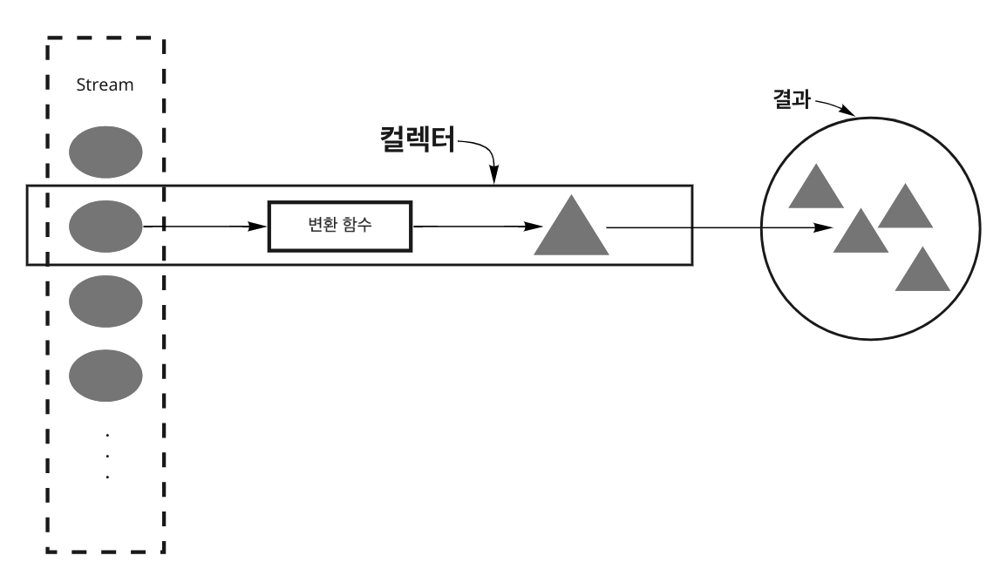
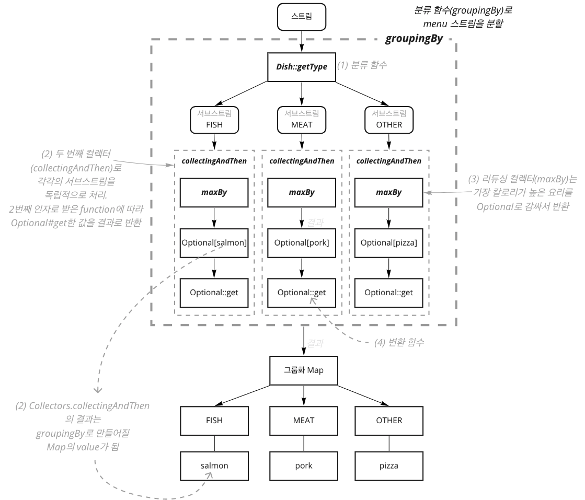

# **CH6. 스트림으로 데이터 수집**
- 스트림은 **데이터 집합을 처리**하는 **lazy**한 반복자이다
- 스트림의 **중간 연산**은 스트림 파이프라인을 구성하지만 스트림 요소를 **소비하지는 않는다**. 
- **최종 연산**이 **스트림의 요소를 소비**(consume)하여 최종 결과를 도출한다
- 최종 연산인 `collect`는 다양한 **요소 누적 방식을 인수로** 받아, 스트림을 최종 결과로 도출하는 **리듀싱 연산을 할 수** 있다
    
<br/>  
  
> *`Collection`<sub>컬렉션</sub>, `Collector`<sub>컬렉터</sub>, `collect`를 헷갈리지 않도록 주의하자!*  

<br/>

---

## **목차**
- [6.1 컬렉터란 무엇인가?](#61-컬렉터란-무엇인가)
- [6.2 리듀싱과 요약](#62-리듀싱과-요약)
- [6.3 그룹화](#63-그룹화)
- [6.4 분할](#64-분할)
- [6.5 Collector 인터페이스](#65-collector-인터페이스)
- [6.6 커스텀 컬렉터를 구현해서 성능 개선하기](#66-커스텀-컬렉터를-구현해서-성능-개선하기)

<br/><br/>

---

<br/><br/>

# 6.1 컬렉터란 무엇인가
아래는 통화별로 `Transaction` 리스트를 그룹화하기 위한 코드다.  
- 반복문을 이용한 코드
    ```java
    Map<Currency, List<Transaction>> transactionsByCurrencies = new HashMap<>();

    for (Transaction transaction : transactions) {
        Currency currency = transaction.getCurrency();  // 트랜잭션의 통화를 추출
        final List<Transaction> transactionsForCurrency = transactionsByCurrencies.get(currency);
        if (StringUtils.isEmpty(transactionsForCurrency)) { // 현재 통화를 그룹화하는 맵에 항목이 없으면 항목을 만든다
            transactionsForCurrency = new ArrayList<>();
            transactionsByCurrencies.put(currency, transactionsForCurrency);
        }
        transactionsForCurrency.add(transaction);   // 같은 통화를 가진 트랜잭션 리스트에, 현재 탐색 중인 트랜잭션을 추가 
    }
    ```
- `Stream`을 이용한 코드
    ```java
    Map<Currency, List<Transaction>> transactionsByCurrencies = transactions.stream()
        .collect(Collectors.groupingBy(Transaction::getCurrency));
    ```

`collect`는 `Collector` 인터페이스의 구현체를 인자로 받는다.  
`Collector` 인터페이스의 구현체는 stream의 요소를 어떤 식으로 도출할 것인지 지정한다.   
  
위 예시 코드에선 `Transaction`의 `currency`를 key로 하여, 각 key에 해당하는 값을 가진 요소들을 `Map`으로 만들었다.      
   
> - *`Collectors.groupingBy()`는 내부적으로 `CollectorImpl` 인스턴스를 생성하여 동작한다.*   
> - *`CollectorImpl`는 `Collector` 인터페이스를 implements한 static class이며, final class인 `Collectors`의 내부에 선언된 클래스다.*    
    
`Collector`<sub>컬렉터</sub>는 `Collectors.groupingBy()`와 같이 스트림 요소를 그룹화하거나, 스트림 요소를 분할할 수 있는 기능을 제공한다.     
   
<br/>

## **고급 리듀싱 기능을 수행하는 컬렉터**
`collect`를 이용해 결과 수집 과정을 간단하면서 유연한 방식으로 정의할 수 있다.   
      
스트림에 `collect`를 호출하면 인자로 전달된 **리듀싱 연산**이 수행된다. 이때 연산은 스트림의 각 요소를 방문하면서 `Collector`가 작업을 수행하는 구조다.      
   
아래 그림은 내부적으로 리듀싱 연산이 일어나는 모습을 보여준다.    
  
  

<br/>
    
일반적으로 `Collector`는 `변환 함수`를 stream의 요소에 적용하고 + 데이터 저장 구조에 결과를 누적하여 최종 결과로 리턴한다.    
위 `Transaction` 예시에 적용해보면, 각 `Transaction`에서 `Currency`를 추출하기 위해 사용된 함수를 변환 함수라 하며, `Map` 데이터 저장 구조에 변환된 요소들을 누적했다.   
  
즉, `Collector` 인터페이스의 메서드를 **어떻게 구현하느냐**에 따라 **스트림에 어떤 리듀싱 연산을 수행할지** 결정된다.   

<br/>

## **미리 정의된 컬렉터**
`Collector`를 implements한 `Collectors` 유틸리티 클래스는 자주 사용되는 `Collector` 인스턴스를 손쉽게 생성할 수 있도록 정적 팩토리 메서드를 제공한다.  
가장 많이 사용되는 `Collector`로는 `toList()`가 있다. `toList()`는 스트림의 모든 요소를 `List`로 수집한다.   
```java
final List<Transaction> transactions = transactionStream.collect(Collectors.toList());
```
  
`Collectors`에서 제공하는 메서드의 기능은 크게 3가지로 구분할 수 있다.
- 스트림 요소를 하나의 값으로 리듀스하고 요약
- 요소 그룹화
- 요소 분할

<br/><br/>

---

<br/><br/>

# 6.2 리듀싱과 요약
`Collector`로 스트림의 모든 항목을 하나의 결과로 합칠 때, 미리 정의된 컬렉터(`Collectors`)를 이용할 수 있다고 했다.  
`Collectors`가 제공해주는 정적 팩토리 메서드들에 대해 더 알아보자.  
      
<br/>

## **`counting`**
`Collectors.counting()` 팩토리 메서드로 스트림의 요소 수를 셀 수 있다.    
```java
final Long howManyDishes = menu.stream().collect(Collectors.counting());
```  
    
> 더 간단한 방법도 있다.
> ```java
> final long howManyDishes = menu.stream().count();
> ```
  
<br/>

## **`maxBy`, `minBy`**
`Collectors.maxBy`, `Collectors.minBy` 메서드를 이용하여 스트림의 최댓값과 최솟값을 계산할 수 있다. 이때 비교 기준은 `Comparator`를 인수로 받아서 사용한다.  
  
다음과 같이 menu에서 가장 칼로리가 높은 요리를 찾을 수 있다.  
```java
final Comparator<Dish> dishCaloriesComparator = Comparator.comparingInt(Dish::getCalories); // 칼로리의 크기를 비교하는 Comparator

// menu가 비어있을 경우를 대비하여 Optional<Dish>가 리턴된다
final Optional<Dish> mostCalorieDish = menu.stream()
        .collect(Collectors.maxBy(dishCaloriesComparator));
``` 
  
<br/>

## **`summingInt`, `averagingDouble`, `summarizingLong`** 
스트림에 있는 객체의 숫자 필드의 합계, 평균 등을 반환하는 연산을 **요약**<sub>summarization</sub> 연산이라 부르며, 요약 연산에도 리듀싱 기능이 사용될 수 있다.    

### **`Collectors.summingXXX`**
`Collectors.summingInt`팩터리 메서드는 객체를 int로 매핑하는 함수(`T -> int`)를 인수로 받는다. 
```java
// menu의 총 칼로리를 계산하는 코드
final Integer totalCalories = menu.stream()
        .collect(Collectors.summingInt(Dish::getCalories));
```
`summingInt`는 각 요소별로 `Dish::getCalories`를 한 다음, 초기값 0에 값을 누적한다. 결과적으로 총 칼로리를 알 수 있다.  
     
`Collectors.summingDouble`, `Collectors.summingLong` 메서드도 동일한 방식으로 동작한다.   
  
<br/>

### **`Collectors.averagingXXX`**
평균값 계산도 요약 기능이 제공된다.  
```java
final Double averageCalories = menu.stream()
        .collect(Collectors.averagingInt(Dish::getCalories));
```
`Collectors.averagingDouble`, `Collectors.averagingLong` 도 제공된다.  
   
<br/>

### **`Collectors.summarizingXXX`**  
만약 두 개 이상의 연산을 한 번에 수행해야 한다면, `Collectors.summarizingXXX`를 사용하여 해당 스트림의 요소 수, 칼로리 합계, 평균, 최솟값, 최댓값 등 모든 정보를 한 번에 확인할 수 있다.  
```java
final IntSummaryStatistics menuStatistics = menu.stream()
                .collect(Collectors.summarizingInt(Dish::getCalories));

// IntSummaryStatistics{count=9, sum=4180, min=120, average=464.444444, max=800}
```

이 역시 `Collectors.summarizingLong`(`LongSummaryStatistics`를 리턴), `Collectors.summarizingDouble`(`DoubleSummaryStatistics`를 리턴)처럼 다른 타입에 대응하는 클래스가 존재한다.    

<br/>

## **`joining`**
`Collectors.joining()`를 이용하여 스트림의 각 요소에 `toString()`한 문자열 모두를, 하나의 문자열로 연결하여 반환할 수 있다.  
```java
final String shortMenu = menu.stream()
        .map(Dish::getName)
        .collect(Collectors.joining());

// season fruitporksalmonprawnschickenfrench friesricepizzabeef        
```

`joining`은 내부적으로 `StringBuilder`를 이용하여 문자열을 하나로 만든다.  

하나의 문자열로 연결할 때, 구분자를 지정해 줄 수도 있다. 
```java
final String shortMenu = menu.stream()
        .map(Dish::getName)
        .collect(Collectors.joining(", "));

// season fruit, pork, salmon, prawns, chicken, french fries, rice, pizza, beef
```

<br/>

## **`reducing`**
앞서 살펴본 모든 `Collector`는 `Collectors.reducing`으로도 구현할 수 있다.
> 범용 팩토리 메서드인 `reducing`을 이용할 수도 있지만, 특화된 컬렉터인 `summingInt`, `averagingInt`, `joining`등을 사용하면 가독성이 좋고 편리하다는 장점이 있다.  

```java
// reducing를 이용하여 menu의 칼로리 합계 구하기

final Integer totalCalories = menu.stream()
        .collect(Collectors.reducing(0, Dish::getCalories, (i, j) -> i + j));
```
  
위에서 사용된 `reducing`은 3개의 인수를 받는다.
```java
public static <T, U> Collector<T, ?, U> reducing(
        U identity,
        Function<? super T, ? extends U> mapper,
        BinaryOperator<U> op
)
``` 
1. `U identity`
    - 리듀싱 연산의 시작값 혹은 스트림에 인수가 없을 때 대비한 반환값
2. `Function<? super T, ? extends U> mapper`
    - 변환 함수
3. `BinaryOperator<U> op`
    - 합계 함수. 같은 타입의 두 항목을 하나의 값으로 만드는 `BinaryOperator`
  
아래 코드에서 사용된 `reducing`은 1개의 인수(`BinaryOperator`)를 받으며, 시작값(혹은 반환값)이 없기 때문에 `Optional`로 감싼 객체가 리턴된다.    
```java
// 가장 칼로리가 높은 요리 찾기

final Optional<Dish> mostCalorieDish = menu.stream()
        .collect(Collectors.reducing((d1, d2) -> d1.getCalories() > d2.getCalories() ? d1 : d2));
```
     
<br/>

> ### **collect와 reduce** 
> ```java
> final Integer totalCalories1 = menu.stream()
>         .collect(Collectors.summingInt(Dish::getCalories));
> 
> final Integer totalCalories2 = menu.stream()
>         .map(Dish::getCalories)
>         .reduce(0, Integer::sum);
> ```  
> `collect`와 `reduce`는 같은 기능을 구현할 수 있지만 의미가 다르다.  
> `collect`는 결과를 누적하기 위한 **컨테이너가 변경 가능하도록** 설계된 메서드인 반면, `reduce`는 두 값을 하나로 도출하는 **불변형 연산**이라는 점이다.  
> 만약 `reduce`의 첫 번째 인자인 초기값에 리스트를 넘겨주게 되면, 여러 스레드가 동시에 같은 데이터 구조체를 고치려 하여 리스트 자체가 망가져버릴 수도 있다.   
> - e.g. 누적자로 `ArrayList`를 사용하면, 여기저기서 리스트에 `add`하는 일이 발생하여 기대했던 결과처럼 되지 않을 수 있다
> 
> 가변 컨테이너 관련 작업이면서 병렬성을 확보하려면 `collect`메서드로 리듀싱 연산을 구현하는게 바람직하다.  
> <sub>*관련 자세한 설명은 CH7에서 계속*</sub>

<br/>

### **컬렉션 프레임워크 유연성: 같은 연산도 다양한 방식으로 수행할 수 있다.**
menu의 칼로리 합계를 구할 때 `Integer`클래스의 `sum` 메서드 참조를 이용하면 코드를 좀 더 단순화할 수 있다. 
```java
final Integer totalCalories = menu.stream()
        .collect(Collectors.reducing(0, Dish::getCalories, Integer::sum));

// 초깃값 0에, 요소별로 변환 함수(Dish::getCalories)를 적용한 결과를, 합계 함수(Integer::sum)를 이용하여 반복적으로 조합
```
`collect`를 이용하지 않고 다른 방법으로도 동일한 연산을 수행할 수 있다.  
```java
final Integer totalCalories1 = menu.stream()
        .map(Dish::getCalories)
        .reduce(Integer::sum)
        .get();

final int totalCalories2 = menu.stream()
        .mapToInt(Dish::getCalories)    // IntStream으로 변환됨
        .sum();
```

마지막 해결 방법은 가독성도 좋지만, `IntStream` 덕분에 자동 언박싱<sub>autounboxing</sub>연산 수행이나 `Integer`를 `int`로 변환하는 과정을 피할 수 있어 성능까지 좋다.   

<br/><br/>

---

<br/><br/>

# 6.3 그룹화
`Collector`는 데이터 집합을 하나 이상의 특성으로 분류하여 **그룹화**하는 연산을 쉽게 구현할 수 있도록, 팩토리 메서드 `Collectors.groupingBy` 등을 제공한다.  
```java
// menu의 type별로 그룹화하기

final Map<Dish.Type, List<Dish>> dishedByType = menu.stream()
        .collect(Collectors.groupingBy(Dish::getType));
```
스트림의 각 요소에서 `Dish.Type`과 일치하는 모든 요리를 추출하기 위해 `getType`함수를 `groupingBy`메서드의 인자로 전달했다. `getType`의 결과를 기준으로 스트림 요소가 그룹화되며 이를 **분류 함수**<sub>classification function</sub>라 한다.  
  
위 예제는 비교적 단순한 분류이기에 메서드 레퍼런스를 분류 함수로 사용할 수 있었다.    
더 복잡한 분류를 해보자.   
400칼로리 이하는 `DIET`, 700 초과는 `FAT`, 그 사이는 `NORMAL`로 menu를 분류해보자. 이번엔 메서드 레퍼런스가 아닌 람다 표현식으로 분류한다.  

```java
public enum CaloricLevel {DIET, NORMAL, FAT}

final Map<CaloricLevel, List<Dish>> dishesByCaloricLevel = menu.stream()
        .collect(
                Collectors.groupingBy(
                        dish -> {
                                if (dish.getCalories() <= 400) {
                                        return CaloricLevel.DIET;
                                }

                                if (dish.getCalories() > 700) {
                                        return CaloricLevel.FAT;
                                }

                                return CaloricLevel.NORMAL;
                        }
                )
        );
```

<br/>

## **그룹화된 요소 조작**
요소를 그룹화한 다음, 각 결과 그룹의 요소를 조작할 수도 있다.  
  
예를 들어 menu를 타입별로 그룹화한 다음, 500칼로리를 초과하는 요리만 필터하고자 한다.   
다음 코드처럼 Predicate로 필터를 적용한 후, 그룹화를 하는 식으로 해결할 수도 있다.
```java
final Map<Dish.Type, List<Dish>> caloricDishesByType = menu.stream()
        .filter(dish -> dish.getCalories() > 500)
        .collect(Collectors.groupingBy(Dish::getType));
```
```
// 실행 결과

{MEAT=[pork, beef], OTHER=[french fries, pizza}]}
```
결과 `Map`에 `FISH`키가 존재하지 않는다! 왜냐면 500칼로리를 초과한 요소들로만 그룹화했기 때문에, 그룹화할 땐 `FISH`에 해당하는 Dish가 존재하지 않기 때문이다. 
    
이는 `Collectors.groupingBy`메서드 중 두 번째 인자로 `Collector`타입을 받는 메서드를 사용하여 해결할 수 있다.  
```java
final Map<Dish.Type, List<Dish>> caloricDishesByType = menu.stream()
        .collect(
                Collectors.groupingBy(
                        Dish::getType,
                        Collectors.filtering(dish -> dish.getCalories() > 500, Collectors.toList()) 
                )
        );
```
```
// 실행 결과

{MEAT=[pork, beef], OTHER=[french fries, pizza], FISH=[]}
```

`Collectors.filtering`는 `Predicate`를 인수로 받아 각 그룹의 요소를 필터링하여 재그룹화한다.    
   
> #### `Collectors.filtering`를 이용하면 `filter`와 `collect`를 한 번에 해결할 수 있다
> ```java
> final List<Integer> evenNumbers = Arrays.asList(1, 2, 3, 4, 5)
>         .stream()
>         .collect(Collectors.filtering(number -> number % 2 == 0, Collectors.toList())); // 2, 4
> ```

<br/>
    
`Collectors.mapping`메서드를 이용하면 그룹화한 요소에 mapping을 적용할 수 있다.  
```java
final Map<Dish.Type, List<String>> dishNamesByType = menu.stream()
        .collect(
                Collectors.groupingBy(
                        Dish::getType,
                        Collectors.mapping(Dish::getName, Collectors.toList()))
        );
```
```
{MEAT=[pork, chicken, beef], OTHER=[season fruit, french fries, rice, pizza], FISH=[salmon, prawns]}
```
--> `Dish.name`의 타입이 `String`이므로, 리턴된 데이터 `dishNamesByType`의 value 타입이 `List<String>`타입인 것을 확인할 수 있다.   

<br/>

`Collectors.groupingBy`에 flatMap도 적용할 수 있다.  
아래와 같이 각 요리별로 태그를 달았다고 가정하자.  
```java
final Map<String, List<String>> dishTags = new HashMap<>();
dishTags.put("pork", asList("greasy", "salty"));
dishTags.put("beef", asList("salty", "roasted"));
dishTags.put("chicken", asList("fried", "crisp"));
dishTags.put("french fries", asList("greasy", "fried"));
dishTags.put("rice", asList("light", "natural"));
dishTags.put("season fruit", asList("fresh", "natural"));
dishTags.put("pizza", asList("tasty", "salty"));
dishTags.put("prawns", asList("tasty", "roasted"));
dishTags.put("salmon", asList("delicious", "fresh"));
```  
  
`Collectors.flatMapping`을 이용하면 Dish의 Type마다 어떤 태그들이 있는지 알 수 있다.  
```java
final Map<Dish.Type, Set<String>> dishTagsByType = menu.stream()
        .collect(
                Collectors.groupingBy(
                        Dish::getType,
                        Collectors.flatMapping(
                                dish -> dishTags.get(dish.getName()).stream(),
                                Collectors.toSet()
                        )
                )
        );
```
```
{FISH=[roasted, tasty, fresh, delicious], MEAT=[salty, greasy, roasted, fried, crisp], OTHER=[salty, natural, greasy, light, tasty, fresh, fried]}
```
`menu` 요소를 `Type`별로 그룹화하는데, `dishTags`에서 현재 스트림 요소의 `Dish.name`을 key로 가진 value를 가져온다. 그럼 `Type`별로 tag list(`List<String>`)가 존재할 것이고 이 list를 하나의 `Set`으로 평면화(list라는 껍데기를 벗겨 `Set<String>`으로 만들어줌)시키는 과정을 거쳤다.  
여기서 `Set`을 사용한 이유는 중복 태그는 제거하기 위함이다.  
  
<br/>

## **다수준 그룹화**
지금까지는 그룹화를 할 때 하나의 기준(menu의 타입 또는 칼로리 등)으로만 그룹화를 하였지만, 둘 이상의 기준으로도 그룹화가 가능하다.  
     
2개의 인수를 받는 `Collectors.groupingBy`를 이용하여 요소를 여러 수준으로 그룹화할 수 있다. 첫 번째 인자는 일반적인 분류 함수(**1**), 두 번째 인자는 Collector를 받는데, 이때 두 번째 인자로 전달된 Collector에 또 다른 분류 함수(**2**)를 전달하여 2개의 수준으로 스트림 항목을 그룹화할 수 있다.  
```java
final Map<Dish.Type, Map<CaloricLevel, List<Dish>>> dishesByTypeAndCaloricLevel = menu.stream()
        .collect(Collectors.groupingBy(
                Dish::getType,                  // 첫 번째 수준의 분류 함수(1)
                Collectors.groupingBy(
                        dish -> {               // 이하 두 번째 수준의 분류 함수(2)
                                if (dish.getCalories() <= 400) {
                                        return CaloricLevel.DIET;
                                }

                                if (dish.getCalories() > 700) {
                                        return CaloricLevel.FAT;
                                }

                                return CaloricLevel.NORMAL;
                        }
                )
        ));
```
```
// 결과

{
        MEAT={
                DIET=[
                        Dish{name='chicken', vegetarian=false, calories=400, tyep=MEAT}
                ], NORMAL=[
                        Dish{name='beef', vegetarian=false, calories=700, tyep=MEAT}
                ], FAT=[
                        Dish{name='pork', vegetarian=false, calories=800, tyep=MEAT}]
        }, FISH={
                DIET=[
                        Dish{name='prawns', vegetarian=false, calories=280, tyep=FISH}
                ], NORMAL=[
                        Dish{name='salmon', vegetarian=false, calories=450, tyep=FISH}
                ]
        }, OTHER={
                DIET=[
                        Dish{name='season fruit', vegetarian=true, calories=120, tyep=OTHER}, 
                        Dish{name='rice', vegetarian=true, calories=350, tyep=OTHER}
                ], NORMAL=[
                        Dish{name='french fries', vegetarian=true, calories=530, tyep=OTHER}, 
                        Dish{name='pizza', vegetarian=true, calories=550, tyep=OTHER}
                ]
        }
}
```

첫 번째 수준의 분류 함수(1)에서 사용한 key는 `MEAT, FISH, OTHER` 라는 값을 가지며 이를 기준으로 분류한다. 그리고 두 번째 수준의 분류 함수(2)는 `NORMAL, DIET, OTHER`를 key로 가지며 이를 기준으로 분류한다.    
이러한 다수준 그룹화 연산은 n수준 그룹화로 확장할 수 있다.  
`groupingBy`연산을 버킷<sub>bucket</sub>(물건을 담을 수 있는 양동이) 개념으로 생각하면 쉽다. 첫 번째 `groupingBy`는 Type별로 버킷을 하나씩 만든다. 그리고 각각의 버킷을 서브스트림 컬렉터로 채워가는데 위 예시에서는 큰 버킷 3개(type별 버킷)안에 각각 칼로리 별로 나누어진 버킷이 존재한다고 생각하면 된다.  

<br/>

## **서브그룹으로 데이터 수집**
`groupingBy`의 두 번째 인자로 `Collectors.counting`을 넘겨주어, menu의 Type별 요리 수를 계산할 수도 있다.  
```java
final Map<Dish.Type, Long> typesCount = menu.stream()
        .collect(Collectors.groupingBy(Dish::getType, Collectors.counting()));
```
```
{FISH=2, MEAT=3, OTHER=4}
```

<br/>
  
> 사실 분류 함수 1개를 인수로 갖는 `groupingBy(f)`는 `groupingBy(f, Collectors.toList())`의 축약형이다 :sunglasses:
  
<br/>

menu의 Type별로 그룹화하되, 각 Type별로 칼로리가 가장 높은 요리를 찾아보자.
```java
final Map<Dish.Type, Optional<Dish>> mostCaloricByType = menu.stream()
        .collect(
                Collectors.groupingBy(
                        Dish::getType,
                        Collectors.maxBy(Comparator.comparing(Dish::getCalories))
                )
        );
```
```
{MEAT=Optional[Dish{name='pork', vegetarian=false, calories=800, type=MEAT}],
 OTHER=Optional[Dish{name='pizza', vegetarian=true, calories=550, type=OTHER}], 
 FISH=Optional[Dish{name='salmon', vegetarian=false, calories=450, type=FISH}]}
```
결과를 보면 Map의 value가 `Optional`로 래핑되어 있다.(`maxBy`의 리턴값이 `Collector<T, ?, Optional<T>>` 이기 때문!)      
사실 `groupingBy`컬렉터는 스트림의 첫 번째 요소를 찾은 후에야 그룹화한 Map에 key를 ~~게으르게~~ 추가하기 때문에, 위 상황에서는 `Optional`을 사용할 필요가 없다.(이미 요소가 존재했기 때문에 그룹화된 것이므로, empty하지 않다는 것이 보장됨)   
    
마지막 그룹화 연산으로 인해 래핑된 `Optional` 삭제해보자.  
`Collectors.collectingAndThen` 을 사용하면 컬렉터가 반환한 결과를 다른 형식으로 활용할 수 있다. `collectingAndThen`메서드는 적용할 컬렉터(`Collectors.maxBy`)와 변환 함수(`Optional::get`)를 인수로 받아, 다른 컬렉터를 리턴한다.  
```java
final Map<Dish.Type, Dish> mostCaloricByType = menu.stream()
        .collect(
                Collectors.groupingBy(
                        Dish::getType,                      // (1) 분류 함수
                        Collectors.collectingAndThen(       // (2)
                                Collectors.maxBy(Comparator.comparing(Dish::getCalories)),  // (3) 가장 높은 칼로리의 요리를 Optional로 래핑하여 반환
                                Optional::get               // (4) 변환 함수 
                        )
                )
        );
```
```
{OTHER=Dish{name='pizza', vegetarian=true, calories=550, type=OTHER}, 
MEAT=Dish{name='pork', vegetarian=false, calories=800, type=MEAT}, 
FISH=Dish{name='salmon', vegetarian=false, calories=450, type=FISH}}
```
> 리듀싱 컬렉터(`maxBy`)는 절대 `Optional.empty()`를 반환하지 않으므로, 위처럼 구현하여도 안전하다 :+1:   
  
<br/>


    
<br/>  
  
이번엔 menu를 Type별로 그룹화하되, Type별 value를 랜덤으로 하나씩만 매핑시킨 Map을 만들어보자.  
```java
final Map<Dish.Type, Dish> result = menu.stream()
        .collect(
                groupingBy(
                        Dish::getType,
                        Collectors.collectingAndThen(
                                Collectors.toList(),
                                list -> {
                                        Collections.shuffle(list);
                                        return list.get(0);
                                }
                        )
                )
        );
```
    
<br/>  
    
이번엔 menu를 Type별로 그룹화하되, 각 칼로리 합계를 구해보자. 
```java
final Map<Dish.Type, Integer> totalCaloriesByType = menu.stream()
        .collect(Collectors.groupingBy(Dish::getType, Collectors.summingInt(Dish::getCalories)));
```
```
{FISH=730, MEAT=1900, OTHER=1550}
```
    
<br/>  
      
만약 각 요리 Type에 존재하는 모든 CaloricLevel 값을 알고 싶다면?
```java
final Map<Dish.Type, Set<CaloricLevel>> dishesByCaloricLevel = menu.stream()
        .collect(
                Collectors.groupingBy(
                        Dish::getType,
                        Collectors.mapping(     // Dish를 CaloricLevel로 매핑하는 변환 함수. 그룹화 함수로 생성된 서브스트림에 mapping 함수가 적용됨
                                dish -> {
                                    if (dish.getCalories() <= 400) {
                                        return CaloricLevel.DIET;
                                    }

                                    if (dish.getCalories() > 700) {
                                        return CaloricLevel.FAT;
                                    }

                                    return CaloricLevel.NORMAL;
                                },
                                Collectors.toSet()
                        )
                )
        );
```  
```
{OTHER=[DIET, NORMAL], MEAT=[FAT, DIET, NORMAL], FISH=[DIET, NORMAL]}
```
  
<br/><br/>

---

<br/><br/>

# 6.4 분할
**분할**은 **분할 함수**<sub>partitioning function</sub>라 불리는 `Predicate`를 **분류 함수**로 사용하는 **그룹화 기능**이다. 
분할 함수는 `Boolean`을 반환하므로 Map의 key 타입은 `Boolean`이다. 결과적으로 그룹화된 Map은 최대 (**true** or **false**) 2개의 그룹으로 분할된다.    
  
예를 들어 채식 요리를 분리해보자.   
```java
final Map<Boolean, Map<Dish.Type, List<Dish>>> vegetarianDishesByType = menu.stream()
        .collect(
                Collectors.partitioningBy(
                        Dish::isVegetarian,
                        Collectors.groupingBy(Dish::getType)
                )
        );
```
```
{false={MEAT=pork, chicken, beef], FISH=[salmon, prawns]}, 
true={OTHER=[season fruit, french fries, rice, pizza]}}
```

<br/>   

이번엔 채식 요리를 분리하되, 각 그룹에서 가장 칼로리가 높은 요리를 찾아보자.
```java
final Map<Boolean, Dish> mostCaloricPartitionedByVegetarian = menu.stream()
        .collect(
                Collectors.partitioningBy(
                        Dish::isVegetarian,
                        Collectors.collectingAndThen(
                                Collectors.maxBy(
                                        Comparator.comparing(Dish::getCalories)
                                ),
                                Optional::get
                        )
                )
        );
```
```
{false=pork, true=pizza}
```

<br/>  

## **숫자를 소수와 비소수로 분할하기**
정수 n을 인수로 받아, 2에서 n까지의 자연수를 소수/비소수로 나누어보자.  
```java
public boolean isPrime(final int candidate) {
    return IntStream.range(2, candidate)
            .noneMatch(i -> candidate % i == 0);    // 스트림의 어떠한 정수로도 candidate를 나눌 수 없다면 소수이므로 true를 반환
}
```

> candidate를 candidate로 나누지 않기 위해, `range` 메서드를 사용함
> - `rangeClosed`를 사용하게 되면 candidate를 candidate로 나누는 일이 발생하기 때문에, 어떤 숫자를 넣어도 true가 리턴된다 :warning:  
     
스트림에 흘릴 요소를 'candidate의 제곱근 이하의 수'로 바꾸면 좀 더 효율적인 계산이 된다. *candidate의 제곱근 이하의 요소로 candidate를 나누었을 때 0이 되는 케이스가 없다면 그 이상은 연산해보지 않아도 candidate가 소수임을 알 수 있기 때문!*  
```java
public boolean isPrime(final int candidate) {
    final int candidateRoot = (int) Math.sqrt(candidate);

    return IntStream.rangeClosed(2, candidateRoot)
            .noneMatch(i -> candidate % i == 0);
}
```

> 이때는 `rangeClosed`를 사용하였는데, candidate의 제곱근을 포함해야지 원하는 결과를 도출할 수 있기 때문이다.    
> - e.g `candidate = 49`일 때, `candidateRoot = 7`이 된다. 그럼 `2이상 7이하` 중에서 `7`로 cadidateRoot를 나누면 나머지가 0이되어 `cadidate is not Prime`이 성립된다. 하지만 `range`로 스트림을 생성하면 `7`로는 나누지 않고 `6`까지만 나누기 때문에 cadidate인 `49`는 prime이라는 결과가 나와버린다 :scream:
  
<a name = "oldIsPrime"></a>

이제 위 `isPrime`메서드를 Predicate로 이용하여 n개의 숫자를 포함하는 스트림에서 소수/비소수를 찾아보자.  
```java
public Map<Boolean, List<Integer>> partitionPrimes(final int n) {
    return IntStream.rangeClosed(2, n).boxed()
            .collect(
                    Collectors.partitioningBy(candidate -> isPrime(candidate))
            );
}
```
```
// n=16  인 경우

{false=[4, 6, 8, 9, 10, 12, 14, 15, 16], true=[2, 3, 5, 7, 11, 13]}
```

<br/><br/>

---

<br/><br/>

# 6.5 Collector 인터페이스
`Collector`인터페이스는 리듀싱 연산(스트림 요소를 처리하여 값으로 도출) 기능을 하는 메서드들(`toList`, `groupingBy` 등)을 제공하고 있으며, 물론 커스텀하게 만들어서(`partitionPrimes` 등) 사용할 수도 있다. 

<br/>

## **Collector 인터페이스의 메서드 살펴보기**
`Collector`인터페이스는 아래와 같이 다섯 개의 추상 메서드를 정의하고 있다.   
```java
public interface Collector<T, A, R> {
    Supplier<A> supplier();
    BiConsumer<A, T> accumulator();
    BinaryOperator<A> combiner();
    Function<A, R> finisher();
    Set<Collector.Characteristics> characteristics();
}
```

- `T`: 스트림 항목의 타입
- `A`: 누적자. 수집 과정에서 중간 결과를 누적하는 객체의 타입
- `R`: 수집 연산 결과 객체의 타입 (대부분은 Collection 타입이다)
  
예를 들어 스트림 내 모든 요소를 `List<T>`로 수집하는 `ToListCollector<T>`라는 클래스를 만들어 본다면 다음과 같다. 
```java
public class ToListCollector<T> implements Collector<T, List<T>, List<T>>
```

> *`ToListCollector`는 누적 과정에서 사용되는 객체가 수집 결과로 사용된다.* 
   
<br/>

`Collector`인터페이스 내 메서드들을 하나씩 살펴보자.  
    
<br/>

### **`supplier()`: 새로운 결과 컨테이너 만들기**
`supplier()`는 파라미터 없이 누적자 인스턴스 `Supplier<A>`를 리턴하는 함수다.  
`ToListCollector#supplier`를 구현한다면 다음과 같다.  
```java
@Override
public Supplier<List<T>> supplier() {
    return ArrayList::new;          // () -> new ArrayList<T>()
}
```

<br/>

### **`accumulator()`: 결과 컨테이너에 요소 추가하기**
리듀싱 연산을 수행하는 함수를 반환한다. 누적자(`List<T>`)와 스트림의 n번째 요소(`T`타입)를 함수에 적용한다.  
`ToListCollector`에서는 다음과 같이 구현할 수 있다. 이 경우 `accumulator()`는 탐색 완료한 요소를 포함하고 있는 list에, 현재 요소를 추가하는 연산을 수행한다. 
```java
@Override
public BiConsumer<List<T>, T> accumulator() {
    return List::add;                // (list, item) -> list.add(item)
}
```

<br/>
   
### **`finisher()`: 최종 변환값을 결과 컨테이너로 적용하기**
누적자를 최종 결과로 변환할 때 사용한다. (리턴 타입인 `Function<A, R>`은 `A`타입을 인자로 받고 `R`타입을 리턴하는 함수다)  
`ToListCollector#finisher`는 누적자 객체가 이미 최종 결과가 된다. 이 경우 변환 과정이 필요치 않으므로 `finisher()`는 항등 함수를 반환하도록 구현하면 된다. ( ==> `A`타입과 `R`타입이 동일한 상황)
```java
@Override
public Function<List<T>, List<T>> finisher() {
    return Function.identity();
}
```

<br/>

### **`combiner()`: 두 결과 컨테이너 병합**
스트림을 병렬로 처리할 때, 누적자가 이 결과를 어떻게 처리할 지를 정의힌다.  
`ToListCollector#combiner`는 다음과 같이 구현할 수 있다.  
```java
@Override
public BinaryOperator<List<T>> combiner() {
    return (list1, list2) -> {
        list1.addAll(list2);
        return list1;
    };
}
```
   
> 스트림의 리듀싱을 병렬로 수행하는 내용은 CH7에서 자세히 알아본다 :smirk:
    
<br/>

### **`characteristics()`**
`characteristics`메서드는 컬렉터의 연산을 정의하는 `Characteristics`타입의 불변 집합(`Set<Characteristics>`)을 반환한다. 즉 이 컬렉터의 연산이 어떤 특징을 가지고 있는지를 정의한다.  
`collect`메서드가 어떤 최적화(e.g. 병렬화)를 이용하여 리듀싱 연상을 수행하게 할 것인지 결정하도록 돕는 *힌트 특성 집합*을 제공한다.  
```java
public static enum Characteristics {
    CONCURRENT,             
    UNORDERED,              
    IDENTITY_FINISH;         
}
```

- `CONCURRENT`
    - 다중 스레드에서 `accumulator()`를 동시에 호출할 수 있으며, 이 컬렉터는 스트림의 병렬 리듀싱을 수행할 수 있다. 
    - 컬렉터의 플래그에 `UNORDERED`를 함께 설정하지 않았다면 데이터 소스가 정렬되어 있지 않은 상황(요소의 순서가 무의미한 상황)에서만 병렬 리듀싱을 수행할 수 있다.  
- `UNORDERED`
    - 리듀싱 결과는 스트림 요소의 방문 순서나 누적 순서에 영향을 받지 않는다
- `IDENTITY_FINISH`
    - `finisher()`가 반환하는 함수는 `Function.identity()`이므로 생략할 수 있다. (누적자를 단순히 그대로 리턴하기 때문) 따라서 리듀싱 과정의 최종 결과로 누적자 객체를 바로 사용할 수 있다. 
    - 또한 누적자의 `A`타입을 `R`타입으로 안전하게 변환하여 리턴할 수 있다.  

앞서 예시로 들었던 `ToListCollector`를 생각해보자.  
누적자 타입과 결과 객체의 타입이 동일했기 때문에 추가 변환이 필요 없었다. 따라서 `ToListCollector`는 `IDENTITY_FINISH`이다. 그리고 리스트의 순서는 상관 없으므로 `UNORDERED`이다. 마지막으로 병렬 리듀싱을 수행할 수 있으므로(요소의 순서가 무의미한 데이터 소스이기 때문) `CONCURRENT`이다. <sub>결론적으론 세 가지 특징을 모두 가지고 있다!</sub>    
`ToListCollector#characteristics`는 다음과 같이 구현할 수 있다.  
```java
@Override
public Set<Characteristics> characteristics() {
    return Collections.unmodifiableSet(
            // ToListCollector는 3가지 특징을 모두 가지고 있으므로, 본 컬렉터의 플래그는 아래와 같이 3개 모두 설정하면 된다. 
            EnumSet.of(     
                    Characteristics.CONCURRENT,
                    Characteristics.UNORDERED,
                    Characteristics.IDENTITY_FINISH
            )
    );
}
```
  
<br/>
  
## **응용하기**
앞서 구현해본 `ToListCollector`를 이용하여 `menu` 내 모든 요소를 수집해보자.  
```java
// 팩토리 메서드인 toList를 사용 
final List<Dish> dishesA = menu.stream().collect(Collectors.toList());

// 커스텀한 ToListCollector를 사용
final List<Dish> dishesB = menu.stream().collect(new ToListCollector<Dish>());  
```
  
<br/><br/>

---

<br/><br/>

# 6.6 커스텀 컬렉터를 구현해서 성능 개선하기
앞서 다루었던 소수/비소수 분할하기 예제를 커스텀 컬렉터를 이용하여 성능을 개선해보자!   
```java
public static Map<Boolean, List<Integer>> partitionPrimes(final int n) {
    return IntStream.rangeClosed(2, n).boxed()
            .collect(
                    Collectors.partitioningBy(candidate -> isPrime(candidate))
            );
}
```

<br/>

## **소수로만 나누기**
우선 `isPrime`에서 `candidateRoot`까지 요소를 반복할 때, 이 요소를 소수로만 나눈다면 범위를 좁힐 수 있다.  
주어진 요소가 소수인지를 판단하려면 지금까지 발견한 소수 리스트에 접근해야 하는데, 지금까지 살펴본 컬렉터로는 컬렉터 수집 과정에서 부분 결과에 접근할 수 없다. :confused:  
이 문제를 바로 커스텀 컬렉터 클래스로 해결할 수 있다!  
지금까지 발견한 소수 리스트를 인자로 넘겨주어, 해당 리스트로 연산하도록 구현하면 된다.  
```java
public static boolean isPrime(final List<Integer> primes, final int candidate) {
    return primes.stream()
            .noneMatch(i -> candidate % i == 0);
}
```
여기서 candidate의 제곱근보다 작은 소수만 사용하도록 코드를 최적화해야 한다. 다음 소수가 candidateRoot보다 커진다면 소수로 나누는 연산을 멈춰야 하는데, 스트림 API에는 이런 기능을 제공하는 메서드가 없다. `fileter`를 사용하여 candidateRoot보다 작은지 검사할 순 있지만, 해당 **스트림을 멈출 수는 없다**.  
따라서 아래 코드처럼 정렬된 리스트와 `Predicate`를 인수로 받아, 리스트의 첫 요소에서 시작해서 `Predicate`를 만족하는 가장 긴 요소로 이루어진 리스트를 반환하는 `takeWhile`이라는 메서드를 구현한다.   
  
물론 Java9 이상이라면, API로 제공되는 `takeWhile`을 사용하면 된다.  
```java
public static boolean isPrimeForJava9(final List<Integer> primes, final int candidate) {
    final int candidateRoot = (int) Math.sqrt(candidate);

    return primes.stream()
            .takeWhile(i -> i <= candidateRoot)
            .noneMatch(i -> candidate % i == 0);
}
```
   
하지만 만약 Java8 이하라면, 아래와 같이 '정렬된 list와 Predicate를 인수로 받아, Predicate를 만족하는 가장 긴 첫 요소리스트를 반환'하도록 `takeWhile`메서드를 직접 구현할 수 있다. 
```java
public static <A> List<A> takewhile(List<A> list, Predicate<A> p) {
    int i = 0;
    for (A item : list) {
        if (!p.test(item)) { // item이 Predicate를 만족하는지 검사
            return list.subList(0, i); // 만족하지 않으면 (list에서 꺼낸 item이 candidateRoot보다 크다는 뜻) list에서 인덱스 i까지만 서브리스트로 만들어 리턴한다
        }

        i++;
    }

    return list; // list 내 모든 요소가 Predicate를 만족하기 때문에 위 루프문을 통과함 --> list 자체를 반환하면 된다!
}
```
   
이 `takeWhile`을 이용하여 `candidateRoot`보다 작은 소수만 찾도록 `isPrime`을 최적화할 수 있다. 
```java
public static boolean isPrime(final List<Integer> primes, final int candidate) {
    final int candidateRoot = (int) Math.sqrt(candidate);

    return takewhile(primes, i -> i <= candidateRoot)
            .stream()
            .noneMatch(i -> candidate % i == 0);
}
```
    
> 스트림 API에서 제공하는 `takeWhile`과는 달리 직접 구현한 `takeWhile`은 적극적<sub>eager</sub>으로 동작한다. (lazy했다면 호출되기 전까지는 동작하지 않는다. eager하다는 건 **호출되지 않더라도 동작한다**는 뜻!!)    
> 따라서 가능하면 `noneMatch`동작과 조화를 이룰 수 있도록 Java9의 스트림에서 제공하는 **게으른** 버전의 `takeWhile`을 사용하는 걸 권장한다.  
    
<br/>
    
새로운 `isPrime()`을 구현하였으니, 이제 본격적으로 커스텀 컬렉터를 구현해보자. 
  
### **1단계: Collector 클래스 시그니처 정의**
`Collector` 인터페이스의 정의를 참고하여 클래스 시그니처를 만들자. 
```java
public interface Collector<T, A, R>
```
`T`는 스트림 요소의 타입, `A`는 누적자 타입, `R`은 최종 결과의 타입이다.  
  
우리는 정수로 이루어진 스트림에서 누적저와 최종 결과의 타입이 `Map<Boolean, List<Integer>>`<sub>*T/F로 분할된 정수 리스트*</sub>인 컬렉터를 구현하고자 한다.   
이 컬렉터의 시그니처는 다음과 같을 것이다.   
```java
class PrimeNumbersCollector implements Collector<Integer, Map<Boolean, List<Integer>>, Map<Boolean, List<Integer>>>
```
  
<br/>
  
### **2단계: 리듀싱 연산 구현**
이제 `Collector` 인터페이스에 정의된 5개의 메서드를 구현해야 한다.   
  
우선 `supplier()`는 누적자를 만드는 함수를 반환해야 한다.  
```java
@Override
public Supplier<Map<Boolean, List<Integer>>> supplier() {
    return () -> new HashMap<Boolean, List<Integer>>() {{
        put(true, new ArrayList<Integer>());
        put(false, new ArrayList<Integer>());
    }};
}
```
누적자로 사용할 `Map`을 만들면서 **key**에는 `Boolean`을 , **value**에는 empty 리스트로 초기화 시켰다.  
이제 empty 리스트에 각각 소수/비소수를 추가할 것이다. 스트림에 요소를 어떻게 수집할지는 `accumulator`에서 결정할 것이다. 이 `accumulator`메서드는 우리가 만들 컬렉터에서 **핵심**이라고 할 수 있다. 언제든지 원할 때 수집 과정의 중간 결과, 즉 **지금까지 발견한 소수를 포함하고 있는 누적자에게 접근**할 수 있는 장치가 된다.    
```java
@Override
public BiConsumer<Map<Boolean, List<Integer>>, Integer> accumulator() {
    return (Map<Boolean, List<Integer>> acc, Integer candidate) -> {
        acc.get(isPrime(acc.get(true), candidate)) // isPrime의 결과인 T/F를 key로 하여, 각각 리스트(소수/비소수 리스트)를 value로 가짐 
                .add(candidate); // candidate를 map에 추가한다.
    };
}
```
지금까지 발견한 소수 리스트(`acc`에 `true`를 key로 가진 값을 get함)와 소수인지 확인할 대상인 `candidate`를 인자로 --> `isPrime`을 호출한다.   
`isPrime`의 리턴값으로 소수/비소수에 대한 T/F를 받아 그것을 key로, 그리고 해당 `candidate`를 value로 하여 map에 추가한다.   
  
<br/>
  
### **3단계: 병렬 실행할 수 있는 컬렉터 만들기(가능하다면)**
이번엔 병렬 수집 과정에서 2개의(T/F) 부분 누적자를 합칠 수 있는 메서드를 만든다.  
우리가 하는 예제에서는 단순하게 두 번째 map의 소수/비소수 리스트의 모든 수를 첫 번째 맵에 추가하는 연산만 구현하면 된다.  
```java
@Override
public BinaryOperator<Map<Boolean, List<Integer>>> combiner() {
    return (Map<Boolean, List<Integer>> map1, Map<Boolean, List<Integer>> map2) -> {
        map1.get(true).addAll(map2.get(true));
        map1.get(false).addAll(map2.get(false));
        return map1;
    };
}
```
사실 알고리즘 자체가 순차적이어서 컬렉터를 실제 병렬로 사용할 순 없다..
> `combiner`는 스트림을 병렬로 처리할 때, 누적자가 어떻게 처리할 것인지 정의하는 메서드인데, 우리 예제는 [2부터 `candidate`까지 순차적으로 진행]되기 때문에 스트림을 병렬로 사용하지 않는다는 뜻)   
   
따라서 `combiner`메서드는 호출될 일이 없어 구현하지 않고 빈 상태로 남겨둬도 됨..(또는 `UnsupportedOperationException`을 던지도록 구현하는 방법도 좋다)     
  
<br/>
  
### **4단계: finisher 메서드와 컬렉터의 characteristics 메서드**
나머지 구현해야할 두 메서드는 쉽게 구현할 수 있다.  
`accumulator`의 형식은 컬렉터의 결과 형식과 동일하기 때문에 변환 과정이 필요 없다. 따라서 항등 함수 `identity`를 반환하도록 `finisher`메서드를 구현한다.  
```java
@Override
public Function<Map<Boolean, List<Integer>>, Map<Boolean, List<Integer>>> finisher() {
    return Function.identity();
}
```
  
우리가 구현하는 커스텀 컬렉터는 `CONCURRENT`도 아니고 `UNORDERED`도 아니지만, `IDENTITY_FINISH`엔 해당하기 때문에 아래와 같이 `characteristics`를 구현하면 된다.
```java
@Override
public Set<Characteristics> characteristics() {
    return Collections.unmodifiableSet(EnumSet.of(Characteristics.IDENTITY_FINISH));
}
```

<br/>
<br/>

<details>
<summary>참고: `PrimeNumbersCollector`의 최종 구현 코드</summary>
<div markdown="1">

```java
public class PrimeNumbersCollector implements Collector<Integer, Map<Boolean, List<Integer>>, Map<Boolean, List<Integer>>> {

    @Override
    public Supplier<Map<Boolean, List<Integer>>> supplier() {
        return () -> new HashMap<Boolean, List<Integer>>() {{   // 2개의 빈 리스트를 갖고 있는 map으로 수집 동작을 시작
            put(true, new ArrayList<Integer>());
            put(false, new ArrayList<Integer>());
        }};
    }

    @Override
    public BiConsumer<Map<Boolean, List<Integer>>, Integer> accumulator() {
        return (Map<Boolean, List<Integer>> acc, Integer candidate) -> {
            acc.get(MainClass.isPrime(acc.get(true), candidate))   // 지금까지 발견한 소수리스트를 isPrime메서드로 전달
                    .add(candidate);        // isPrime의 결과에 따라 알맞은 key(t/f)의 value(리스트)에 candidate를 추가한다
        };
    }

    @Override
    public BinaryOperator<Map<Boolean, List<Integer>>> combiner() {
        return (Map<Boolean, List<Integer>> map1, Map<Boolean, List<Integer>> map2) -> {
            map1.get(true).addAll(map2.get(true));
            map1.get(false).addAll(map2.get(false));
            return map1;
        };
    }

    @Override
    public Function<Map<Boolean, List<Integer>>, Map<Boolean, List<Integer>>> finisher() {
        return Function.identity(); // 최종 수집 과정에서 데이터 변환은 필요치 않으므로 항등 함수를 반환
   }

    @Override
    public Set<Characteristics> characteristics() {
        return Collections.unmodifiableSet(EnumSet.of(Characteristics.IDENTITY_FINISH));
    }
}
```

---

</div>
</details>

<br/>
<br/>

앞서 `Collectors.partitioningBy`를 이용하여 만들었던 [예제](#oldIsPrime)를, 이제 다음처럼 우리가 만든 커스텀 컬렉터로 교체할 수 있다. 
```java
public Map<Boolean, List<Integer>> partitionPrimesWithCustomCollector(final int n) {
    return IntStream.rangeClosed(2, n).boxed()
            .collect(new PrimeNumbersCollector());
}
```
  
<br/>
  
## 컬렉터 성능 비교
팩토리 메서드 `Collectors.partitioningBy`로 만든 코드와, 우리가 커스텀하게 만들었던 코드의 성능에 차이가 있을까?  
  
아래와 같이 컬렉터의 성능을 확인할 수 있는 간단한 하니스<sub>harness</sub>를 만들어보았다. 
> *JMH 등을 이용하여 좀 더 과학적인 벤치마킹을 할 수도 있지만, 여기선 간단하게 테스트하기 위한 용도이므로 직접 구현함*  

```java
long fastest = Long.MAX_VALUE;
for (int i = 0; i < 10; i++) {  // 테스트를 10번 실행한다
    final long start = System.nanoTime();
    partitionPrimes(1_000_000);     // 2에서 백만까지의 숫자를 소수/비소수로 분할한다
    final long duration = (System.nanoTime() - start) / 1_000_000;
    if (duration < fastest) {
        fastest = duration;     // 가장 빨리 실행된 결과를 저장한다
    }
}
System.out.println("Fastest execution done in " + fastest + "msecs");
```

- `partitionPrimes`
    ```
    Fastest execution done in 285msecs
    ```
  
- `partitionPrimesWithCustomCollector`
    ```
    Fastest execution done in 129msecs
    ```
  
우리가 구현해본 커스텀 컬렉터의 성능이 더 좋음을 확인할 수 있다 :sunglasses:
  