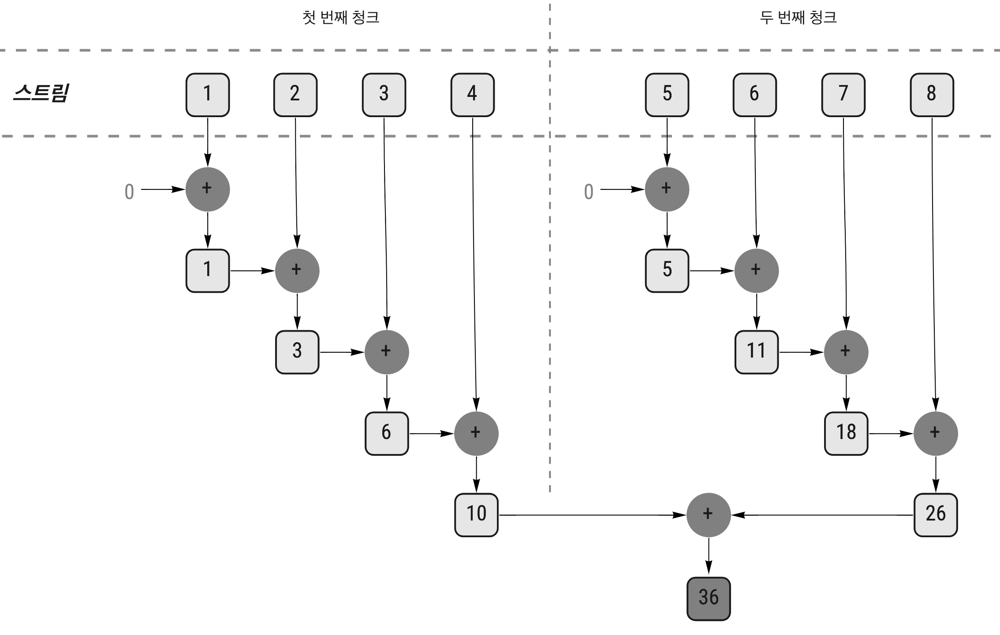
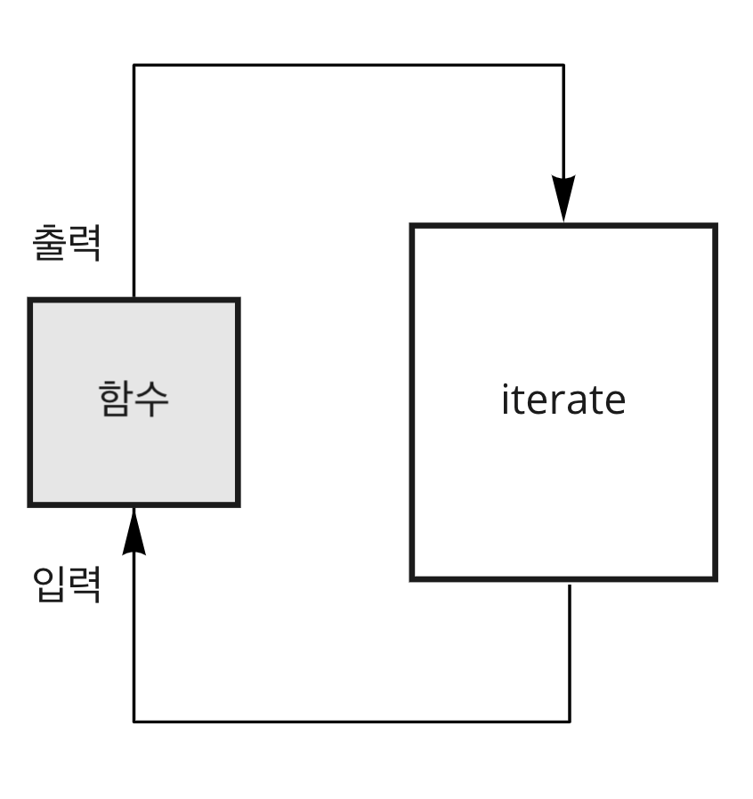
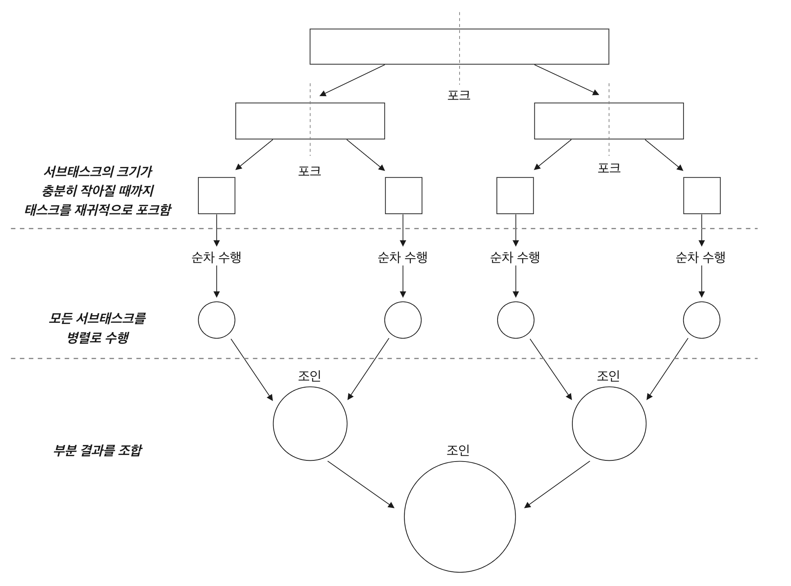
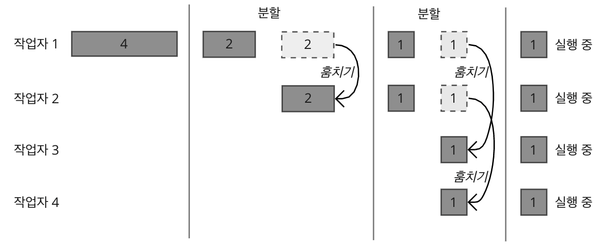
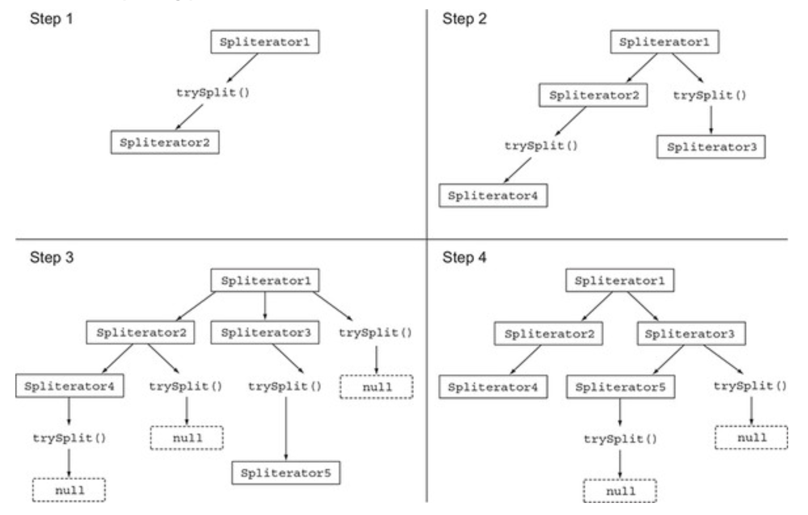

# **CH7. 병렬 데이터 처리와 성능**
자바 7 이전엔 데이터 컬렉션 병렬 처리를 아래와 같은 ~~<sub>귀찮고 어려운</sub>~~ 방식으로 진행했다.   
1. 데이터를 서브파트로 분할한다
2. 분할된 서브파트를 각각의 스레드로 할당한다
3. 스레드로 할당한 다음 의도치 않은 레이스 컨디션<sub>race condition; 경쟁 상태</sub>이 발생하지 않도록 적절한 동기화를 추가한다
4. 부분 결과를 합친다
      
자바 7에선 병렬화를 더 쉽게 수행하면서 에러를 최소화할 수 있도록 **포크/조인 프레임워크**<sub>fork/join framework</sub>라는 기능을 제공한다. 
  
이번 7장에선 포크/조인 프레임워크, 스트림으로 데이터 컬렉션 관련 동작을 병렬로 쉽게 처리하는 방법을 살펴본다.       
     
--- 

## **목차**
- [7.1 병렬 스트림](#71-병렬-스트림)
- [7.2 포크/조인 프레임워크](#72-포크조인-프레임워크)
- [7.3 Spliterator](#73-spliterator)

---

# 7.1 병렬 스트림
컬렉션에 `parallelStream`을 호출하면 **병렬 스트림**<sub>parallel stream</sub>이 생성된다. **병렬 스트림**이란 각각의 스레드에서 처리할 수 있도록 **스트림 요소를 여러 청크로 분할한 스트림**이다. 따라서 병렬 스트림을 이용하면 모든 멀티코어 프로세서가 각각의 청크를 처리하도록 할당할 수 있다.  

<a name="numbersum"></a>

숫자 n이 주어졌을때 1부터 n까지 모든 숫자의 합계를 반환하는 메서드를 구현해보자.     
아래 코드처럼 무한 스트림을 이용하여 해결할 수도 있다.  
```java
public static long sequentialSum(final long n) {
    return Stream.iterate(1L, i -> 1 + i)       // 1씩 증가하는 무한 스트림 생성
            .limit(n)                           // n개 이하로 제한
            .reduce(0L, Long::sum);             // 모든 요소를 더하는 스트림 리듀싱 연산
}
```
    
for문을 이용해서 구현할 수도 있다.
```java
public static long iterativeSum(long n) {
    long result = 0;
    
    for(long i = 1L; i <= n; i++ ) {
        result += i;
    }
    
    return result;
}
```
  
만약 `n`이 엄청나게 큰 숫자라면 병렬로 처리하는 것이 좋을 텐데, 이 땐 무엇부터 건드려야 할까? 결과는 어떻게 동기화해야 하며 스레드는 몇 개를 사용할까? 숫자는 어떻게 생성하고 생성된 숫자는 누가 더해야 할까? ... :sweat:      
    
이 의문들을 병렬 스트림이 날려줄 것이다 :+1:   

<br/>

## **순차 스트림을 병렬 스트림으로 변환하기**
순차 스트림에 `parallel()`를 호출하면 기존 함수형 리듀싱 연산이 **병렬로 처리**된다.   
```java
public static long parallelSum(final long n) {
    return Stream.iterate(1L, i -> 1 + i)
            .limit(n)
            .parallel()     // 스트림을 병렬 스트림으로 변환
            .reduce(0L, Long::sum);
}
```
일반 스트림에서 **병렬 스트림**으로 바뀌면서 스트림은 여러 청크로 분할되어, **리듀싱 연산을 여러 청크에서 병렬로 수행**할 수 있다! 리듀싱 연산으로 생성된 부분 결과는 다시 리듀싱 연산으로 합쳐져 전체 스트림의 리듀싱 결과를 도출한다.  
<a name = "reducingimage"></a>  
  
<br/>

  
  
순차 스트림에 `parallel()`를 호출한다고 해서 사실 스트림 자체에 어떤 변화가 생기는 건 아니다.   
스트림 내부에 이 파이프라인을 `순차|병렬`로 실행할 것인지에 대한 `boolean`플래그가 존재하는데, 이 플래그 값에 따라 순차 또는 병렬로 실행되는 것이다. `parallel()`을 호출하면 **병렬**로 실행되며, `sequential()`을 호출하면 **순차**적으로 실행된다. 이 두 메서드 중에서 **최종으로 호출된 메서드**가 **전체** 파이프라인을 어떻게 실행할 것인지 결정한다. 
  
```java
stream.parallel()
    .filter(...)
    .sequential()
    .map(...)
    .parallel()
    .reduce();
```
위 코드에서는 `parallel()`이 마지막으로 호출됐으므로 이 파이프라인은 전체적으로 **병렬**로 실행된다.   
    
<br/>

> ### 병렬 스트림에서 사용하는 스레드 풀 설정
> 병렬 스트림을 수행하는 스레드는 어디서 생성되는 것이며, 몇 개나 생성되는 걸까? 그리고 그 과정을 어떻게 커스터마이즈 할 수 있을까?  
>   
> 병렬 스트림은 내부적으로 `ForkJoinPool`을 사용한다. `ForkJoinPool`은 기본적으로 **프로세서의 수에 상응하는 스레드**를 갖는다. (`Runtime.getRuntime().availableProcessors()`가 반환하는 값!)   
> 현재는 하나의 병렬 스트림에 개별적으로 스레드 수를 지정할 수는 없다. 전역으로 설정할 수는 있지만, 특별한 이유가 없다면 일반적으로 기기의 프로세서 수와 동일한 `ForkJoinPool`의 기본값을 그대로 사용할 것을 권장한다.    
> 
> <details>
> <summary>참고: 병렬 스트림의 스레드 풀 찍어보기</summary>
> <div markdown="1">
> 
> ```java
> public static void parallelStream(final long n) {
>     System.out.println("availableProcessors :: " + Runtime.getRuntime().availableProcessors());
>     System.out.println("start :: " + Thread.currentThread().getName() + " ::: " + LocalTime.now());
>     Stream.iterate(1L, i -> 1 + i)
>             .limit(n)
>             .parallel()
>             .forEach(i -> {
>                         System.out.println("\t\t" + i + " ::: " + Thread.currentThread().getName() + " ::: " + LocalTime.now());
>                         try {
>                             Thread.sleep(5000);
>                         } catch (InterruptedException e) {
>                             e.printStackTrace();
>                         }
>                     }
>             );
>     System.out.println("end :: " + Thread.currentThread().getName() + " ::: " + LocalTime.now());
> }
> 
> public static void main(String[] args) {
>     parallelStream(20);
> }
> ```
> ```bash
> // 실행 결과
> 
> availableProcessors :: 16
> start :: main ::: 16:33:31.131181
> 		14 ::: ForkJoinPool.commonPool-worker-3 ::: 16:33:31.144039
> 		8 ::: ForkJoinPool.commonPool-worker-21 ::: 16:33:31.143734
> 		16 ::: ForkJoinPool.commonPool-worker-25 ::: 16:33:31.143929
> 		19 ::: ForkJoinPool.commonPool-worker-27 ::: 16:33:31.143209
> 		3 ::: ForkJoinPool.commonPool-worker-17 ::: 16:33:31.143792
> 		4 ::: ForkJoinPool.commonPool-worker-11 ::: 16:33:31.143976
> 		20 ::: ForkJoinPool.commonPool-worker-23 ::: 16:33:31.143196
> 		17 ::: ForkJoinPool.commonPool-worker-9 ::: 16:33:31.143153
> 		2 ::: ForkJoinPool.commonPool-worker-7 ::: 16:33:31.143809
> 		6 ::: ForkJoinPool.commonPool-worker-13 ::: 16:33:31.143866
> 		7 ::: ForkJoinPool.commonPool-worker-29 ::: 16:33:31.144297
> 		18 ::: ForkJoinPool.commonPool-worker-19 ::: 16:33:31.143290
> 		5 ::: ForkJoinPool.commonPool-worker-15 ::: 16:33:31.146486
> 		15 ::: ForkJoinPool.commonPool-worker-31 ::: 16:33:31.145842
> 		11 ::: ForkJoinPool.commonPool-worker-5 ::: 16:33:31.143109
> 		12 ::: ForkJoinPool.commonPool-worker-25 ::: 16:33:36.153210
> 		10 ::: ForkJoinPool.commonPool-worker-27 ::: 16:33:36.153212
> 		13 ::: ForkJoinPool.commonPool-worker-21 ::: 16:33:36.153210
> 		1 ::: ForkJoinPool.commonPool-worker-3 ::: 16:33:36.153313
> 		9 ::: ForkJoinPool.commonPool-worker-17 ::: 16:33:36.153397
> end :: main ::: 16:33:41.158385
> ```
> 
> main을 포함하여 16개째 스레드(worker-5)가 돌아간 이후, 5초 후에 나머지가 실행된 것을 볼 수 있다.  
> 15개의 워커 스레드가 연산을 병렬로 처리하고, 5초 후에 남은 연산이 수행된다. 그러고나서 5초 후에 end가 출력된다.    
>   
> </div>
> </details>
    
<br/>
  
<br/>
    
## 스트림 성능 측정
앞선 [숫자 합계 예제](#numbersum)에서 구현 방법을 3가지(순차 스트림, for문 반복, 병렬 리듀싱)로 살펴보았는데, 이 중 어느 것이 빠른지 성능을 측정해보자.  
  
> 책 실습에선 JMH<sub>Java Microbenchmark Harness;자바 마이크로벤치마크 하니스</sub>라는 라이브러리를 이용해 벤치마크를 구현해서 측정하였음   
   
<a name="harness"></a>

<details>
<summary>성능 측정용 코드</summary>
<div markdown="1">

`measureSumPerf`는 함수 method를 인자로 받아 10번 반복 수행하며 그 중 가장 짧은 시간을 반환한다.    

```java
public class ParallelStreamBenchmark {
    public static long iterativeSum(final long n) {
        long result = 0;

        for (long i = 1L; i <= n; i++) {
            result += i;
        }

        return result;
    }

    public static long sequentialSum(final long n) {
        return Stream.iterate(1L, i -> i + 1)
                .limit(n)
                .reduce(0L, Long::sum);
    }

    public static long parallelSum(final long n) {
        return Stream.iterate(1L, i -> 1 + i)
                .limit(n)
                .parallel()    
                .reduce(0L, Long::sum);
    }
}

class TestMain {
    private static final long N = 100_000_000L;     

    public static long measureSumPerf(Function<Long, Long> method) {
        long fastest = Long.MAX_VALUE;

        for (int i = 0; i < 10; i++) {
            final long start = System.nanoTime();
            final Long sum = method.apply(N);
            final long duration = (System.nanoTime() - start) / 1_000_000;

            if (duration < fastest) {
                fastest = duration;
            }
        }

        return fastest;
    }

    public static void main(String[] args) {
        System.out.println("iterativeSum done in: " + measureSumPerf(ParallelStreamBenchmark::iterativeSum) + " msecs");
        System.gc();
        System.out.println("sequentialSum done in: " + measureSumPerf(ParallelStreamBenchmark::sequentialSum) + " msecs");
        System.gc();
        System.out.println("parallelSum done in: " + measureSumPerf(ParallelStreamBenchmark::parallelSum) + " msecs");
    }
}
```

---

</div>
</details>
  
수행 결과,  
```
iterativeSum done in: 27 msecs
sequentialSum done in: 661 msecs
parallelSum done in: 3564 msecs   // 병렬 수행이 제일 느리다 0_0
```

고전적인 for문이 가장 빨랐고, 병렬 스트림이 가장 느렸다! :flushed:  
여기에는 다음과 같은 이유가 있다.   
1. `iterativeSum()`은 for문을 이용하여 저수준으로 작동하며 기본값을 박싱/언박싱할 필요가 없다  
2. `sequentialSum()`은 `iterate`가 박싱된 객체(`Long`)를 생성하므로, 이를 다시 언박싱하는 과정이 필요했다
3. `parallelSum()`은 `iterate`가 병렬로 실행될 수 있도록 독립적인 청크로 분할하기가 어려웠다  
   
3번 이유를 살펴보자.   
`iterate`는 본질적으로 순차적이다.  

이는 이전 연산 결과에 따라 다음 함수의 입력이 달라지기 때문에 `iterate`연산을 **청크로 분할하기가 어렵**다. 이런 상황에서는 위 [병렬 리듀싱 연산 그림](#reducingimage)처럼 리듀싱 연산이 수행되지 않는다. 리듀싱 과정을 시작하는 시점에 **전체 숫자 리스트가 준비되지 않았으므로** 스트림을 병렬로 처리할 수 있도록 **청크로 분할할 수 없다**. 스트림이 병렬로 처리되도록 지시하였기 때문에 각각의 합계가 다른 스레드에서 수행되긴 하였지만, 결국 순차처리 방식과 크게 다른 점은 없었고 **스레드를 할당하는 오버헤드만 증가**한 것이다.   
  
이처럼 병렬 프로그래밍은 까다롭고, 병렬 프로그래밍을 오용(e.g. *병렬과 거리가 먼 반복 작업* )하면 오히려 전체 프로그램의 성능이 더 나빠질 수 있다.  따라서 `parallel`메서드를 호출했을 때 내부적으로 어떤 일이 일어나는지 꼭 이해하고 사용해야 한다.  

  
<br/>

### **더 특화된 메서드 사용**
멀티코어 프로세서를 활용하여 효과적으로 합계 연산을 병렬 실행하려면 어떻게 해야 할까?  
CH5에서 [`LongStream.rangeClosed`메서드](./modern_java_in_action__CH5__Working_with_streams.md#%EC%88%AB%EC%9E%90-%EB%B2%94%EC%9C%84)가 등장했었다. 이 메서드는 long 타입을 직접 사용하여 박싱/언박싱에 대한 오버헤드가 없으며, 쉽게 청크로 분할할 수 있는 숫자 범위를 생산한다(e.g. 1-5, 6-10, 11-15, 16-20 범위로 숫자를 분할할 수 있다).   
그럼 `LongStream.rangeClosed`를 이용하여 순차 스트림과 병렬 스트림의 성능을 비교해보자.  
```java
public static long rangedSum(final long n) {
    return LongStream.rangeClosed(1, n)
            .reduce(0L, Long::sum);
}

public static long parallelRangedSum(final long n) {
    return LongStream.rangeClosed(1, n)
            .parallel()
            .reduce(0L, Long::sum);
}
```
```
iterativeSum done in: 27 msecs
sequentialSum done in: 661 msecs
parallelSum done in: 3564 msecs
rangedSum done in: 29 msecs
parallelRangedSum done in: 3 msecs
```

드디어 순차 실행보다 빠른 병렬 리듀싱을 만들었다! 올바른 자료 구조를 선택해야 병렬 실행도 최적의 성능을 발휘할 수 있다는 사실도 확인하였다.  
    
물론 병렬화가 완전 공짜는 아니다. 병렬화를 이용하려면 스트림을 재귀적으로 분할해야 하고, 각 서브스트림을 서로 다른 스레드의 리듀싱 연산으로 할당하고, 이들 결과를 하나의 값으로 합쳐야 한다. 따라서 `코어 간에 데이터 전송 시간`보다 훨씬 오래 걸리는 작업일 경우에 병렬로 수행토록 하는게 바람직하다. ㅍㅍ
  
<br/>

## **병렬 스트림 효과적으로 사용하기** 
- 확신이 서지 않으면 직접 측정하라
    - 순차 스트림과 병렬 스트림 중 어떤 것이 좋을지 모르겠다면 적절한 벤치마크로 직접 성능을 측정하는 것이 바람직하다.
- 박싱을 주의하라
    - 자동 박싱/언박싱은 성능을 크게 저하시킬 수 있는 요소다. 되도록이면 그럴 땐 기본형 특화 스트림(`IntStream`, `LongStream`, `DoubleStream`)을 고려해라.
- 순차 스트림보다 병렬 스트림에서 성능이 떨어지는 연산이 있다
    - `limit`, `findFirst`처럼 **요소의 순서에 의존**하는 연산을 병렬 스트림에서 수행하려면 비싼 비용을 치러야 한다. 
    - `findAny`는 요소의 순서와 상관없이 연산한다.  
    - `unordered`를 정렬된 스트림에서 호출하면 비정렬된 스트림을 얻을 수 있다. 요소의 순서가 상관없을 때, 비정렬된 스트림에서 `limit`를 사용하는 것이 효율적이다. 
- 스트림에서 수행하는 전체 파이프라인 연산 비용을 고려해라.
    - **N**(처리해야 할 요소 수) * **Q**(하나의 요소를 처리하는 데 드는 비용) => 전체 스트림 파이프라인 처리 비용
        - **Q**가 높을 땐 병렬 스트림으로 성능을 개선할 가능성이 있다는 것을 의미한다
- 소량의 데이터에서는 병렬 스트림이 도움 되지 않는다.
- 스트림을 구성하는 자료구조가 적절한지 확인하라.
    - `LinkedList`보다 `ArrayList`를 효율적으로 분할할 수 있다. (모든 요소를 탐색하지 않고도 리스트를 분할할 수 있기 때문)
    - `range`팩토리 메서드로 만든 기본형 스트림도 쉽게 분해할 수 있다.
- 스트림의 특성과 파이프라인의 중간 연산이 스트림의 특성을 어떻게 바꾸는지에 따라 분해 과정의 성능이 달라질 수 있다.
    - 크기가 정해진 스트림은 정확히 같은 크기의 두 스트림으로 분할할 수 있지만, `filter`연산이 있거나 하면 스트림 길이를 예측할 수 없으므로 스트림을 병렬 처리 가능한지 알 수 없다.
- 최종 연산의 병합 과정 비용을 살펴보라.
    - 병합 과정에 드는 비용이 비싸다면, 병렬 스트림으로 얻은 성능의 이익이 [서브 스트림 각각의 결과를 합치는 과정]에서 상쇄될 수 있다.
  
<br/><br/>

---

<br/><br/>

# 7.2 포크/조인 프레임워크
포크/조인 프레임워크는 병렬화할 수 있는 작업을 재귀적으로 작은 작업으로 분할한 다음, 서브태스크 각각의 결과를 합쳐서 전체 결과를 만들도록 설계되었다. 포크/조인 프레임워크에서는 서브태스크를 스레드 풀(`ForkJoinPool`)의 작업자 스레드에 분산 할당하는 `ExecutorService` 인터페이스를 구현한다.  

<br/>

## **`RecursiveTask` 활용**
`ForkJoinPool`스레드 풀을 이용하려면 `RecursiveTask<R>`의 서브 클래스(상속받는 클래스)를 만들어야 한다. `R`은 병렬화된 태스크가 생성하는 결과의 타입을 뜻하며, 만약 결과가 없을 때(결과가 없더라도 다른 비지역 구조를 바꿀 수 있다)는 `RecursiveAction`타입이 된다.  
> `RecursiveTask`
> - 리턴이 존재하는 작업  
> - `public abstract class RecursiveTask<V> extends ForkJoinTask<V>`
>   
> `RecursiveAction`
> - 리턴이 없는 작업
> - `public abstract class RecursiveAction extends ForkJoinTask<Void>`

`RecursiveTask`를 정의하려면 추상 메서드 `compute()`를 구현해야 한다.    
```java
public abstract class RecursiveTask<R> extends ForkJoinTask<R> {
    protected abstract R compute();
    // 이하 생략
}
```  
`compute()`는 **태스크를 서브태스크로 분할하는 로직**과 더 이상 분할할 수 없을 때 **개별 서브태스크의 결과를 생산할 알고리즘**을 정의한다. 

```java
// compute 메서드에 대한 의사코드

if (태스크가 충분히 작거나 더 이상 분할할 수 없으면) {
    순차적으로 태스크 계산
} else {
   태스크를 두 개의 서브태스크로 분할
   태스크가 다시 서브태스크 분할되도록 이 메서드를 재귀적으로 호출 
   모든 서브태스크의 연산이 완료될 때까지 기다림 
   각 서브태스크의 연산을 합침
}
```

위 의사코드의 알고리즘은 `분할 후 정복`<sub>divide-and-compute</sub> 알고리즘의 병렬화 버전이다.   
    

     
아래는 포크/조인 프레임워크를 이용하여 병렬 합계를 수행하는 코드다. 
```java
import java.util.concurrent.RecursiveTask;

// RecursiveTask를 상속받아 포크/조인 프레임워크에서 사용할 태스크 생성
public class ForkJoinSumCalculator extends RecursiveTask<Long> {
    public static final long THRESHOLD = 10_000L;   // 이 값 이하의 서브태스크는 더 이상 분할할 수 없다

    private final long[] numbers;   // 더할 숫자 배열
    private final int start;        // 이 서브태스크에서 처리할 배열의 초기 위치와
    private final int end;          // 최종 위치

    // 메인 태스크를 생성할 때 사용할 public 생성자
    public ForkJoinSumCalculator(final long[] numbers) {
        this(numbers, 0, numbers.length);
    }

    // 메인 태스크의 서브태스크를 재귀적으로 만들 때 사용할 private 생성자
    private ForkJoinSumCalculator(final long[] numbers, final int start, final int end) {
        this.numbers = numbers;
        this.start = start;
        this.end = end;
    }

    @Override
    protected Long compute() {
        final int length = end - start; // 이 태스크에서 더할 배열이 길이

        if (length <= THRESHOLD) {   // 충분히 작거나 더 이상 분할할 수 없을 땐, 순차적으로 결과 계산
            return computeSequentially();
        }

        // 배열을 반으로 나누고, left 배열로 (총합 연산을 위해) 서브태스크를 생성
        final ForkJoinSumCalculator leftTask = new ForkJoinSumCalculator(numbers, start, start + length / 2);
        leftTask.fork();    // ForkJoinPool의 다른 스레드로 새로 생성한 태스크를 비동기적으로 실행

        // 앞서 나뉜 배열의 right 배열로 (총합 연산을 위해) 서브태스크 생성
        final ForkJoinSumCalculator rightTask = new ForkJoinSumCalculator(numbers, start + length / 2, end);
        final Long rightResult = rightTask.compute();   // right 배열로 서브태스크를 동기 실행 (이때 추가로 분할이 일어날 수 있다)

        final Long leftResult = leftTask.join();    // left의 서브태스크의 결과를 읽거나, 아직 결과가 없으면 기다린다
        return leftResult + rightResult;        // 두 서브태스크의 결과를 조합한 값 (이 태스크의 결과값)
    }

    // 더 분할할 수 없을 때, 서브 태스크의 결과를 계산할 메서드
    private Long computeSequentially() {
        long sum = 0;

        for (int i = start; i < end; i++) {
            sum += numbers[i];
        }

        return sum;
    }
}
```  
```java
public class MainClass {
    public static final ForkJoinPool FORK_JOIN_POOL = new ForkJoinPool();

    public static void main(String[] args) {
        System.out.println("ForkJoin sum done in: " + measureSumPerf(TestMain::forkJoinSum) + " msecs");
    }

    public static long forkJoinSum(final long n) {
        final long[] numbers = LongStream.rangeClosed(1, n).toArray();
        final ForkJoinTask<Long> task = new ForkJoinSumCalculator(numbers);
        return FORK_JOIN_POOL.invoke(task);
    }
}
```
    
스레드 풀을 이용할 수 있는 (`RecursiveTask<Long>`를 extends하는 서브 클래스인) `ForkJoinSumCalculator`를 구현했다. 그리고 `1`부터 `N`까지 배열을 생성하여 `ForkJoinSumCalculator`의 public 생성자로 전달하여 `ForkJoinTask`를 만들었다. 이제 스래드 풀을 이용할 준비가 끝났다!      
이제 이 태스크를 `ForkJoinPool#invoke`로 전달하였다.  `invoke()`의 최종 반환값은 `ForkJoinSumCalculator`에서 정의한 태스크의 결과이다.  
  
> 일반적으로 애플리케이션에서는 2개 이상의 `ForkJoinPool`를 사용하지 않으므로, `ForkJoinPool`는 싱글턴으로 사용하도록 한다.  
     
`ForkJoinSumCalculator`를 `ForkJoinPool`로 전달하면, pool의 스레드가 `ForkJoinSumCalculator#compute`를 실행하면서 작업을 수행한다.  
`compute()`메서드는 태스크의 크기가 충분히 작아졌는지 확인하며, 아직 분할할 수 있는 조건이라면 배열을 반으로 분할 -> 2개의 새로운 `ForkJoinSumCalculator`를 생성하여 각각의 배열을 할당한다. 그러면 다시 `ForkJoinPool`이 새로 생성된 `ForkJoinSumCalculator`를 실행한다.  
이 과정이 재귀적으로 실행되며, 주어진 조건(위 예시 코드에서는 배열의 크기가 `10_000`이하인 경우)을 만족할 때까지 태스크 분할을 반복한다.   
이제 각 서브태스크는 순차적으로 처리되며, 각 서브태스크의 결과를 합쳐 태스크의 최종 결과를 계산한다. 
    
위 포크/조인 프레임워크의 [합계 메서드] 성능을 확인해보자.
```
[0] Result: 5000000050000000 ||| duration: 639
[1] Result: 5000000050000000 ||| duration: 266
[2] Result: 5000000050000000 ||| duration: 250
[3] Result: 5000000050000000 ||| duration: 213
[4] Result: 5000000050000000 ||| duration: 190
[5] Result: 5000000050000000 ||| duration: 209
[6] Result: 5000000050000000 ||| duration: 174
[7] Result: 5000000050000000 ||| duration: 218
[8] Result: 5000000050000000 ||| duration: 186
[9] Result: 5000000050000000 ||| duration: 204
ForkJoin sum done in: 174 msecs
```

앞서 병렬 스트림(`parallelRangedSum`)을 이용했을 때보다 성능이 나빠졌다. :disappointed_relieved: 이는 `ForkJoinSumCalculator`태스크에서 사용할 수 있도록 전체 스트림을 `long[]`로 변환했기 때문이다. 

</br>

## **포크/조인 프레임워크를 제대로 사용하는 방법**
- `join()`를 태스크에서 호출하면 태스크가 생산하는 결과가 준비될 때까지 호출지를 block 시킨다. 따라서 두 서브태스크가 모두 시작된 다음에 `join()`을 호출해야 한다. 그렇지 않으면 각각의 서브태스크는 다른 서브태스크가 끝나길 기다리는 일이 발생하여 프로그램이 복잡하고 느려질 수 있다.
- `RecursiveTask` 내에서는 `ForkJoinPool#invoke`를 직접 사용하지 말아야 한다. 단 `compute()`나 `fork()`는 직접 호출할 수 있다. 
    - 순차 코드 내에서 병렬 계산을 시작할 때만 `invoke()`를 사용해야 한다
- 서브태스크에 `fork()`를 호출하여 `ForkJoinPool`의 일정을 조절할 수 있다. 
    - 위 배열 예시에서 왼쪽과 오른쪽 작업 모두에 `fork()`를 호출하는 게 자연스러울 것 같지만, 한쪽은 `fork()` 다른 쪽은 `compute()`를 호출하는 게 효율적이다. 그러면 두 서브태스크의 한 태스크에는 같은 스레드를 재사용할 수 있으므로 pool에서 불필요한 태스크를 할당하는 오버헤드를 피할 수 있다.  
- 포크/조인 프레임워크를 이용한 병렬 계산은 디버깅하기 어렵다. 스택 트레이스(stack strace)를 해도 `fork()`하는 순간 다른 스레드에서 `compute()`를 호출하므로 별 도움이 되진 않는다. 
- 포크/조인 프레임워크가 무조건 빠르진 않다. 병렬 처리로 성능 개선이 가능하려면 태스크를 여러 독립적인 서브태스크로 분할할 수 있어야 하며, 각 서브태스크의 실행 시간이 새로운 태스크를 forking하는 데 드는 시간보다 길어야 한다. 
  
<br/>
  
## **작업 훔치기**
포크/조인 분할 전략에서 **주어진 서브태스크를 더 분할할 것인가**를 결정할 기준을 정해야 한다. 이 기준에 대해 더 알아보자.

앞선 예시에서는 1억 개(100_000_000)의 요소를 가진 배열을 사용하였고, 만 개(10_000)이하가 될 때까지 분할을 진행하였다. 그래서 `ForkJoinSumCalculator`에서는 만 개 이상의 서브태스크를 포크했을 것이다. 이때 사용된 기기의 코어는 4개라고 가정하면 서브태스크를 만 개 이상 만든 것은 자원을 낭비하는 것처럼 보일 수 있다.(각각의 태스크가 CPU로 할당되는 상황이라면, 만 개 이상의 서브태스크로 분할한다고 해서 성능이 좋아지지는 않을 것이므로)    
  
하지만 실제로는 코어 갯수와 상관없이 적절한 크기로 분할된 많은 태스크를 포킹하는 것이 바람직하다. 이론적으로는 코어 갯수만큼 병렬화된 태스크로 작업부하를 분할하면 모든 CPU 코어에서 태스크를 실행할 것이고, 크기가 같은 각각의 태스크는 같은 시간에 종료될 것이라 생각할 수 있다. 하지만 현실에서는 각각의 서브태스크 작업완료 시간이 크게 달라질 수 있다. 분할 기법이 효율적이지 않았을 수도 있고, 예기치 못하게 디스크 접근 속도가 저하되어 지연이 발생할 수도 있기 때문이다.  
  
포크/조인 프레임워크에서는 작업 훔치기<sub>work stealing</sub>라는 기법으로 이 문제를 해결한다. 작업 훔치기 기법은 `ForkJoinPool`의 모든 스레드를 거의 공정하게 분할한다. 각 스레드는 자신에게 할당된 태스크를 포함하는 이중 연결 리스<sub>doubly linked list</sub>를 참조하면서, 작업이 끝날 때마다 큐의 헤드에서 다른 태스크를 가져와 작업을 처리한다. 스레드가 자신에게 할당된 태스크를 빨리 처리하여, 할 일이 없어졌다면 다른 스레드의 큐의 꼬리<sub>tail</sub>에서 작업을 훔쳐 온다. 이 과정을 모든 태스크가 작업을 끝낼 때까지 반복한다. 따라서 태스크의 크기를 작게 나누어야 worker 스레드 간의 작업 부하를 비슷하게 유지할 수 있다.  

pool에 있는 worker 스레드의 태스크를 재분배하고 균형을 맞출 때 작업 훔치기 알고리즘을 사용한다. worker의 큐에 있는 태스크를 2개의 서브태스크로 분할했을 때 둘 중 하나의 태스크를 다른 유휴 worker가 훔쳐 갈 수 있다. 그리고 주어진 태스크를 순차 실행할 단계가 될 때까지 이 과정을 재귀적으로 반복한다.  


  
<br/><br/>

---

<br/><br/>

# 7.3 Spliterator
자바 8에서는 `Spliterator`<sub>splitable iterator; 분할할 수 있는 반복자</sub> 인터페이스를 제공한다. 이는 `Iterator`처럼 소스의 요소 탐색 기능을 제공하긴 하지만, 병렬 작업에 특화되어 있다는 특징이 있다.    
```java
public interface Spliterator<T> {
    boolean tryAdvance(Consumer<? super T> var1);
    Spliterator<T> trySplit();
    long estimateSize();
    int characteristics();
}
```
- `T`: `Spliterator`에서 탐색하는 요소의 타입
- `tryAdvance()`: `Spliterator`의 요소를 하나씩 순차적으로 소비하면서 탐색해야 할 요소가 남아있으면 `true`를 반환
    - `Iterator`의 동작과 동일
- `trySplit()`: `Spliterator`의 일부 요소(자신이 반환한 요소)를 분할하여 두 번째 `Spliterator`를 생성
- `estimateSize()`: 탐색해야 할 요소 수
- `characteristics()`: `Spliterator`의 특성 집합을 포함하는 int를 리턴
    - `ORDERED`, `DISTINCT`, `SORTED`, `SIZED` ...

자바 8은 컬렉션 프레임워크에 포함된 모든 자료구조에서 사용할 수 있는 디폴트 `Spliterator` 구현을 제공한다. 
```java
package java.util;

public interface Collection<E> extends Iterable<E> {
    ...
    @Override
    default Spliterator<E> spliterator() {
        return Spliterators.spliterator(this, 0);
    }
    ...
}
```

<br/>

## **분할 과정**
스트림을 여러 스트림으로 분할하는 과정은 재귀적으로 일어난다.   

1. 첫 번째 `Spliterator`의 `trySplit`를 호출하면, 두 번째 `Spliterator`가 생성된다.
2. 두 개의 `Spliterator`에서 `trySplit`를 호출하면 4개의 `Spliterator`가 생성된다.
3. `trySplit`의 결과가 null이 될 때까지 이 과정을 반복한다.
4. `Spliterator`가 호출한 모든 `trySplit`의 결과가 null이면 재귀 분할 과정이 종료된다.
  
==> 이 분할 과정은 `characteristics()`의 값, 즉 `Spliterator`의 특성에 따라 달라진다. 

<br/>

## **커스텀 `Spliterator` 구현하기**
`Spliterator`를 구현해보자.  
  
다음은 문자열에 포함된 단어 수를 계산하는 메서드다. 
```java
// 단순 반복으로 구현
public static int countWordsIteratively(final String s) {
    int counter = 0;
    boolean lastSpace = true;
    for (char c : s.toCharArray()) {    // 문자열의 모든 문자를 하나씩 탐색한다
        if (Character.isWhitespace(c)) {
            lastSpace = true;
        } else {
            if (lastSpace) {    // 문자를 하나씩 탐색하다가 공백 문자를 만나면, 지금까지 탐색한 문자를 단어로 간주 -> 단어 갯수를 증가시킴
                counter++;
            }
            lastSpace = Character.isWhitespace(c);
        }
    }
    return counter;
}
```

단테의 인페르노<sub>Inferno</sub>의 첫 문장으로 위 메서드를 테스트해보자.
```java
// 단어 사이에 임의의 공백을 넣어줌
public static final String SENTENCE =
        " Nel   mezzo del cammin  di nostra  vita "
                + "mi  ritrovai in una  selva oscura"
                + " che la  dritta via era   smarrita ";
```
```
19
```

<br/>

### **함수형으로 단어 개수 계산 메서드 재 구현하기**
```java
// 문자열 스트림을 탐색하면서 단어 수를 세는 클래스
class WordCounter {
    private final int counter;          // 지금까지 발견한 단어 수
    private final boolean lastSpace;    // 마지막 문자가 공백이었는지 여부를 기록

    public WordCounter(final int counter, final boolean lastSpace) {
        this.counter = counter;
        this.lastSpace = lastSpace;
    }

    public WordCounter accumulate(final Character c) {  // 문자열의 문자를 하나씩 탐색 
        if (Character.isWhitespace(c)) {
            return lastSpace ? this : new WordCounter(counter, true);
        } else {
            // 문자를 하나씩 탐색하다가 공백 문자를 만나면 지금까지 탐색한 문자는 단어로 간주 -> 단어 개수를 증가시킴 
            return lastSpace ? new WordCounter(counter + 1, false) : this;
        }
    }
    
    // 두 WordCounter의 counter값을 더한다
    public WordCounter combine(final WordCounter wordCounter) {
        // counter값만 더할 것이므로 마지막 공백은 신경쓰지 않음
        return new WordCounter(counter + wordCounter.counter, wordCounter.lastSpace);
    }
    
    public int getCounter() {
        return counter;
    }
}
```

이제 문자 스트림의 리듀싱 연산을 아래와 같이 구할 수 있다.  
```java
private static int countWords(Stream<Character> stream) {
    final WordCounter wordCounter = stream.reduce(new WordCounter(0, true),
            WordCounter::accumulate,
            WordCounter::combine);

    return wordCounter.getCounter();
}
``` 

단테의 인페르노의 첫 문장에 포함된 문자열에 단어가 몇 개 존재하는지 구해보자.
```java
public static void main(String[] args) {
    final Stream<Character> stream = IntStream.range(0, SENTENCE.length())
            .mapToObj(SENTENCE::charAt);

    System.out.println(countWords(stream));
}
```
  
`WordCounter`를 구현했던 원래 이유는 **병렬 수행**이었다. 이제 이 동작을 어떻게 병렬로 수행할 수 있는지 알아보자. 

<br/>

### **`WordCounter` 병렬로 수행하기**
단순히 `System.out.println(countWords(stream.parallel()));` 이렇게 구현하여 병렬 스트림을 만든다면? 내가 원하는 결과가 나오지 않는다!  
왜냐면 원래 문자열의 임의의 위치에서 둘로 나누다 보니, 예상치 못하게 하나의 단어를 둘로 계산하는 상황도 발생할 수 있다. 순차 스트림을 병렬 스트림으로 바꿀 때 스트림 분할 위치에 따라 잘못된 결과가 나올 수 있는 것.  
이 문제를 해결하려면 단어 끝에서 문자열을 분할하는 문자 `Spliterator`가 필요하다.    
```java
class WordCounterSpliterator implements Spliterator<Character> {
    private final String string;
    private int currentChar = 0;

    public WordCounterSpliterator(final String string) {
        this.string = string;
    }

    @Override
    public boolean tryAdvance(final Consumer<? super Character> consumer) {
        consumer.accept(string.charAt(currentChar++));      // 현재 문자를 소비
        return currentChar < string.length();               // 소비할 문자가 남아있으면 true를 반환
    }

    @Override
    public Spliterator<Character> trySplit() {
        final int currentSize = string.length() - currentChar; // 현재 위치에서 나머지 사이즈를 계산

        if (currentSize < 10) {
            return null;        // 파싱할 문자열을 순차 처리할 수 있을 만큼 충분히 작아졌다는 뜻으로 null을 리턴
        }
                                                            // 파싱할 문자열의 중간을 분할 위치로 설정
        for (int splitPos = currentSize / 2 + currentChar; splitPos < string.length(); splitPos++) {
            if (Character.isWhitespace(string.charAt(splitPos))) {  // 다음 공백이 나올 때까지 분할 위치를 뒤로 이동 시킨다
                final Spliterator<Character> spliterator = new WordCounterSpliterator(string.substring(currentChar, splitPos)); // 처음부터 분할 위치까지 문자열을 파싱할 새로운 WordCounterSpliterator를 생성
                currentChar = splitPos;    // 이 WordCounterSpliterator의 시작 위치를 분할 위치로 설정

                return spliterator;     // 공백을 찾았고 문자열을 분리했으므로 루프를 종료
            }
        }

        return null;
    }

    @Override
    public long estimateSize() {
        return string.length() - currentChar;
    }

    @Override
    public int characteristics() {
        return ORDERED + SIZED + SUBSIZED + NONNULL + IMMUTABLE;
    }
}
```
  
이제 `WordCounterSpliterator`를 병렬 스트림에 사용할 수 있다. 
```java
public static void main(String[] args) {
    final WordCounterSpliterator spliterator = new WordCounterSpliterator(SENTENCE);
    final Stream<Character> stream = StreamSupport.stream(spliterator, true);       // 두 번째 인자로 true를 넘겨주면, 병렬 스트림을 생성한다. 이제 병렬 스트림을 countWords로 전달한다

    System.out.println(countWords(stream));
}
```
 